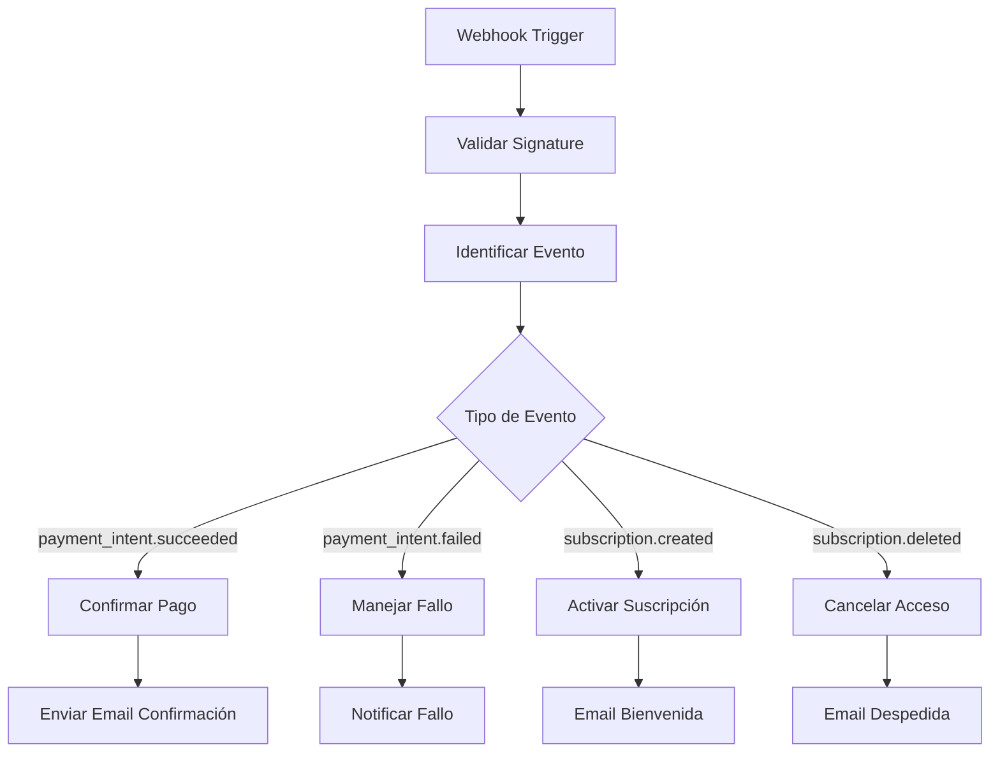

# Configurar webhooks de Stripe para procesar pagos

Los webhooks de Stripe te permiten recibir notificaciones automáticas cuando ocurren eventos en tu cuenta, como pagos exitosos, fallos de cobro, o suscripciones canceladas. En esta guía aprenderás cómo configurarlos con RP9.

## ¿Por qué usar webhooks de Stripe?

Los webhooks son esenciales para:

- ✅ **Confirmar pagos** en tiempo real
- ✅ **Actualizar suscripciones** automáticamente
- ✅ **Manejar fallos de cobro** y dunning
- ✅ **Sincronizar** datos entre Stripe y tu sistema
- ✅ **Enviar emails** de confirmación/recibo

## Eventos de Stripe más comunes

| Evento | Descripción | Cuándo usarlo |
|--------|-------------|---------------|
| `payment_intent.succeeded` | Pago exitoso | Confirmar órdenes, enviar recibos |
| `payment_intent.payment_failed` | Pago falló | Notificar al cliente, reintentar |
| `customer.subscription.created` | Nueva suscripción | Activar acceso, email bienvenida |
| `customer.subscription.updated` | Suscripción modificada | Cambiar plan, actualizar acceso |
| `customer.subscription.deleted` | Suscripción cancelada | Revocar acceso, email despedida |
| `invoice.payment_succeeded` | Factura pagada | Renovar suscripción |
| `invoice.payment_failed` | Factura no pagada | Iniciar proceso de dunning |

## Paso 1: Crear webhook en RP9

### 1.1 Crear nuevo workflow

1. Ve a **Workflows** → **Crear Nuevo**
2. Nombre: `Stripe Webhook Handler`
3. Descripción: `Procesamiento de eventos de Stripe`

### 1.2 Configurar trigger webhook

1. Selecciona **"Webhook"** como trigger
2. Copia la URL generada (ej: `https://hooks.rp9.com/webhook/abc123def`)
3. **Importante**: Guarda esta URL, la necesitarás en Stripe

### 1.3 Configurar validación de signature

Para seguridad, valida que el webhook viene de Stripe:

```javascript
// Nodo de validación de signature
const crypto = require('crypto');

// Obtener signature de headers
const signature = $input.all()[0].headers['stripe-signature'];
const endpointSecret = 'whsec_tu_endpoint_secret'; // Desde Stripe
const payload = JSON.stringify($input.all()[0].body);

// Validar signature
const elements = signature.split(',');
const signatureHash = elements.find(element => element.includes('v1')).split('=')[1];
const timestamp = elements.find(element => element.includes('t')).split('=')[1];

const expectedSignature = crypto
  .createHmac('sha256', endpointSecret)
  .update(timestamp + '.' + payload)
  .digest('hex');

if (signatureHash !== expectedSignature) {
  throw new Error('Invalid signature');
}

return { valid: true, event: $input.all()[0].body };
```

## Paso 2: Configurar webhook en Stripe

### 2.1 Acceder al Dashboard de Stripe

1. Ve a [dashboard.stripe.com](https://dashboard.stripe.com)
2. Navega a **Developers** → **Webhooks**
3. Haz clic en **"Add endpoint"**

### 2.2 Configurar el endpoint

**URL del endpoint**: Pega la URL de RP9 que copiaste
```
https://hooks.rp9.com/webhook/abc123def
```

**Eventos a escuchar**: Selecciona los eventos que necesitas:

```bash
# Para e-commerce básico:
payment_intent.succeeded
payment_intent.payment_failed
customer.subscription.created
customer.subscription.updated
customer.subscription.deleted

# Para facturación avanzada:
invoice.payment_succeeded
invoice.payment_failed
invoice.upcoming
customer.created
customer.updated
```

### 2.3 Obtener signing secret

1. Una vez creado el webhook, copia el **Signing secret**
2. Se ve así: `whsec_1234567890abcdef...`
3. Lo necesitarás para validar signatures

## Paso 3: Procesar eventos en RP9

### 3.1 Estructura del workflow



### 3.2 Nodo switch para eventos

Usa un nodo **Switch** para manejar diferentes tipos de eventos:

```javascript
// Switch basado en event.type
const eventType = $input.all()[0].body.type;

return [
  {
    // Route 0: Pagos exitosos
    condition: eventType === 'payment_intent.succeeded'
  },
  {
    // Route 1: Pagos fallidos  
    condition: eventType === 'payment_intent.payment_failed'
  },
  {
    // Route 2: Nueva suscripción
    condition: eventType === 'customer.subscription.created'
  },
  {
    // Route 3: Suscripción cancelada
    condition: eventType === 'customer.subscription.deleted'
  }
];
```

### 3.3 Procesar pago exitoso

Para `payment_intent.succeeded`:

```javascript
// Extraer datos del evento
const event = $input.all()[0].body;
const paymentIntent = event.data.object;

return {
  paymentId: paymentIntent.id,
  amount: paymentIntent.amount / 100, // De centavos a pesos
  currency: paymentIntent.currency,
  customerId: paymentIntent.customer,
  customerEmail: paymentIntent.receipt_email,
  status: paymentIntent.status,
  created: new Date(paymentIntent.created * 1000),
  metadata: paymentIntent.metadata
};
```

Luego puedes:
- Actualizar tu base de datos
- Enviar email de confirmación
- Activar el producto/servicio
- Generar factura

### 3.4 Manejar fallo de pago

Para `payment_intent.payment_failed`:

```javascript
const event = $input.all()[0].body;
const paymentIntent = event.data.object;

return {
  paymentId: paymentIntent.id,
  customerId: paymentIntent.customer,
  amount: paymentIntent.amount / 100,
  failureCode: paymentIntent.last_payment_error?.code,
  failureMessage: paymentIntent.last_payment_error?.message,
  declineCode: paymentIntent.last_payment_error?.decline_code,
  customerEmail: paymentIntent.receipt_email
};
```

Acciones recomendadas:
- Notificar al cliente del fallo
- Sugerir método de pago alternativo
- Programar reintento automático
- Actualizar estado del pedido

## Paso 4: Ejemplos de workflows completos

### 4.1 E-commerce simple

```yaml
# Workflow: E-commerce Payment Processing
Trigger: Stripe Webhook

1. Validar Signature
   - Verificar que viene de Stripe
   - Usar signing secret

2. Switch por Evento
   - payment_intent.succeeded → Ruta A
   - payment_intent.payment_failed → Ruta B

3A. Pago Exitoso:
   - Actualizar BD (marcar pedido como pagado)
   - Enviar email de confirmación
   - Notificar a fulfillment
   - Crear entrada en contabilidad

3B. Pago Fallido:
   - Marcar pedido como fallido
   - Enviar email con opciones de pago
   - Notificar al equipo de ventas
```

### 4.2 SaaS con suscripciones

```yaml
# Workflow: SaaS Subscription Management
Trigger: Stripe Webhook

1. Validar Signature

2. Switch por Evento:
   - customer.subscription.created → Activar
   - customer.subscription.updated → Modificar  
   - customer.subscription.deleted → Cancelar
   - invoice.payment_failed → Dunning

3. Activar Suscripción:
   - Crear/actualizar usuario en BD
   - Asignar rol según plan
   - Enviar credenciales de acceso
   - Email de bienvenida

4. Modificar Suscripción:
   - Actualizar plan en BD
   - Ajustar límites/features
   - Email de confirmación cambio

5. Cancelar Suscripción:
   - Marcar para cancelación al final del período
   - Revocar acceso si es inmediato
   - Email de despedida
   - Encuesta de cancelación
```

## Paso 5: Testing y debugging

### 5.1 Usar Stripe CLI para testing

Instala Stripe CLI:
```bash
# macOS
brew install stripe/stripe-cli/stripe

# Windows
# Descargar desde https://github.com/stripe/stripe-cli
```

Reenviar eventos a tu webhook local:
```bash
stripe listen --forward-to https://hooks.rp9.com/webhook/abc123def
```

Simular eventos:
```bash
# Simular pago exitoso
stripe trigger payment_intent.succeeded

# Simular fallo de pago
stripe trigger payment_intent.payment_failed

# Simular nueva suscripción
stripe trigger customer.subscription.created
```

### 5.2 Logs y monitoreo en RP9

1. Ve a **Workflows** → **Tu workflow** → **Ejecuciones**
2. Revisa logs de cada ejecución
3. Configura alertas para fallos
4. Monitorea métricas de éxito

### 5.3 Debugging común

**Error: Invalid signature**
- Verifica el signing secret
- Asegúrate de usar el raw body
- Revisa que el timestamp no sea muy viejo

**Error: Timeout**  
- Stripe espera respuesta en 10 segundos
- Procesa async lo que puedas
- Responde 200 OK inmediatamente

**Eventos duplicados**
- Implementa idempotencia usando `event.id`
- Guarda IDs procesados en BD
- Ignora eventos ya procesados

## Paso 6: Mejores prácticas

### 6.1 Seguridad

- ✅ **Siempre valida signatures** de Stripe
- ✅ **Usa HTTPS** en producción
- ✅ **No expongas** signing secrets
- ✅ **Implementa rate limiting**
- ✅ **Loguea intentos** fallidos

### 6.2 Reliability

- ✅ **Responde 200 OK** rápidamente  
- ✅ **Implementa idempotencia** con event ID
- ✅ **Maneja reintentos** de Stripe automáticamente
- ✅ **Procesa async** tareas pesadas
- ✅ **Monitora fallos** y alertas

### 6.3 Escalabilidad

- ✅ **Usa queues** para alto volumen
- ✅ **Procesa por lotes** cuando posible
- ✅ **Implementa circuit breakers**
- ✅ **Monitorea performance**

## Recursos adicionales

### Documentación oficial:
- [Stripe Webhooks Guide](https://stripe.com/docs/webhooks)
- [Event Types Reference](https://stripe.com/docs/api/events/types)
- [Webhook Signatures](https://stripe.com/docs/webhooks/signatures)

### Plantillas RP9:
- 🛒 [E-commerce Payment Flow](./templates/ecommerce-payments)
- 💳 [SaaS Subscription Manager](./templates/saas-subscriptions)  
- 📧 [Email Automation for Payments](./templates/payment-emails)

### Videos:
- [Stripe Webhooks en 10 minutos](https://youtube.com/watch?v=stripe123)
- [Debugging Webhooks](https://youtube.com/watch?v=debug456)

## ¿Necesitas ayuda?

Si tienes problemas con la integración:

- 💬 **Chat**: Soporte técnico L-V 9:00-17:00
- 📧 **Email**: stripe-help@rp9.com  
- 🎫 **Ticket**: [Crear ticket especializado](../new?category=integrations)
- 👥 **Comunidad**: [Slack #stripe-integration](https://rp9-community.slack.com)

---

**⭐ ¿Te ayudó esta guía?** Tu feedback mejora nuestro contenido.