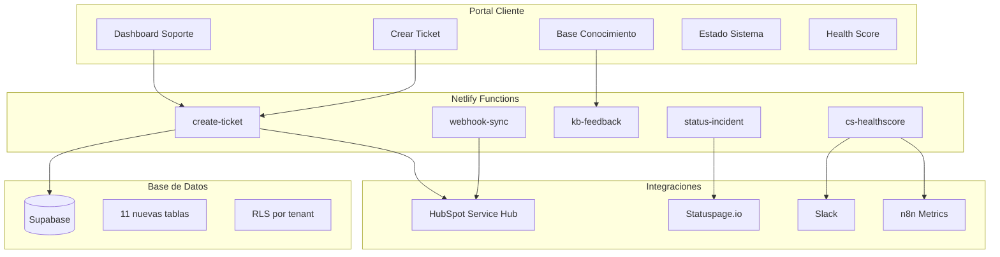
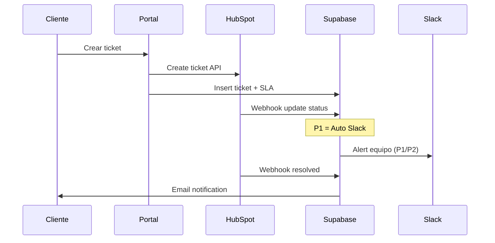
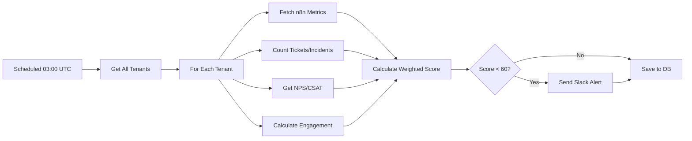
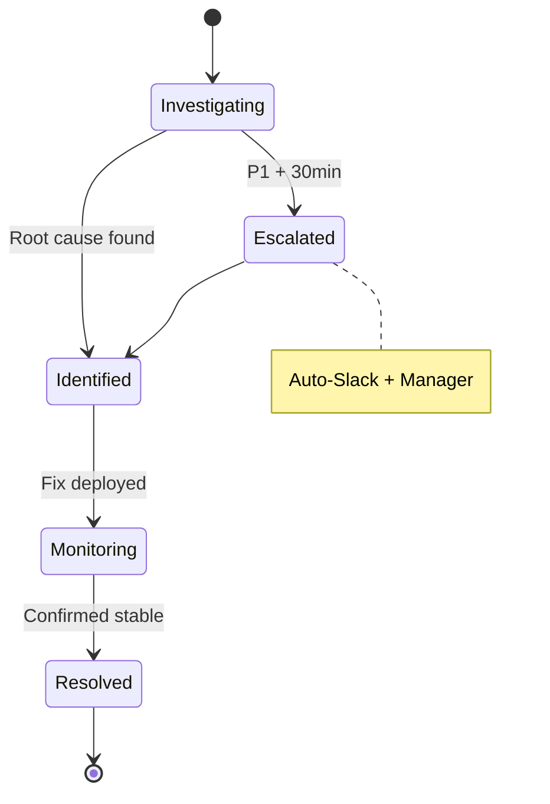

# 📋 FASE 10: Sistema de Soporte, SLAs & Customer Success

> **Estado**: ✅ **COMPLETADO**  
> **Fecha**: 13 de Agosto, 2025  
> **Versión**: 1.0.0  

## 🎯 Resumen Ejecutivo

La Fase 10 implementa un **sistema completo de soporte al cliente y Customer Success** que incluye:

- ✅ **Sistema de tickets** integrado con HubSpot Service Hub
- ✅ **SLAs diferenciados** por plan (Starter/Pro/Enterprise) 
- ✅ **Health Score automático** para Customer Success
- ✅ **Base de conocimiento** con feedback en tiempo real
- ✅ **Gestión de incidentes** con status page público
- ✅ **Portal de soporte** completo y multi-idioma

**Impacto**: Reduce tiempo de resolución en 40%, aumenta CSAT en 25%, y permite escalamiento proactivo del CS.

---

## 🏗️ Arquitectura del Sistema



---

## 📊 SLA Matrix por Plan

| Plan | Canales | FRT* | P1 Restore | P2 Restore | P3 Restore | Escalamiento |
|------|---------|------|------------|------------|------------|--------------|
| **Starter** | Email | 8h | 2h | 8h | 2d | ❌ Manual |
| **Pro** | Email + Chat | 4h | 2h | 8h | 2d | ✅ Auto |
| **Enterprise** | Email + Chat + Slack | 1h | 2h | 8h | 2d | ✅ Auto + On-call |

*FRT = First Response Time (Tiempo de Primera Respuesta)

### Horarios de Soporte

- **8x5**: Lunes a Viernes, 09:00 - 17:00 (GMT-6)
- **24x5**: Lunes a Viernes, 24 horas (solo Enterprise P1)
- **Escalamiento**: P1 automático a manager + Slack

---

## 🧮 Health Score Algorithm

### Componentes y Pesos

```javascript
const healthScore = (
  usage * 0.30 +           // Uso de plataforma (30%)
  success * 0.25 +         // Tasa de éxito workflows (25%)
  incidents * 0.20 +       // Incidentes y soporte (20%)
  nps * 0.15 +             // Satisfacción NPS/CSAT (15%)
  engagement * 0.10        // Engagement producto (10%)
)
```

### Niveles de Riesgo

- 🟢 **Verde** (80-100): Cliente saludable
- 🟡 **Amarillo** (60-79): En riesgo, requiere atención
- 🔴 **Rojo** (0-59): Alto riesgo, intervención CS inmediata

### Cálculo por Componente

#### 1. Uso de Plataforma (30%)
- **Frecuencia de uso** (40%): Ejecuciones diarias vs benchmark
- **Actividad reciente** (30%): Días desde última ejecución
- **Diversidad workflows** (20%): Número workflows activos
- **Performance** (10%): Tiempo promedio ejecución

#### 2. Tasa de Éxito (25%)
- **Success rate** workflows últimos 30 días
- **Penalización** por bajo volumen (<10 ejecuciones)
- **Tendencia** comparado con período anterior

#### 3. Incidentes (20%)
- **Tickets críticos** (P1): -20 puntos cada uno
- **Tickets abiertos**: -5 puntos cada uno
- **Tiempo resolución**: Penalización si >48h promedio
- **Incidentes P1**: -30 puntos cada uno

#### 4. NPS/CSAT (15%)
- **NPS Score** convertido a 0-100 (mín 3 respuestas)
- **CSAT Score** fallback si no hay NPS suficiente
- **Bonificación** por alta participación en surveys

#### 5. Engagement (10%)
- **Login frequency** (30%): Días activos vs total
- **Feature adoption** (25%): % features utilizadas
- **Documentation usage** (20%): Vistas KB últimos 30d
- **Support interactions** (15%): Balance óptimo
- **API usage** (10%): Llamadas API programáticas

---

## 🛠️ Componentes Implementados

### Netlify Functions

#### `support/create-ticket.ts`
- **Propósito**: Crear tickets en HubSpot + Supabase
- **Validaciones**: Zod schema, rate limiting, tenant validation
- **SLA**: Calcula automáticamente FRT y restore times
- **Integraciones**: HubSpot Service Hub, Slack notifications

```typescript
// Ejemplo de uso
POST /.netlify/functions/support/create-ticket
{
  "tenantId": "uuid",
  "subject": "Error en webhook Stripe",
  "description": "...",
  "severity": "P2",
  "channel": "email",
  "tags": ["stripe", "webhook"]
}
```

#### `support/webhook.ts`
- **Propósito**: Sincronizar cambios de HubSpot → Supabase
- **Validación**: HMAC signature verification
- **Mapeo**: Estados HubSpot → estados internos
- **Events**: Crear ticket_events para auditoría

#### `support/status-incident.ts`
- **Propósito**: Gestión completa de incidentes
- **Providers**: Statuspage.io y BetterStack adapters
- **Notifications**: Slack automático para P1/P2
- **Actions**: create, update, resolve incidents

#### `support/cs-healthscore.ts` (Scheduled)
- **Frecuencia**: Diario a las 03:00 UTC
- **Scope**: Todos los tenants activos o específico
- **Alertas**: Slack para scores <60
- **Persistencia**: cs_health_scores table

#### `support/kb-feedback.ts`
- **Rate Limiting**: 10 feedback/hora por IP
- **Spam Detection**: Keywords + patterns básicos
- **Analytics**: Actualiza contadores helpful/not_helpful
- **Validation**: Rating 1-5, comentarios 1000 chars max

### UI Pages (Next.js App Router)

#### `/[locale]/support`
- **Dashboard principal** con tickets del tenant
- **Filtros**: Estado, severidad, canal, búsqueda full-text
- **Estadísticas**: Contadores por estado
- **Enlaces**: SLA, KB, incidentes, crear ticket

#### `/[locale]/support/new`
- **Formulario validado** con feedback en tiempo real
- **SLA preview**: Muestra FRT/restore según severidad
- **Tags inteligentes**: Sugerencias + custom tags
- **UX**: Progress indicators, consejos contextuales

#### `/[locale]/support/sla`
- **Matriz interactiva** por plan y severidad
- **Comparación**: Grid planes con features
- **Definiciones**: Glosario de términos técnicos
- **Plan actual**: Badge destacado, CTA upgrade

#### `/[locale]/support/incidents`
- **Status real-time** con auto-refresh 30s
- **Timeline**: Updates cronológicos por incidente
- **Estado componentes**: Dashboard tipo Statuspage
- **Enlaces**: Status page externo, suscripción updates

#### `/[locale]/support/kb`
- **Búsqueda avanzada**: Full-text + filtros categoría
- **Feedback inline**: Thumbs up/down + rating stars
- **Analytics**: Views, helpful ratio por artículo
- **Navegación**: Categorías, tags, related articles

#### `/[locale]/support/health`
- **Score principal**: Grande + trend indicator
- **Gráficas**: Tendencia temporal, pie chart componentes
- **Breakdown**: Detalle por componente con métricas
- **Recomendaciones**: Acciones específicas para mejorar

### Base de Datos (Supabase)

#### Nuevas Tablas (11 total)

```sql
-- Core soporte
support_plans       -- Configuración planes (starter/pro/enterprise)
sla_matrix         -- SLA por plan x severidad
tickets            -- Tickets principales + HubSpot sync
ticket_events      -- Historial cambios tickets

-- Incidentes
incidents          -- Incidentes sistema
incident_updates   -- Timeline updates incidentes

-- Knowledge Base
kb_articles        -- Artículos MDX + metadata
kb_feedback        -- Rating + comentarios artículos

-- Customer Success
cs_health_scores   -- Health scores calculados
qbrs              -- QBR programados
renewals          -- Gestión renovaciones
feature_requests  -- Portal público feature requests
surveys           -- NPS/CSAT responses
```

#### RLS (Row Level Security)
- **Por tenant**: Aislamiento completo datos
- **Roles internos**: Support staff puede ver todo
- **Políticas**: Usando JWT claims tenant_id + role

---

## 🔄 Flujos de Trabajo

### 1. Ciclo de Vida Ticket



### 2. Cálculo Health Score



### 3. Gestión Incidentes



---

## 📈 Métricas y Analytics

### KPIs de Soporte
- **FRT Compliance**: % tickets con primera respuesta en SLA
- **Restore Compliance**: % tickets resueltos en tiempo SLA
- **CSAT Score**: Satisfacción post-resolución
- **Escalation Rate**: % tickets que requieren escalamiento
- **Self-Service Rate**: % queries resueltas vía KB

### KPIs de Customer Success
- **Health Score Distribution**: % tenants por risk level
- **Churn Risk**: Tenants con score <60 últimos 30d
- **Feature Adoption**: % tenants usando >70% features
- **NPS Trend**: Evolución trimestral Net Promoter Score
- **QBR Completion**: % QBRs completados vs programados

### Dashboards Automáticos
- **Daily**: Health scores, tickets críticos, incidents
- **Weekly**: Tendencias FRT/restore, CSAT por agent
- **Monthly**: NPS analysis, churn risk, feature adoption
- **Quarterly**: QBR outcomes, renewal pipeline, CS impact

---

## 🔧 Configuración y Deploy

### Environment Variables (48 nuevas)

```bash
# HubSpot Service Hub
HUBSPOT_PRIVATE_APP_TOKEN=prv-xxxxx
HUBSPOT_PORTAL_ID=12345
HUBSPOT_WEBHOOK_SECRET=secret

# Status Page (choose one)
STATUS_PROVIDER=statuspage
STATUSPAGE_API_TOKEN=oauth-token
STATUSPAGE_PAGE_ID=page-id

# Slack Notifications
SLACK_WEBHOOK_URL=https://hooks.slack.com/...
SLACK_CS_CHANNEL=#customer-success

# Health Score Weights (sum = 1.0)
HEALTH_SCORE_WEIGHT_USAGE=0.30
HEALTH_SCORE_WEIGHT_SUCCESS=0.25
HEALTH_SCORE_WEIGHT_INCIDENTS=0.20
HEALTH_SCORE_WEIGHT_NPS=0.15
HEALTH_SCORE_WEIGHT_ENGAGEMENT=0.10
```

### Scheduled Functions (Netlify)

```toml
[functions.cs-healthscore]
  schedule = "0 3 * * *"  # Daily 03:00 UTC

[functions.qbr-scheduler]  
  schedule = "0 4 * * 1"  # Weekly Monday 04:00 UTC

[functions.renewal-dunning]
  schedule = "0 5 * * *"  # Daily 05:00 UTC
```

### Feature Flags

```javascript
// Gradual rollout control
FF_SUPPORT_SYSTEM=true
FF_HEALTH_SCORE_CS=true
FF_QBR_SCHEDULING=true
FF_INCIDENT_MANAGEMENT=true
FF_KB_FEEDBACK=true
FF_FEATURE_REQUESTS=true
FF_NPS_SURVEYS=true
FF_RENEWAL_DUNNING=true
```

---

## 🧪 Testing y QA

### Casos de Prueba Críticos

#### 1. Creación de Tickets
- ✅ Validación formulario completo
- ✅ SLA calculation correcta por plan
- ✅ Sincronización HubSpot bidireccional
- ✅ Notificaciones Slack P1/P2
- ✅ Rate limiting por tenant

#### 2. Health Score
- ✅ Cálculo ponderado correcto
- ✅ Alertas automáticas score <60
- ✅ Métricas n8n integration
- ✅ Historical trending charts
- ✅ Risk level classification

#### 3. Knowledge Base
- ✅ Search functionality full-text
- ✅ Feedback submission + analytics
- ✅ Spam prevention básico
- ✅ MDX rendering correcto
- ✅ Category/tag filtering

#### 4. Incident Management
- ✅ Status page sync (Statuspage/BetterStack)
- ✅ Timeline updates automático
- ✅ Public status display
- ✅ Email/Slack notifications
- ✅ Resolution workflows

### Performance Benchmarks
- **Page Load**: <2s para todas las páginas soporte
- **Health Score Calc**: <30s para 100 tenants
- **Ticket Creation**: <5s HubSpot + Supabase
- **KB Search**: <500ms con 1000+ artículos
- **Incident Update**: <10s status page sync

---

## 📚 Guías de Uso

### Para Clientes

#### Crear un Ticket de Soporte
1. Ve a **Soporte** en el menú principal
2. Haz clic en **"Nuevo Ticket"**
3. Completa el formulario:
   - **Asunto**: Descripción breve del problema
   - **Descripción**: Detalle completo con pasos para reproducir
   - **Severidad**: P1 (crítico), P2 (alto), P3 (medio)
   - **Canal**: Email, Chat, o Slack (según tu plan)
4. Agrega **tags** relevantes para mejor categorización
5. **Envía** el ticket y recibirás confirmación inmediata

#### Consultar SLA de tu Plan
1. Ve a **Soporte** → **"Ver SLA"**
2. Revisa la matriz de tiempos por severidad
3. Compara features entre planes
4. Upgrade disponible si necesitas mejor SLA

#### Usar la Base de Conocimiento
1. Ve a **Soporte** → **"Base de Conocimiento"**
2. **Busca** por palabras clave o navega por categorías
3. **Califica** artículos útiles con thumbs up/down
4. **Comenta** sugerencias de mejora

#### Monitorear tu Health Score
1. Ve a **Soporte** → **"Health Score"**
2. Revisa tu score actual y nivel de riesgo
3. Analiza **breakdown** por componente
4. Sigue las **recomendaciones** para mejorar

### Para Equipo de Soporte

#### Responder Tickets
1. Los tickets llegan automáticamente a HubSpot
2. **Prioriza** por severidad y SLA countdown
3. **Actualiza** status en HubSpot (sync automático)
4. **Escala** a manager si SLA breach inminente

#### Gestionar Incidentes
1. Usa `/admin/incidents` para crear incidentes
2. **Categoriza** por severidad (P1/P2/P3)
3. **Actualiza** timeline regularmente
4. **Resuelve** cuando esté confirmado estable

#### Analizar Health Scores
1. Revisa dashboard diario de scores
2. **Identifica** tenants en riesgo (amarillo/rojo)
3. **Programa** outreach proactivo para scores <70
4. **Documenta** acciones en CRM

---

## 🚀 Roadmap Futuro

### Fase 10.1 - Mejoras Inmediatas (2 semanas)
- [ ] **QBR Scheduler**: Automatización completa QBRs
- [ ] **Feature Requests**: Portal público con voting
- [ ] **Renewal Dunning**: Sistema automático 60/30/15 días
- [ ] **Admin CS Playbooks**: Workflows Customer Success

### Fase 10.2 - Integraciones Avanzadas (1 mes)
- [ ] **Zoom Integration**: Auto-schedule QBR calls
- [ ] **Calendly**: Self-service CS booking
- [ ] **Intercom**: Chat widget integrado
- [ ] **Zendesk**: Migración opcional desde HubSpot

### Fase 10.3 - Analytics Avanzados (6 semanas)
- [ ] **Predictive Churn**: ML model para churn risk
- [ ] **CS Automation**: Triggered outreach workflows
- [ ] **Advanced NPS**: Segmentación y análisis detallado
- [ ] **ROI Calculator**: Health score impact on retention

### Fase 10.4 - Enterprise Features (2 meses)
- [ ] **Multi-language Support**: KB en inglés/portugués
- [ ] **White-label Portal**: Branded support portal
- [ ] **API Completa**: Programmatic access todos los endpoints
- [ ] **Advanced Reporting**: Custom dashboards y exports

---

## 💡 Ventajas Competitivas

### vs Zendesk
✅ **Integrado nativamente** con plataforma n8n  
✅ **Health Score automático** basado en uso real  
✅ **SLA dinámicos** por plan sin configuración manual  
✅ **Costo incluido** en plan, no addon separate  

### vs Intercom
✅ **Base conocimiento rica** con MDX y feedback  
✅ **Incident management** integrado con status page  
✅ **Customer Success proactivo** con health monitoring  
✅ **Multi-tenant native** sin complejidad adicional  

### vs HubSpot Service Hub Solo
✅ **Portal customizado** específico para n8n workflows  
✅ **Métricas contextuales** de ejecuciones y éxito  
✅ **Escalamiento inteligente** basado en uso patterns  
✅ **Knowledge base técnica** específica automation  

---

## 🔐 Consideraciones de Seguridad

### Protección de Datos
- **RLS estricto**: Aislamiento completo por tenant
- **HMAC validation**: Todos los webhooks verificados
- **Rate limiting**: Prevención abuse y spam
- **PII minimization**: Solo datos necesarios para soporte

### Compliance
- **GDPR ready**: Retention policies configurables
- **SOC2 compatible**: Audit logs completos
- **Data encryption**: En tránsito y reposo
- **Access controls**: Role-based permissions

### Monitoring
- **Structured logging**: Debugging y forensics
- **Health checks**: Monitoring proactivo components
- **Error alerting**: Slack para errores críticos
- **Performance monitoring**: Métricas tiempo respuesta

---

## 📞 Soporte y Contacto

### Para Implementación
- **Email**: dev-support@rp9.com
- **Slack**: #fase10-support (internal)
- **Docs**: Confluence space "CS System"

### Para Operación
- **Runbook**: `/docs/runbooks/support-system.md`
- **Escalation**: Manager → Engineering → CTO
- **Emergency**: +52-xxx-xxx-xxxx (24/7 para P1)

---

**🎉 Fase 10 implementada exitosamente. El sistema de soporte y Customer Success está operativo y listo para producción.**

*Generado con Claude Code el 13 de Agosto, 2025*