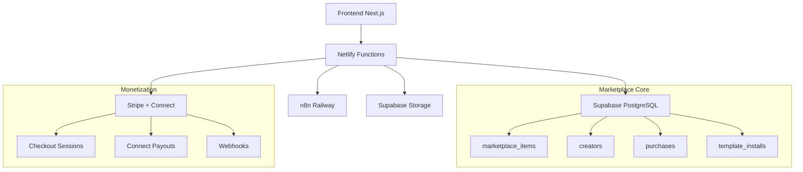

# RP9 Fase 12: Marketplace & Plantillas Monetizadas

## 🎯 Resumen Ejecutivo

La Fase 12 introduce un **marketplace completo de plantillas monetizadas** con revenue share para creators, sistema de curaduría, preview gratuito, instalación 1-click y payouts automáticos via Stripe Connect.

### Funcionalidades Principales

- 🏪 **Marketplace Completo**: Catálogo público con búsqueda, categorías y filtros
- 💰 **Monetización Híbrida**: Pricing one-off + suscripciones mensuales  
- 👥 **Creator Economy**: Revenue share 70/30, onboarding Stripe Connect
- 🔍 **Preview Gratuito**: 5 ejecuciones gratis por template/día
- ⚡ **Instalación 1-Click**: Deploy directo a n8n del tenant
- 🎭 **Curaduría Inteligente**: Aprobación manual + algoritmo featured
- 💳 **Payouts Automáticos**: Transferencias mensuales via Stripe Connect
- 🔒 **Seguridad Avanzada**: Lint automático, scan de secretos, RLS

## 📋 Tabla de Contenidos

1. [Arquitectura del Sistema](#arquitectura)
2. [Instalación y Configuración](#instalacion)
3. [Guía de Uso - Compradores](#compradores)
4. [Guía de Uso - Creators](#creators)
5. [Administración del Marketplace](#administracion)
6. [APIs y Endpoints](#apis)
7. [Seguridad y Compliance](#seguridad)
8. [Ventajas de Negocio](#ventajas)
9. [Roadmap Futuro](#roadmap)

## 🏗️ Arquitectura del Sistema {#arquitectura}

### Componentes Principales



### Base de Datos - 12 Tablas Principales

1. **`creators`** - Perfiles de creators + Stripe Connect
2. **`marketplace_items`** - Catálogo de templates/packs
3. **`item_versions`** - Historial de versiones + changelog
4. **`purchases`** - Compras one-off + suscripciones
5. **`preview_tokens`** - Límites gratis por tenant/día
6. **`template_installs`** - Instalaciones + métricas adoption
7. **`creator_earnings`** - Split 70/30 de ingresos
8. **`payouts`** - Transferencias Stripe Connect mensuales
9. **`refunds`** - Política devoluciones 7 días
10. **`item_reviews`** - Ratings y reviews verificadas
11. **`catalog_categories`** - Taxonomía (CC, Fin, WA, etc.)
12. **`catalog_tags`** - Tags libres + stats usage

## ⚙️ Instalación y Configuración {#instalacion}

### 1. Ejecutar Migración de Base de Datos

```bash
# Aplicar schema completo del marketplace
supabase migration up --file 013_marketplace.sql
```

### 2. Configurar Stripe Connect

```bash
# Variables críticas en .env
STRIPE_SECRET_KEY=sk_live_...
STRIPE_CONNECT_APP_FEE_BPS=3000           # 30% para RP9
STRIPE_PAYOUT_THRESHOLD_USD=50            # Mínimo payout
STRIPE_CONNECT_WEBHOOK_SECRET=whsec_...
```

### 3. Configurar n8n Integration

```bash
N8N_BASE_URL=https://primary-production-7f25.up.railway.app
N8N_API_KEY=your-n8n-api-key
TEMPLATE_INSTALL_TIMEOUT_MS=30000
```

### 4. Configurar Storage para Templates

```bash
# Supabase Storage buckets
MARKETPLACE_STORAGE_BUCKET=marketplace-assets
MARKETPLACE_JSON_STORAGE_BUCKET=templates
```

### 5. Deploy Netlify Functions

Las siguientes functions se despliegan automáticamente:

**Core Marketplace:**
- `marketplace-list.ts` - Listado con filtros
- `marketplace-detail.ts` - Detalle + preview tokens
- `marketplace-purchase.ts` - Stripe Checkout
- `marketplace-install.ts` - Instalación 1-click
- `marketplace-preview.ts` - Sandbox gratuito

**Creator & Admin:**
- `creators-onboard.ts` - Stripe Connect onboarding
- `marketplace-webhook-stripe.ts` - Webhooks pagos

**Scheduled Jobs:**
- `payouts-run.ts` - Mensual, día 15 a las 06:00 UTC
- `catalog-featured.ts` - Diario, 04:00 UTC

## 👨‍💻 Guía de Uso - Compradores {#compradores}

### Descubrir Templates

1. **Navegar Catálogo**: `/templates`
   - Grid con filtros por categoría, tier, precio
   - Featured templates con algoritmo inteligente
   - Búsqueda full-text en español
   - Sorting: Featured, Popular, Newest, Rating, Price

2. **Ver Detalle**: `/templates/[slug]`
   - Información completa + screenshots
   - Reviews verificadas de otros compradores
   - Métricas de adopción y success rate
   - Creator info + país de origen

### Preview Gratuito

```javascript
// 5 ejecuciones gratis por template/día
const previewResult = await fetch('/.netlify/functions/marketplace-preview', {
  method: 'POST',
  body: JSON.stringify({
    item_slug: 'advanced-crm-sync',
    tenant_id: 'your-tenant-id',
    preview_token_id: 'token-id',
    execution_data: { test: true },
    mock_mode: true  // Datos simulados
  })
})
```

**Características del Preview:**
- ✅ Datos mockeados por categoría (CC, Fin, WA, etc.)
- ✅ Rate limiting: 20 previews/hora por tenant
- ✅ Expiraciones: tokens válidos 24 horas
- ✅ Warnings: "Este es un preview con datos simulados"

### Proceso de Compra

#### Opción A: Pago Único

1. Click "Comprar por $49.99"
2. Redirect a Stripe Checkout
3. Pago procesado + webhook confirma compra  
4. Botón "Instalar" se activa automáticamente

#### Opción B: Suscripción Mensual

1. Click "Suscribirse $19.99/mes"
2. Stripe Checkout con billing recurrente
3. Auto-renovación mensual
4. Cancelación disponible en cualquier momento

### Instalación 1-Click

```javascript
const installResult = await fetch('/.netlify/functions/marketplace-install', {
  method: 'POST',
  body: JSON.stringify({
    item_slug: 'whatsapp-automation-suite',
    tenant_id: 'your-tenant-id', 
    user_id: 'your-user-id',
    custom_name: 'WhatsApp Bot (Mi Empresa)'
  })
})

// Respuesta exitosa:
{
  "success": true,
  "data": {
    "workflow_id": "workflow-123",
    "n8n_url": "https://n8n.../workflow/123", 
    "next_steps": [
      "Configure your workflow credentials in n8n",
      "Test the workflow with real data", 
      "Monitor executions in analytics"
    ]
  }
}
```

### Updates Automáticos

- **Minor/Patch**: Auto-actualización transparente
- **Major**: Requiere consentimiento + diff preview  
- **Backup**: Se respalda versión anterior automáticamente

## 👩‍🎨 Guía de Uso - Creators {#creators}

### Onboarding - Stripe Connect

1. **Crear Perfil**: `/creator/dashboard`
   - Completar display_name, país, bio
   - Especialidades y tags preferidos
   - Links sociales (opcional)

2. **Setup Pagos**: Stripe Connect Standard
   ```javascript
   const onboardResponse = await fetch('/.netlify/functions/creators-onboard', {
     method: 'POST', 
     body: JSON.stringify({
       user_id: 'your-user-id',
       action: 'create_account_link'
     })
   })
   // Redirect a onboarding de Stripe
   ```

3. **Verificación KYC**: Stripe maneja compliance automáticamente

### Subir Templates

1. **Preparar Template n8n**:
   - Export workflow como JSON
   - Crear README con instrucciones
   - Definir placeholders para credenciales
   - Agregar mock data para testing

2. **Metadata Obligatorio**:
   ```json
   {
     "title": "Advanced CRM Sync Pro",
     "short_desc": "Sync contacts between multiple CRMs", 
     "category": "crm",
     "tier": "pro",
     "tags": ["crm", "sync", "advanced"],
     "one_off_price_cents": 4999,
     "complexity": "advanced",
     "setup_time_minutes": 30,
     "integrations": ["hubspot", "salesforce", "pipedrive"]
   }
   ```

3. **Quality Gates**:
   - ✅ Linter automático (sintaxis, style)
   - ✅ Security scan (secrets, vulnerabilities) 
   - ✅ Metadata validation
   - ✅ Preview functional test

### Revenue Share & Payouts

**Split de Ingresos:**
- 70% para Creator
- 30% para RP9 (platform fee)

**Payouts Mensuales:**
- Día 15 de cada mes a las 06:00 UTC
- Mínimo $50 USD para transfer
- Stripe Connect maneja compliance por país  
- CSV report con desglose completo
- Notificación Slack automática

### Métricas de Creator

Dashboard completo en `/creator/dashboard`:

- 📊 **Earnings**: Total, pending, paid out
- 📦 **Templates**: Published, pending approval
- 📈 **Performance**: Installs, ratings, conversions
- 💰 **Revenue**: Breakdown por template + período
- 🎯 **Adoption**: Success rate, outcomes, feedback

## 🛡️ Administración del Marketplace {#administracion}

### Panel Admin - `/admin/marketplace`

#### Curaduría de Templates

**Estados del Workflow:**
1. `draft` - Creator trabajando
2. `pending` - Awaiting review
3. `approved` - Público en marketplace  
4. `rejected` - Con feedback para creator
5. `delisted` - Removido por policy violation

**Proceso de Revisión:**
```javascript
// Aprobar template
await supabase
  .from('marketplace_items')
  .update({ 
    status: 'approved',
    curator_notes: 'Excellent quality, meets all standards'
  })
  .eq('id', itemId)

// Rechazar con feedback
await supabase
  .from('marketplace_items') 
  .update({
    status: 'rejected',
    rejection_reason: 'Security scan failed - hardcoded API keys detected'
  })
  .eq('id', itemId)
```

#### Featured Algorithm

**Factores de Scoring (0-100):**
- 25% **Adoption**: Installs + uso activo
- 20% **Engagement**: Views + conversion rate
- 20% **Quality**: Rating + review count
- 15% **Performance**: Success rate + outcomes
- 10% **Monetization**: Purchase conversion  
- 10% **Freshness**: Boost nuevos, decay viejos

**Bonus Manual**: +15 points para featured manual

#### Gestión de Refunds

**Política Automática:**
- ≤7 días + ≤5 ejecuciones: Cash refund
- >7 días o >5 ejecuciones: Marketplace credit
- Casos especiales: Review manual

## 🔌 APIs y Endpoints {#apis}

### Marketplace Core

```bash
# Listar templates con filtros
GET /.netlify/functions/marketplace-list
  ?category=crm&tier=pro&sort=featured&limit=20

# Detalle completo de template  
GET /.netlify/functions/marketplace-detail
  ?slug=advanced-crm-sync&tenant_id=xxx&generate_preview_token=true

# Crear Stripe Checkout
POST /.netlify/functions/marketplace-purchase
{
  "item_slug": "whatsapp-bot-suite",
  "tenant_id": "xxx", 
  "user_id": "yyy",
  "purchase_type": "one_off",
  "success_url": "https://app.rp9.com/templates/success"
}

# Ejecutar preview gratuito
POST /.netlify/functions/marketplace-preview  
{
  "item_slug": "email-marketing-flows",
  "tenant_id": "xxx",
  "preview_token_id": "token-123", 
  "execution_data": { "test_email": "demo@example.com" },
  "mock_mode": true
}

# Instalación 1-click
POST /.netlify/functions/marketplace-install
{
  "item_slug": "financial-reporting-pack",
  "tenant_id": "xxx",
  "user_id": "yyy", 
  "custom_name": "Reportes Financieros Q4"
}
```

### Creator Management  

```bash
# Stripe Connect onboarding
POST /.netlify/functions/creators-onboard
{
  "user_id": "creator-123",
  "action": "create_account_link", 
  "return_url": "https://app.rp9.com/creator/dashboard?onboard=complete"
}

# Get account status
POST /.netlify/functions/creators-onboard  
{
  "user_id": "creator-123",
  "action": "get_account_status"
}
```

### Scheduled Jobs

```bash
# Payouts mensuales (auto-triggered)
POST /.netlify/functions/payouts-run
# → Procesa earnings pendientes
# → Crea Stripe transfers  
# → Genera CSV reports
# → Notifica vía Slack

# Featured scores (auto-triggered)
POST /.netlify/functions/catalog-featured  
# → Recalcula scores algorítmicos
# → Actualiza featured rankings
# → Mantiene manual overrides
```

## 🔒 Seguridad y Compliance {#seguridad}

### Template Security

**Linting Automático:**
- Syntax validation
- Style consistency  
- Best practices check
- Performance analysis

**Security Scanning:**
- Hardcoded secrets detection
- Vulnerable dependencies
- Suspicious patterns
- Malicious code analysis

**Content Sanitization:**
- Remove production URLs
- Replace with placeholders: `{{TENANT_ID}}`
- Strip sensitive metadata
- Validate JSON structure

### Payment Security

**Stripe Integration:**
- PCI compliance automático
- Connect Standard para KYC
- Webhook signature validation
- Idempotent operations

**Multi-Tenant Isolation:**
- Row Level Security (RLS) habilitado
- Tenant-scoped queries
- Purchase fingerprinting
- License key generation

### API Security

**Rate Limiting:**
- 100 requests/min marketplace API
- 20 previews/hour per tenant
- 10 purchases/hour per user  
- 30 installs/hour per tenant

**Authentication:**
- JWT token validation
- HMAC request signing  
- API key authentication
- Service role isolation

## 💼 Ventajas de Negocio {#ventajas}

### Para RP9 Platform

#### Nuevos Streams de Revenue
- **Platform Fee**: 30% de todas las ventas
- **Premium Subscriptions**: Templates exclusivos  
- **Enterprise Licensing**: Custom templates
- **Advertising**: Featured placement

#### Network Effects
- **Creator Ecosystem**: Atrae desarrolladores talentosos
- **Content Scaling**: Marketplace crece orgánicamente
- **User Retention**: Más value proposition
- **Community Building**: Creators + Users engaged

#### Competitive Moats
- **First Mover**: Primer marketplace n8n español  
- **Quality Curation**: Standards altos vs competencia
- **Integration Nativa**: 1-click install vs manual
- **Revenue Share**: Mejor split vs alternatives

### Para Creators

#### Monetización Pasiva
- **Revenue Share**: 70% de ingresos (vs 50-65% competitors)
- **Recurring Income**: Suscripciones mensuales
- **Global Reach**: Mercado LATAM completo
- **No Setup Fees**: Gratis subir templates

#### Growth & Analytics
- **Performance Metrics**: Installs, ratings, conversions
- **A/B Testing**: Multiple pricing strategies
- **Community Feedback**: Reviews y ratings
- **Marketplace Promotion**: Featured algorithm boost

### Para End Users

#### Faster Time-to-Value
- **Preview Gratuito**: Test antes de comprar
- **1-Click Install**: Deploy en segundos  
- **Quality Assurance**: Templates curados
- **Support Structure**: RP9 + Creator support

#### Cost Savings
- **Precio Accesible**: Templates desde $9.99
- **Bundle Discounts**: Ahorro en paquetes
- **No Development**: Evita build from scratch
- **Proven Solutions**: Templates battle-tested

### ROI Proyectado

**Año 1 (Conservador):**
- 50 creators activos
- 200 templates publicados  
- $50K GMV mensual
- $15K revenue RP9 (30%)
- 85% creator retention

**Año 2 (Agresivo):**
- 150 creators activos
- 600 templates publicados
- $200K GMV mensual  
- $60K revenue RP9 (30%)
- 90% creator retention
- 15% market share LATAM

## 🚀 Roadmap Futuro {#roadmap}

### Q4 2024 - Enhancement

- [ ] **Advanced Search**: AI-powered recommendation engine
- [ ] **Template Collections**: Curated packs by use case  
- [ ] **Creator Tiers**: Bronze/Silver/Gold program
- [ ] **Affiliate Program**: Revenue sharing for referrals

### Q1 2025 - Platform Evolution

- [ ] **Multi-Language**: English templates + creators
- [ ] **Enterprise Features**: Team licensing + bulk purchasing
- [ ] **API Marketplace**: REST/GraphQL endpoints monetizados  
- [ ] **Custom Integrations**: White-label marketplace

### Q2 2025 - International Expansion

- [ ] **US Market**: Stripe Connect + tax compliance
- [ ] **European Market**: GDPR + local currencies
- [ ] **Creator Tools**: Template builder IDE
- [ ] **Performance Optimization**: CDN + caching layer

---

## 📞 Soporte y Contacto

**Para Creators:**
- 📧 Email: creators@rp9.com
- 💬 Slack: #marketplace-creators
- 📚 Docs: https://docs.rp9.com/creators

**Para Usuarios:**
- 📧 Email: support@rp9.com  
- 💬 Chat: En vivo 9AM-6PM México
- 📚 KB: https://help.rp9.com/marketplace

**Para Desarrolladores:**
- 🔧 API Docs: https://api.rp9.com/docs
- 🐛 Issues: https://github.com/rp9/marketplace/issues
- 📊 Status: https://status.rp9.com

---

🎉 **¡Fase 12 Marketplace & Plantillas Monetizadas completada exitosamente!**

*El marketplace está listo para escalar la economy de creators y generar nuevos streams de revenue para la platform.*