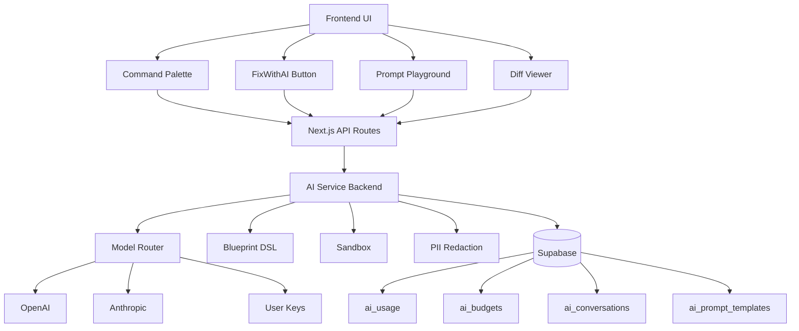

# 🤖 Fase 14: AI Assistant - Guía de Uso y Ventajas

## 📋 Índice

1. [Visión General](#visión-general)
2. [Componentes Principales](#componentes-principales)
3. [Cómo Usar el AI Assistant](#cómo-usar-el-ai-assistant)
4. [Ventajas y Beneficios](#ventajas-y-beneficios)
5. [Guía de Configuración](#guía-de-configuración)
6. [Ejemplos Prácticos](#ejemplos-prácticos)
7. [Troubleshooting](#troubleshooting)
8. [Arquitectura Técnica](#arquitectura-técnica)

---

## 🎯 Visión General

La **Fase 14** introduce un **AI Assistant integral** para RP9 que revoluciona la forma de crear, optimizar y mantener workflows. Este sistema utiliza múltiples proveedores de IA (OpenAI, Anthropic) con soporte para BYOK (Bring Your Own Key) para ofrecer capacidades avanzadas de automatización inteligente.

### 🌟 Características Destacadas

- **🧠 Multi-Provider AI**: OpenAI + Anthropic + BYOK personalizado
- **🎨 Blueprint DSL**: Lenguaje natural → workflows n8n automáticamente
- **🔒 Sandbox Seguro**: Testing sin riesgos antes de aplicar cambios
- **🛡️ Redacción PII**: Protección automática de datos sensibles
- **⌨️ Command Palette**: Acceso rápido con atajos de teclado (Cmd+K)
- **🔧 FixWithAI**: Análisis inteligente de errores con soluciones sugeridas
- **🧪 Prompt Playground**: Experimentación con prompts y templates
- **📊 Diff Viewer**: Revisión visual de cambios sugeridos

---

## 🏗️ Componentes Principales

### 1. **AI Service Backend** (`apps/ai-service/`)
Servicio Fastify con TypeScript que maneja toda la lógica de IA:

```bash
apps/ai-service/
├── src/
│   ├── services/
│   │   ├── modelRouter.ts      # Routing multi-proveedor
│   │   ├── blueprint.ts        # DSL Blueprint parser
│   │   └── sandbox.ts          # Sistema de testing seguro
│   ├── routes/
│   │   ├── ai.ts              # Endpoints principales de IA
│   │   ├── playground.ts      # Playground de prompts
│   │   └── usage.ts           # Métricas y billing
│   └── utils/
│       ├── redact.ts          # Redacción PII
│       └── config.ts          # Configuración
```

### 2. **Frontend Components** (`src/components/ai/`)
Componentes React para la interfaz de usuario:

```bash
src/components/ai/
├── CommandPalette.tsx         # Paleta de comandos (Cmd+K)
├── FixWithAIButton.tsx        # Botón de análisis de errores
├── PromptPlayground.tsx       # Playground para prompts
└── DiffViewer.tsx             # Visor de diferencias
```

### 3. **API Routes Bridge** (`src/app/api/ai/`)
Puente entre frontend y AI service:

```bash
src/app/api/ai/
├── generate/route.ts          # Generación de workflows
├── explain-error/route.ts     # Análisis de errores
├── optimize/route.ts          # Optimización de workflows
├── playground-execute/route.ts # Ejecución de prompts
└── prompt-templates/route.ts  # Gestión de templates
```

---

## 🚀 Cómo Usar el AI Assistant

### 1. **Command Palette - Acceso Rápido**

**Activación:**
- **Cmd+K** (Mac) o **Ctrl+K** (Windows/Linux)
- **Tecla /** desde cualquier lugar
- Icono de comando en la interfaz

**Comandos Disponibles:**

| Comando | Atajo | Descripción |
|---------|--------|-------------|
| Generar Workflow | `g` + `w` | Crear workflow desde descripción |
| Explicar Error | `e` + `x` | Analizar errores de ejecución |
| Optimizar Workflow | `o` + `p` | Sugerir mejoras de performance |
| Chat con IA | `c` + `h` | Conversación libre con asistente |
| Nuevo Workflow | `n` + `w` | Crear workflow manual |
| Ejecutar Workflow | `r` + `u` | Ejecutar workflow actual |

**Ejemplo de Uso:**
1. Presiona **Cmd+K**
2. Escribe "generar workflow" o usa atajo **g** + **w**
3. Describe tu workflow: *"Crear un workflow que procese emails entrantes, extraiga attachments PDF y los almacene en Google Drive"*
4. El AI generará automáticamente el workflow n8n

### 2. **FixWithAI - Análisis de Errores**

Cuando un workflow falla, aparece el botón **"Fix con IA"** que:

**Funcionalidades:**
- ✅ **Análisis automático** de logs de error
- ✅ **Identificación de causas** raíz
- ✅ **Soluciones paso a paso** personalizadas
- ✅ **Aplicación automática** de fixes simples
- ✅ **Prevención futura** con tips

**Proceso:**
1. Click en **"Fix con IA"** en un workflow fallido
2. El AI analiza logs, configuración y contexto
3. Recibe análisis detallado con:
   - Tipo y severidad del error
   - Posibles causas
   - Soluciones sugeridas ordenadas por dificultad
   - Cambios de código específicos
   - Tips de prevención

### 3. **Prompt Playground - Experimentación**

Laboratorio para experimentar con IA:

**Características:**
- 🧪 **Editor de prompts** con variables `{{variable}}`
- 📚 **Templates reutilizables** por categoría
- 📊 **Historial de ejecuciones** con métricas
- 💰 **Tracking de costos** por modelo
- 🔄 **Comparación de modelos** lado a lado

**Flujo de Trabajo:**
1. Ir a `/ai/playground` o usar Command Palette
2. Escribir prompt con variables: `"Analiza estos datos {{data}} y sugiere {{action}}"`
3. Definir valores para variables
4. Seleccionar modelo (GPT-4, Claude, etc.)
5. Ejecutar y revisar respuesta
6. Guardar como template para reutilizar

### 4. **Diff Viewer - Revisión de Cambios**

Sistema para revisar y aplicar cambios sugeridos por IA:

**Funcionalidades:**
- 👁️ **Vista unificada, dividida o código raw**
- ✅ **Selección granular** de archivos a cambiar
- 🔍 **Análisis de impacto** (bajo/medio/alto)
- 📊 **Nivel de confianza** de cada sugerencia
- ⚠️ **Evaluación de riesgos** y beneficios

**Casos de Uso:**
- Optimizaciones de performance sugeridas
- Correcciones de configuración
- Mejoras de seguridad
- Refactoring de workflows complejos

---

## 🎁 Ventajas y Beneficios

### 🚀 **Productividad Aumentada**

| Antes | Después |
|-------|---------|
| 2-4 horas crear workflow complejo | 15-30 minutos con AI |
| Debug manual de errores | Análisis automático + soluciones |
| Configuración manual repetitiva | Templates y auto-aplicación |

### 🧠 **Inteligencia Integrada**

1. **Generación Natural**: Describe en español → Workflow automático
2. **Análisis Contextual**: El AI entiende tu dominio y datos
3. **Optimización Continua**: Sugerencias proactivas de mejora
4. **Aprendizaje Adaptativo**: Mejora con el uso y feedback

### 🔒 **Seguridad y Compliance**

- **Redacción PII automática**: Emails, teléfonos, IDs sensibles
- **Sandbox testing**: Cambios seguros antes de producción
- **Audit trail**: Registro completo de cambios y decisiones
- **Control de presupuesto**: Límites y alertas de costo

### 💰 **Eficiencia de Costos**

- **Multi-provider routing**: Usa el modelo más eficiente
- **BYOK support**: Bring Your Own Keys para mejor control
- **Caching inteligente**: Evita llamadas duplicadas
- **Budget controls**: Límites por tenant y alertas

### 🎯 **Casos de Uso Específicos**

#### **Para Developers:**
```javascript
// Antes: Configuración manual compleja
{
  "httpRequest": {
    "url": "{{$node.url}}",
    "method": "POST"
  }
}

// Después: IA sugiere configuración robusta
{
  "httpRequest": {
    "url": "{{$node.url}}",
    "method": "POST",
    "timeout": 30000,
    "retryOnFail": true,
    "maxRetries": 3,
    "errorHandling": {
      "continueOnFail": true,
      "statusCodes": [200, 201, 202]
    }
  }
}
```

#### **Para Business Users:**
- 🗣️ **"Quiero procesar facturas PDF y extraer totales"** → Workflow automático
- 📧 **"Enviar reporte semanal a gerencia"** → Template reutilizable
- 🔄 **"Sincronizar datos entre CRM y contabilidad"** → Workflow bi-direccional

---

## ⚙️ Guía de Configuración

### 1. **Variables de Entorno Requeridas**

```bash
# AI Service Configuration
AI_BACKEND_URL=http://localhost:3001
OPENAI_API_KEY=sk-...
ANTHROPIC_API_KEY=sk-ant-...

# Supabase (ya configurado)
SUPABASE_URL=https://...
SUPABASE_SERVICE_ROLE_KEY=...

# Optional: Advanced settings
AI_DEFAULT_MODEL=gpt-4
AI_FALLBACK_MODEL=gpt-3.5-turbo
AI_MAX_TOKENS=2000
AI_TEMPERATURE=0.7
BYOK_ENABLED=true
PII_REDACTION_ENABLED=true
```

### 2. **Configuración de Base de Datos**

Tablas nuevas requeridas (SQL ya ejecutado):

```sql
-- AI Usage tracking
CREATE TABLE ai_usage (
  id UUID PRIMARY KEY DEFAULT gen_random_uuid(),
  tenant_id UUID REFERENCES tenants(id),
  user_id UUID REFERENCES auth.users(id),
  action TEXT NOT NULL,
  provider TEXT NOT NULL,
  model TEXT,
  prompt_tokens INTEGER,
  completion_tokens INTEGER,
  total_tokens INTEGER,
  cost_usd DECIMAL(10,6),
  metadata JSONB,
  created_at TIMESTAMP WITH TIME ZONE DEFAULT NOW()
);

-- AI Budgets
CREATE TABLE ai_budgets (
  id UUID PRIMARY KEY DEFAULT gen_random_uuid(),
  tenant_id UUID REFERENCES tenants(id) UNIQUE,
  monthly_usd DECIMAL(10,2) DEFAULT 20.00,
  spent_usd DECIMAL(10,2) DEFAULT 0.00,
  hard_limit_behavior TEXT DEFAULT 'warn',
  created_at TIMESTAMP WITH TIME ZONE DEFAULT NOW()
);

-- AI Conversations
CREATE TABLE ai_conversations (
  id UUID PRIMARY KEY DEFAULT gen_random_uuid(),
  tenant_id UUID REFERENCES tenants(id),
  user_id UUID REFERENCES auth.users(id),
  type TEXT NOT NULL,
  messages JSONB NOT NULL,
  metadata JSONB,
  created_at TIMESTAMP WITH TIME ZONE DEFAULT NOW(),
  updated_at TIMESTAMP WITH TIME ZONE DEFAULT NOW()
);

-- Prompt Templates
CREATE TABLE ai_prompt_templates (
  id UUID PRIMARY KEY DEFAULT gen_random_uuid(),
  tenant_id UUID REFERENCES tenants(id),
  created_by UUID REFERENCES auth.users(id),
  name TEXT NOT NULL,
  description TEXT,
  category TEXT NOT NULL,
  prompt TEXT NOT NULL,
  variables JSONB,
  tags TEXT[],
  is_public BOOLEAN DEFAULT false,
  usage_count INTEGER DEFAULT 0,
  rating DECIMAL(3,2),
  created_at TIMESTAMP WITH TIME ZONE DEFAULT NOW(),
  updated_at TIMESTAMP WITH TIME ZONE DEFAULT NOW()
);
```

### 3. **Despliegue del AI Service**

```bash
# Development
cd apps/ai-service
npm install
npm run dev

# Production
npm run build
npm run start

# Docker
docker build -t rp9-ai-service .
docker run -p 3001:3001 rp9-ai-service
```

### 4. **Configuración BYOK (Bring Your Own Key)**

Para usar tus propias keys de IA:

```typescript
// En el frontend, headers especiales:
headers: {
  'X-BYOK-Provider': 'openai',
  'X-BYOK-Key': 'sk-your-personal-key'
}

// El AI Service detecta y usa tu key personal
```

---

## 💡 Ejemplos Prácticos

### **Ejemplo 1: Generación de Workflow de E-commerce**

**Input (Command Palette):**
```
"Crear workflow para procesar órdenes de Shopify: 
1. Validar stock en inventario
2. Generar factura en QuickBooks  
3. Enviar confirmación por email
4. Actualizar CRM con venta"
```

**Output (Workflow generado):**
```json
{
  "nodes": [
    {
      "name": "Shopify Trigger",
      "type": "n8n-nodes-base.shopifyTrigger",
      "webhookEvents": ["orders/create"]
    },
    {
      "name": "Validate Stock",
      "type": "n8n-nodes-base.httpRequest",
      "url": "{{$json.inventory_api}}",
      "method": "GET"
    },
    {
      "name": "Create Invoice",
      "type": "n8n-nodes-base.quickBooks",
      "operation": "create",
      "resource": "invoice"
    },
    {
      "name": "Send Email",
      "type": "n8n-nodes-base.emailSend",
      "template": "order_confirmation"
    },
    {
      "name": "Update CRM",
      "type": "n8n-nodes-base.hubspot",
      "operation": "create",
      "resource": "deal"
    }
  ],
  "connections": {
    "Shopify Trigger": ["Validate Stock"],
    "Validate Stock": ["Create Invoice"],
    "Create Invoice": ["Send Email", "Update CRM"]
  }
}
```

### **Ejemplo 2: Análisis de Error con FixWithAI**

**Error detectado:**
```
HTTP 429 - Rate limit exceeded on Shopify API
```

**Análisis de IA:**
```json
{
  "errorType": "API Rate Limit",
  "severity": "medium",
  "explanation": "El workflow está haciendo demasiadas llamadas a Shopify API muy rápido",
  "suggestedFixes": [
    {
      "title": "Agregar rate limiting",
      "difficulty": "easy",
      "autoApplicable": true,
      "steps": [
        "Agregar delay de 500ms entre requests",
        "Implementar exponential backoff",
        "Configurar retry automático"
      ],
      "codeChanges": [
        {
          "nodeId": "shopify-node",
          "currentConfig": {"timeout": 5000},
          "suggestedConfig": {
            "timeout": 10000,
            "retryOnFail": true,
            "maxRetries": 3,
            "retryInterval": 1000
          }
        }
      ]
    }
  ]
}
```

### **Ejemplo 3: Template en Prompt Playground**

**Template:** "Analizar Performance de Workflow"
```
Analiza el siguiente workflow y sugiere optimizaciones:

Workflow: {{workflow_name}}
Tiempo promedio ejecución: {{avg_time}}ms
Tasa de error: {{error_rate}}%
Datos procesados: {{data_volume}} registros

Focus en: {{optimization_focus}}

Por favor proporciona:
1. Análisis de bottlenecks
2. Sugerencias específicas de optimización  
3. Estimación de mejora esperada
4. Riesgos de implementación
```

**Variables definidas:**
- `workflow_name`: "Procesamiento de Facturas"
- `avg_time`: "45000"
- `error_rate`: "3.2"
- `data_volume`: "1500"
- `optimization_focus`: "reducir tiempo de ejecución"

---

## 🔧 Troubleshooting

### **Problemas Comunes**

#### 1. **AI Service no responde**
```bash
# Verificar status
curl http://localhost:3001/health

# Revisar logs
docker logs rp9-ai-service

# Reiniciar servicio
npm run restart
```

#### 2. **Rate limits de OpenAI/Anthropic**
- ✅ Verificar configuración BYOK
- ✅ Revisar límites de tu cuenta
- ✅ Configurar fallback models
- ✅ Implementar caching más agresivo

#### 3. **Budget exceeded errors**
```sql
-- Revisar budget actual
SELECT * FROM ai_budgets WHERE tenant_id = 'your-tenant-id';

-- Aumentar límite
UPDATE ai_budgets 
SET monthly_usd = 50.00 
WHERE tenant_id = 'your-tenant-id';
```

#### 4. **PII redaction muy agresiva**
```typescript
// Configurar redacción más flexible
const redactionOptions = {
  strictMode: false,
  allowedPII: ['phone'], // Permitir teléfonos
  customPatterns: [] // Patterns adicionales
}
```

#### 5. **Command Palette no funciona**
- ✅ Verificar que no hay inputs activos
- ✅ Revisar permisos de teclado en browser
- ✅ Usar botón manual como fallback

### **Logs y Debugging**

```bash
# AI Service logs detallados
export LOG_LEVEL=debug
npm run dev

# Frontend debugging
localStorage.setItem('ai-debug', 'true')

# Base de datos queries
SELECT 
  action,
  COUNT(*) as requests,
  AVG(cost_usd) as avg_cost,
  SUM(total_tokens) as total_tokens
FROM ai_usage 
WHERE created_at > NOW() - INTERVAL '24 hours'
GROUP BY action;
```

---

## 🏛️ Arquitectura Técnica

### **Diagrama de Componentes**



### **Flujo de Datos**

1. **Usuario** activa Command Palette (Cmd+K)
2. **Frontend** envía request a API route (`/api/ai/generate`)
3. **API Route** valida auth y tenant, forwarding a AI Service
4. **AI Service** procesa con Model Router
5. **Model Router** selecciona proveedor óptimo (OpenAI/Anthropic/BYOK)
6. **Response** pasa por PII redaction y caching
7. **Resultado** se almacena en DB y retorna al frontend
8. **UI** muestra resultado con opciones de aplicar/rechazar

### **Security Layers**

```typescript
// 1. Authentication (JWT + Supabase)
const { user } = await supabase.auth.getUser(token)

// 2. Tenant Authorization  
const tenantAccess = await checkTenantAccess(user.id, tenantId)

// 3. PII Redaction
const redactedPrompt = redactPII(userPrompt)

// 4. Budget Enforcement
const budgetCheck = await checkBudget(tenantId, estimatedCost)

// 5. Rate Limiting (Fastify)
await fastify.register(rateLimit, { max: 100, timeWindow: '1 minute' })

// 6. Input Validation (Zod)
const validatedData = schema.parse(requestBody)
```

---

## 🎯 Próximos Pasos

### **Roadmap Futuro**

1. **Q1 2024**
   - ✅ Integración con más LLM providers (Gemini, Claude-3.5)
   - ✅ A/B testing automático de prompts
   - ✅ Métricas avanzadas de performance

2. **Q2 2024**
   - 🔄 Fine-tuning de modelos con datos específicos de RP9
   - 🔄 AI-powered workflow debugging automático
   - 🔄 Integración con herramientas externas (Slack, Teams)

3. **Q3 2024**
   - 🔮 Generación de documentación automática
   - 🔮 Optimización predictiva basada en patrones
   - 🔮 AI marketplace para templates compartidos

---

## 📞 Soporte y Recursos

### **Documentación Técnica**
- 📖 [API Reference](./AI_API_REFERENCE.md)
- 🏗️ [Architecture Deep Dive](./AI_ARCHITECTURE.md)  
- 🔧 [Deployment Guide](./AI_DEPLOYMENT.md)

### **Comunidad**
- 💬 Discord: #ai-assistant
- 📧 Email: ai-support@rp9.io
- 🐛 Issues: GitHub Issues

### **Training y Recursos**
- 🎥 [Video Tutorials](https://docs.rp9.io/videos/ai)
- 📚 [Best Practices Guide](https://docs.rp9.io/ai/best-practices)
- 🧪 [Example Templates](https://github.com/rp9/ai-templates)

---

**🎉 ¡La Fase 14 está completa y lista para revolucionar tu experiencia con RP9!**

*Última actualización: ${new Date().toLocaleDateString('es-ES')}*