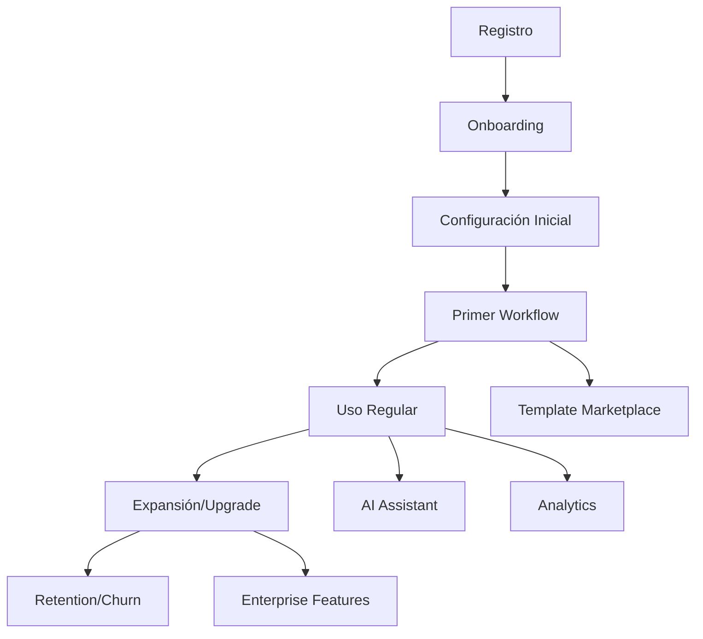

# 01. System Overview

## 🎯 Propósito del Sistema

**Agente Virtual IA** es una plataforma integral de automatización inteligente con IA diseñada para empresas modernas. El sistema permite a las organizaciones crear, gestionar y ejecutar workflows automatizados usando tecnologías de inteligencia artificial.

## 🏢 Contexto de Negocio

### Problema que Resuelve
- **Automatización Manual**: Empresas con procesos manuales repetitivos
- **Falta de Integración**: Sistemas desconectados sin comunicación efectiva
- **Escalabilidad Limitada**: Dificultad para escalar operaciones sin aumentar recursos humanos
- **Complejidad Técnica**: Barreras técnicas para implementar automatización

### Propuesta de Valor
- **Automatización Inteligente**: Workflows con capacidades de IA integradas
- **Multi-tenant**: Soporte para múltiples organizaciones en una sola plataforma
- **Marketplace**: Plantillas pre-construidas y monetización de contenido
- **Enterprise-Ready**: Seguridad, compliance y escalabilidad empresarial

## 👥 Stakeholders

### Usuarios Primarios
1. **Administradores de Empresa**
   - Configuración de tenants y límites
   - Gestión de usuarios y permisos
   - Monitoreo de métricas y costos

2. **Desarrolladores/Automatizadores**
   - Creación y configuración de workflows
   - Integración con sistemas externos
   - Debugging y optimización

3. **Usuarios de Negocio**
   - Ejecución de workflows automatizados
   - Consulta de resultados y reportes
   - Configuración básica de procesos

### Usuarios Secundarios
1. **Creadores de Plantillas**
   - Desarrollo de workflows reutilizables
   - Monetización a través del marketplace

2. **Soporte Técnico**
   - Resolución de incidentes
   - Monitoreo del sistema
   - Atención al cliente

3. **Auditores/Compliance**
   - Revisión de logs de auditoría
   - Verificación de controles de seguridad
   - Compliance reporting

## 🎯 Objetivos del Sistema

### Objetivos Funcionales
- ✅ **Gestión de Workflows**: CRUD completo de workflows automatizados
- ✅ **Ejecución Confiable**: Procesamiento robusto con manejo de errores
- ✅ **Multi-tenancy**: Aislamiento completo entre organizaciones
- ✅ **Marketplace**: Catalogación y monetización de plantillas
- ✅ **Analytics**: Métricas de rendimiento y business intelligence
- ✅ **Billing**: Sistema de facturación por consumo con Stripe
- ✅ **Soporte**: Sistema integral de atención al cliente

### Objetivos No Funcionales
- ⚡ **Performance**: < 2s tiempo de respuesta para operaciones críticas
- 🔒 **Security**: Autenticación robusta y cifrado end-to-end
- 📈 **Scalability**: Soporte para 10,000+ workflows concurrentes
- 🛡️ **Reliability**: 99.9% uptime con recovery automático
- 🌍 **Availability**: Disponibilidad global 24/7
- 🔄 **Maintainability**: Arquitectura modular y bien documentada

## 🏗️ Características Principales

### 🤖 AI-Powered Automation
- **AI Assistant**: Asistente inteligente para crear y optimizar workflows
- **Error Analysis**: Análisis automático de errores con sugerencias de corrección
- **Workflow Generation**: Generación automática de workflows desde descripción natural
- **Performance Optimization**: Sugerencias de optimización basadas en ML

### 🔐 Enterprise Security
- **JWT Authentication**: Autenticación robusta con tokens seguros
- **Multi-factor Authentication**: 2FA para cuentas empresariales
- **Role-based Access Control**: Permisos granulares por rol
- **Audit Logging**: Trazabilidad completa de acciones

### 📊 Analytics & Monitoring
- **Real-time Metrics**: Dashboard con métricas en tiempo real
- **Financial Analytics**: Análisis de costos y revenue
- **Operational KPIs**: Monitoreo de performance operacional
- **Custom Reports**: Reportes personalizables por cliente

### 🛒 Marketplace
- **Template Catalog**: Catálogo de workflows pre-construidos
- **Creator Economy**: Monetización para creadores de contenido
- **Rating System**: Sistema de reviews y calificaciones
- **Automatic Payouts**: Distribución automática de revenue

### 🌍 Internationalization
- **Multi-language**: Soporte para 8+ idiomas
- **Multi-currency**: Facturación en múltiples monedas
- **Regional Compliance**: Adaptación a regulaciones locales
- **Localized Content**: Contenido adaptado por región

## 📏 Métricas de Éxito

### Métricas de Usuario
- **Monthly Active Users (MAU)**: Meta > 1,000 usuarios
- **Workflow Execution Success Rate**: > 99.5%
- **User Satisfaction (NPS)**: Score > 8.0
- **Time to Value**: < 24 horas para primer workflow

### Métricas de Negocio
- **Monthly Recurring Revenue (MRR)**: Crecimiento 20% mensual
- **Customer Acquisition Cost (CAC)**: < 3x LTV
- **Churn Rate**: < 5% mensual
- **Marketplace Revenue Share**: 15% de ingresos totales

### Métricas Técnicas
- **System Uptime**: > 99.9%
- **Response Time (P95)**: < 2 segundos
- **Error Rate**: < 0.1% de ejecuciones
- **Data Processing Latency**: < 5 minutos

## 🔄 Ciclo de Vida del Usuario

## 🏁 Estado Actual

### Fases Completadas ✅
- **Fase 0**: Discovery y arquitectura base
- **Fase 1**: Sistema de pricing y billing
- **Fase 2**: ICP y segmentación de clientes
- **Fase 3**: GTM y estrategia de ventas
- **Fase 4**: Seguridad y compliance
- **Fase 5**: Onboarding y time-to-value
- **Fase 7**: Diferenciadores competitivos
- **Fase 8**: Billing y finanzas avanzado
- **Fase 9**: Documentación y soporte
- **Fase 10**: Soporte y customer success
- **Fase 11**: Analytics y reporting
- **Fase 12**: Marketplace monetizado
- **Fase 13**: Orchestrator multi-tenancy
- **Fase 14**: AI Assistant
- **Fase 15**: Internacionalización
- **Fase 16**: Legal y compliance

### Próximos Pasos 🔄
- Optimización continua de performance
- Expansión a nuevos mercados
- Integración con más sistemas empresariales
- Evolución del AI Assistant

---

**Próximo documento**: [02. Architecture Overview](./02-architecture-overview.md)