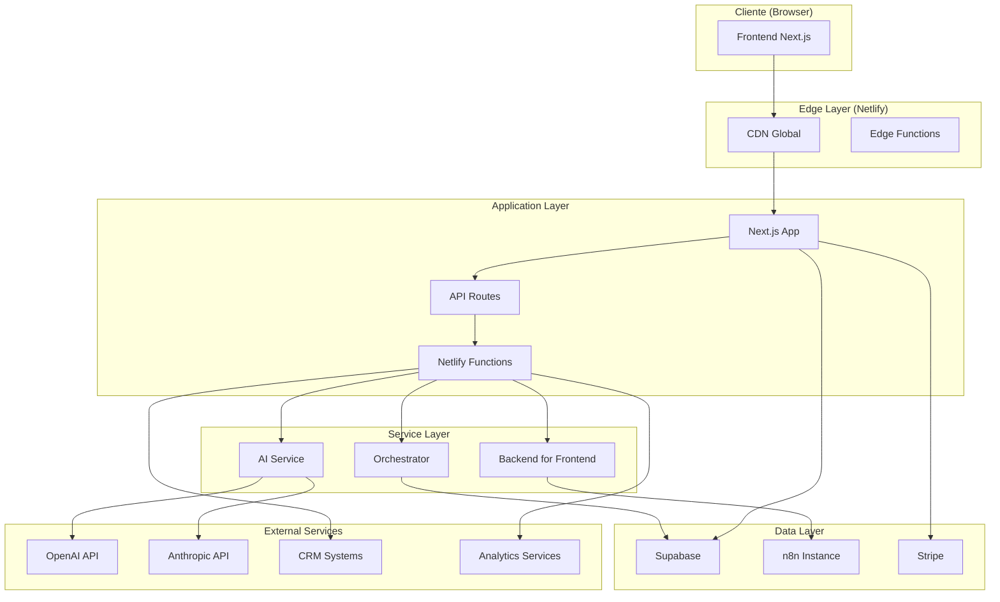
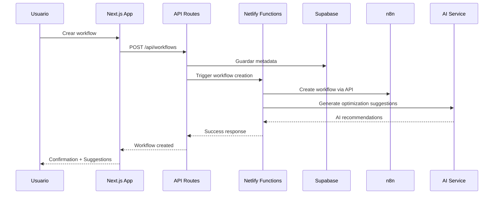

# 02. Architecture Overview

## 🏗️ Arquitectura de Alto Nivel

El sistema **Agente Virtual IA** sigue una arquitectura moderna de **microservicios híbridos** que combina la simplicidad de una aplicación monolítica frontend con servicios especializados para funcionalidades críticas.



## 🏛️ Patrones Arquitectónicos

### 1. **Jamstack Architecture**
- **Frontend estático** pre-renderizado con Next.js
- **API serverless** mediante Netlify Functions
- **CDN global** para distribución optimizada
- **Progressive Enhancement** para funcionalidades avanzadas

### 2. **Backend for Frontend (BFF)**
- **Capa de adaptación** entre frontend y servicios externos
- **Agregación de datos** de múltiples fuentes
- **Transformación de APIs** para optimizar consumo frontend
- **Proxy seguro** hacia servicios como n8n

### 3. **Event-Driven Architecture**
- **Webhooks** para comunicación asíncrona
- **Event sourcing** para auditoría y trazabilidad
- **Scheduled functions** para tareas periódicas
- **Real-time updates** mediante WebSockets cuando necesario

### 4. **Multi-Tenant Architecture**
- **Tenant isolation** a nivel de datos y aplicación
- **Shared infrastructure** con límites configurables
- **Resource pooling** para optimización de costos
- **Per-tenant configuration** flexible

## 🎯 Principios de Diseño

### 1. **Separation of Concerns**
```typescript
// Ejemplo de separación clara de responsabilidades
interface WorkflowService {
  create(workflow: Workflow): Promise<Workflow>
  execute(id: string): Promise<ExecutionResult>
  monitor(id: string): Promise<MetricsData>
}

interface BillingService {
  calculateUsage(tenantId: string): Promise<UsageData>
  processPayment(invoice: Invoice): Promise<PaymentResult>
}
```

### 2. **API-First Design**
- **OpenAPI specifications** para todas las APIs
- **Contract-first development** con esquemas definidos
- **Versioning strategy** para evolución de APIs
- **Documentation auto-generation** desde código

### 3. **Security by Design**
- **Zero-trust architecture** sin confianza implícita
- **Defense in depth** con múltiples capas de seguridad
- **Least privilege principle** en todos los niveles
- **Security headers** y CSP configurados

### 4. **Observability First**
- **Structured logging** con contexto completo
- **Distributed tracing** para requests cross-service
- **Custom metrics** para KPIs de negocio
- **Alerting strategy** proactiva

## 📊 Architectural Drivers

### Calidad Requerida vs Decisiones Arquitectónicas

| Quality Attribute | Decisión Arquitectónica | Rationale |
|-------------------|------------------------|-----------|
| **Scalability** | Serverless functions + CDN | Auto-scaling sin gestión de infraestructura |
| **Performance** | Edge computing + Caching | Latencia mínima global |
| **Security** | Zero-trust + JWT | Múltiples capas de protección |
| **Maintainability** | Modular monolith + Services | Balance entre simplicidad y flexibilidad |
| **Cost Efficiency** | Pay-per-use serverless | Costos alineados con usage real |
| **Developer Experience** | TypeScript + Hot reload | Productividad y calidad de código |

## 🔄 Data Flow Architecture



## 🏢 Multi-Tenant Architecture

### Tenant Isolation Strategy

```typescript
// Ejemplo de aislamiento por tenant
interface TenantContext {
  tenantId: string
  configuration: TenantConfig
  limits: ResourceLimits
  billing: BillingPlan
}

// Middleware para inyección de contexto
export function withTenantContext(handler: TenantHandler) {
  return async (req: Request, res: Response) => {
    const tenant = await extractTenant(req)
    const context = await buildTenantContext(tenant)
    return handler(req, res, context)
  }
}
```

### Resource Allocation

| Recurso | Shared | Per-Tenant | Hybrid |
|---------|--------|------------|--------|
| **Database** | ❌ | ✅ | Schema isolation |
| **Compute** | ✅ | ❌ | Shared functions |
| **Storage** | ❌ | ✅ | Per-tenant buckets |
| **APIs** | ✅ | ❌ | Rate limiting per tenant |
| **Monitoring** | ✅ | ✅ | Shared infra, tenant metrics |

## 🔧 Technology Alignment

### Frontend Stack
```typescript
// Next.js App Router con TypeScript
export default function WorkflowPage({ params }: PageProps) {
  return (
    <Suspense fallback={<WorkflowSkeleton />}>
      <WorkflowManager workflowId={params.id} />
    </Suspense>
  )
}

// React Server Components para performance
async function WorkflowManager({ workflowId }: Props) {
  const workflow = await getWorkflow(workflowId) // Server-side fetch
  return <WorkflowEditor workflow={workflow} />
}
```

### Backend Services
```typescript
// Serverless functions con TypeScript
export const handler: Handler = async (event) => {
  const { tenantId, workflowId } = JSON.parse(event.body)
  
  // Dependency injection pattern
  const services = createServiceContainer(tenantId)
  const result = await services.workflow.execute(workflowId)
  
  return {
    statusCode: 200,
    body: JSON.stringify(result)
  }
}
```

## 📈 Scalability Patterns

### Horizontal Scaling
- **Auto-scaling serverless functions** basado en demanda
- **CDN edge locations** para distribución global
- **Database read replicas** para queries de solo lectura
- **Background job queues** para procesamiento asíncrono

### Vertical Scaling
- **Memory optimization** en funciones críticas
- **CPU allocation** dinámico según carga
- **Connection pooling** para base de datos
- **Caching strategies** multi-nivel

### Data Scaling
- **Partitioning by tenant** para aislamiento
- **Archive strategies** para datos históricos
- **Compression** para reducir storage costs
- **CDN caching** para assets estáticos

## 🎭 Deployment Patterns

### Blue-Green Deployment
- **Parallel environments** para testing completo
- **Traffic switching** instantáneo
- **Rollback capability** en segundos
- **Database migration** strategies

### Feature Flags
```typescript
// Feature flag implementation
export function useFeatureFlag(flag: string, tenantId: string) {
  return featureFlags.isEnabled(flag, { tenantId })
}

// Conditional rendering
if (useFeatureFlag('ai-assistant', tenant.id)) {
  return <AIAssistantWidget />
}
```

## 🔍 Monitoring & Observability

### Application Performance Monitoring
- **Real User Monitoring (RUM)** para métricas frontend
- **Synthetic monitoring** para health checks
- **Error tracking** con contexto completo
- **Performance budgets** automatizados

### Business Intelligence
- **Custom dashboards** por stakeholder
- **Real-time KPIs** actualizados por evento
- **Predictive analytics** para planning
- **Automated alerting** basado en anomalías

---

**Próximo documento**: [03. Technology Stack](./03-technology-stack.md)