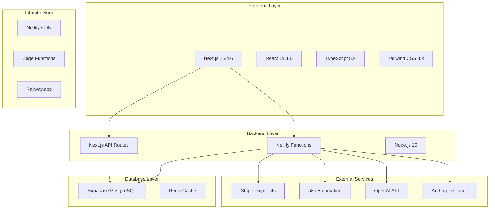

# 03. Technology Stack

## 🎯 Stack Overview

**Agente Virtual IA** utiliza un stack tecnológico moderno y bien establecido, optimizado para desarrollo rápido, escalabilidad y mantenibilidad empresarial.



## 🎨 Frontend Stack

### Core Framework
```json
{
  "next": "15.4.6",
  "react": "19.1.0", 
  "react-dom": "19.1.0",
  "typescript": "^5"
}
```

#### **Next.js 15.4.6** - Framework Principal
- **App Router**: Nueva arquitectura de routing
- **React Server Components**: Rendering del lado del servidor
- **Turbopack**: Bundle optimizer para desarrollo rápido
- **Static Generation**: Pre-rendering para performance óptimo

```typescript
// Ejemplo de uso App Router
export default function WorkflowsPage() {
  return (
    <Suspense fallback={<WorkflowsSkeleton />}>
      <WorkflowsList />
    </Suspense>
  )
}

// Server Component con data fetching
async function WorkflowsList() {
  const workflows = await getWorkflows() // Server-side
  return <WorkflowGrid workflows={workflows} />
}
```

### UI/UX Libraries
```json
{
  "@radix-ui/react-dialog": "^1.1.14",
  "@radix-ui/react-dropdown-menu": "^2.1.15",
  "tailwindcss": "^4",
  "lucide-react": "^0.539.0",
  "next-themes": "^0.4.6"
}
```

#### **Tailwind CSS 4.x** - Styling Framework
- **Utility-first**: Clases atómicas para styling rápido
- **Design System**: Variables CSS personalizadas
- **Dark Mode**: Soporte nativo para temas
- **Responsive Design**: Mobile-first approach

```css
/* Tema personalizado Agente Virtual IA */
:root {
  --primary: oklch(0.5 0.25 264); /* Azul corporativo */
  --background: oklch(1 0 0);
  --foreground: oklch(0.15 0 0);
}

@media (prefers-color-scheme: dark) {
  :root {
    --background: oklch(0.05 0 0);
    --foreground: oklch(0.95 0 0);
  }
}
```

#### **Radix UI** - Component Library
- **Accessibility**: ARIA compliance nativo
- **Unstyled Components**: Flexibilidad total de styling
- **Keyboard Navigation**: Soporte completo de teclado
- **Focus Management**: Control profesional de focus

### State Management & Data Fetching
```json
{
  "next-intl": "^4.3.4",
  "axios": "^1.11.0",
  "zod": "^3.22.4"
}
```

#### **React Server Components** - State Architecture
- **Server State**: Datos fetcheados en servidor
- **Client State**: Estado local con useState/useReducer
- **URL State**: Parámetros y query strings
- **Cache State**: Automático con Next.js fetch

```typescript
// Schema validation con Zod
const WorkflowSchema = z.object({
  id: z.string().uuid(),
  name: z.string().min(1),
  active: z.boolean(),
  tenantId: z.string()
})

type Workflow = z.infer<typeof WorkflowSchema>

// Type-safe API client
async function getWorkflows(): Promise<Workflow[]> {
  const response = await fetch('/api/workflows')
  const data = await response.json()
  return WorkflowSchema.array().parse(data)
}
```

## ⚙️ Backend Stack

### Runtime & Framework
```json
{
  "@netlify/functions": "^4.2.1",
  "node": "20.x"
}
```

#### **Node.js 20** - Runtime Environment
- **ES Modules**: Soporte nativo para import/export
- **Performance**: V8 engine optimizado
- **Security**: Security patches automáticos
- **LTS Support**: Soporte extendido hasta 2026

#### **Netlify Functions** - Serverless Backend
- **Auto-scaling**: Escalado automático basado en demanda
- **Edge Computing**: Ejecución cerca del usuario
- **Cold Start Optimization**: Tiempos de inicio mínimos
- **Built-in Monitoring**: Métricas y logs integrados

```typescript
// Netlify Function con TypeScript
import { Handler, HandlerEvent } from '@netlify/functions'
import { createServerlessHandler } from '../lib/serverless'

export const handler: Handler = createServerlessHandler({
  auth: true,
  rateLimit: { requests: 100, window: '1h' },
  handler: async (event: HandlerEvent, context: Context) => {
    const { tenantId } = context.user
    const workflows = await getWorkflowsByTenant(tenantId)
    
    return {
      statusCode: 200,
      headers: { 'Content-Type': 'application/json' },
      body: JSON.stringify(workflows)
    }
  }
})
```

### Authentication & Security
```json
{
  "jsonwebtoken": "^9.0.2",
  "crypto-js": "^4.2.0",
  "@supabase/auth-helpers-nextjs": "^0.10.0"
}
```

#### **JWT + Supabase Auth** - Authentication Strategy
- **Stateless Authentication**: No server session storage
- **HTTP-only Cookies**: XSS protection
- **Refresh Token Rotation**: Security best practices
- **Multi-factor Authentication**: 2FA support

```typescript
// JWT middleware implementation
export function withAuth(handler: AuthenticatedHandler) {
  return async (event: HandlerEvent) => {
    const token = extractToken(event.headers)
    
    if (!token) {
      return { statusCode: 401, body: 'Unauthorized' }
    }
    
    try {
      const payload = jwt.verify(token, process.env.JWT_SECRET!)
      const context = { user: payload as JWTPayload }
      return handler(event, context)
    } catch (error) {
      return { statusCode: 401, body: 'Invalid token' }
    }
  }
}
```

## 💾 Database & Storage

### Primary Database
```yaml
Supabase PostgreSQL:
  version: "15.x"
  features:
    - Row Level Security (RLS)
    - Real-time subscriptions
    - Auto-generated APIs
    - Built-in authentication
  extensions:
    - pg_stat_statements
    - pg_cron
    - uuid-ossp
```

#### **Supabase** - Backend-as-a-Service
- **PostgreSQL**: Base de datos relacional robusta
- **Real-time**: WebSocket subscriptions automáticas
- **Auto APIs**: REST y GraphQL generados automáticamente
- **Edge Functions**: Serverless functions integradas

```sql
-- Schema example con RLS
CREATE TABLE workflows (
  id UUID PRIMARY KEY DEFAULT gen_random_uuid(),
  tenant_id UUID NOT NULL REFERENCES tenants(id),
  name VARCHAR(255) NOT NULL,
  config JSONB,
  active BOOLEAN DEFAULT false,
  created_at TIMESTAMPTZ DEFAULT NOW()
);

-- Row Level Security
ALTER TABLE workflows ENABLE ROW LEVEL SECURITY;

CREATE POLICY workflows_tenant_isolation ON workflows
  FOR ALL USING (tenant_id = auth.jwt() ->> 'tenant_id');
```

### Caching Strategy
```typescript
// Multi-level caching implementation
interface CacheConfig {
  ttl: number
  strategy: 'memory' | 'redis' | 'cdn'
}

class CacheManager {
  async get<T>(key: string, config: CacheConfig): Promise<T | null> {
    // L1: Memory cache (fastest)
    if (config.strategy === 'memory') {
      return this.memoryCache.get(key)
    }
    
    // L2: Redis cache (fast, shared)
    if (config.strategy === 'redis') {
      return this.redisCache.get(key)
    }
    
    // L3: CDN cache (edge locations)
    return this.cdnCache.get(key)
  }
}
```

## 🔌 External Integrations

### Payment Processing
```json
{
  "stripe": "^18.4.0",
  "@stripe/stripe-js": "^7.8.0"
}
```

#### **Stripe** - Payment Infrastructure
- **Subscription Billing**: Recurring payments automáticos
- **Usage-based Billing**: Facturación por consumo
- **Multi-currency**: Soporte para múltiples monedas
- **Connect Platform**: Marketplace payouts

```typescript
// Stripe integration example
import Stripe from 'stripe'

const stripe = new Stripe(process.env.STRIPE_SECRET_KEY!)

export async function createUsageRecord(
  customerId: string,
  usage: number
) {
  return stripe.subscriptionItems.createUsageRecord(
    subscription.items.data[0].id,
    {
      quantity: usage,
      timestamp: Math.floor(Date.now() / 1000),
      action: 'increment'
    }
  )
}
```

### AI Services
```typescript
// AI service abstraction
interface AIProvider {
  name: 'openai' | 'anthropic'
  generateWorkflow(prompt: string): Promise<WorkflowSpec>
  explainError(error: string): Promise<string>
  optimizePerformance(workflow: Workflow): Promise<OptimizationSuggestion[]>
}

class OpenAIProvider implements AIProvider {
  name = 'openai' as const
  
  async generateWorkflow(prompt: string): Promise<WorkflowSpec> {
    const response = await openai.chat.completions.create({
      model: 'gpt-4',
      messages: [
        { role: 'system', content: WORKFLOW_GENERATION_PROMPT },
        { role: 'user', content: prompt }
      ]
    })
    
    return parseWorkflowSpec(response.choices[0].message.content)
  }
}
```

### Automation Engine
```yaml
n8n Integration:
  deployment: "Self-hosted / Railway.app"
  api_version: "v1"
  features:
    - Workflow CRUD operations
    - Execution monitoring
    - Webhook endpoints
    - Custom node development
```

## 🛠️ Development Tools

### Code Quality
```json
{
  "eslint": "^9",
  "eslint-config-next": "15.4.6",
  "typescript": "^5"
}
```

#### **ESLint + TypeScript** - Code Quality
- **Strict TypeScript**: Configuración estricta de tipos
- **Next.js Rules**: Reglas específicas de Next.js
- **Custom Rules**: Reglas personalizadas del proyecto
- **Auto-fix**: Corrección automática donde sea posible

```typescript
// tsconfig.json strict configuration
{
  "compilerOptions": {
    "strict": true,
    "noUncheckedIndexedAccess": true,
    "exactOptionalPropertyTypes": true,
    "noImplicitReturns": true,
    "noFallthroughCasesInSwitch": true
  }
}
```

### Testing Framework
```json
{
  "jest": "^29.7.0",
  "jest-environment-jsdom": "^29.7.0",
  "@testing-library/react": "^16.0.1",
  "@testing-library/jest-dom": "^6.1.5",
  "@testing-library/user-event": "^14.5.1"
}
```

#### **Jest + React Testing Library** - Testing Stack
- **Unit Tests**: Componentes y funciones individuales
- **Integration Tests**: Flujos completos de usuario
- **Snapshot Tests**: Regression testing de UI
- **Mock Services**: Aislamiento de dependencias externas

```typescript
// Example test with RTL
import { render, screen, fireEvent } from '@testing-library/react'
import { WorkflowCard } from '../WorkflowCard'

describe('WorkflowCard', () => {
  it('should toggle workflow status when clicked', async () => {
    const mockWorkflow = { id: '1', name: 'Test', active: false }
    const mockToggle = jest.fn()
    
    render(
      <WorkflowCard 
        workflow={mockWorkflow} 
        onToggle={mockToggle} 
      />
    )
    
    fireEvent.click(screen.getByRole('switch'))
    expect(mockToggle).toHaveBeenCalledWith('1', true)
  })
})
```

## 📦 Build & Deployment

### Build Tools
```json
{
  "build": "next build",
  "dev": "next dev --turbopack",
  "start": "next start"
}
```

#### **Turbopack** - Development Build Tool
- **Fast Refresh**: Hot reloading instantáneo
- **Incremental Compilation**: Solo recompila lo necesario
- **Memory Efficient**: Uso optimizado de memoria
- **TypeScript Integration**: Type checking integrado

### Deployment Pipeline
```yaml
# netlify.toml
[build]
  publish = ".next"
  command = "npm install --legacy-peer-deps && npm run build"

[build.environment]
  NODE_VERSION = "20"
  NEXT_PUBLIC_DEFAULT_LOCALE = "es-419"
  
# Scheduled functions
[functions.usage-collector]
  schedule = "*/10 * * * *"  # Every 10 minutes

[functions.billing-enforcement]
  schedule = "0 * * * *"  # Every hour
```

## 📊 Monitoring & Analytics

### Observability Stack
```typescript
// Structured logging example
import { Logger } from './lib/logger'

const logger = new Logger({
  service: 'workflow-service',
  version: process.env.npm_package_version
})

export async function executeWorkflow(id: string) {
  const span = logger.startSpan('workflow.execute', { workflowId: id })
  
  try {
    const result = await n8n.executeWorkflow(id)
    span.setTag('success', true)
    span.setTag('duration', result.executionTime)
    return result
  } catch (error) {
    span.setTag('error', error.message)
    span.setTag('success', false)
    throw error
  } finally {
    span.finish()
  }
}
```

## 🔄 Version Management

### Current Versions
| Component | Version | LTS Until | Notes |
|-----------|---------|-----------|-------|
| Node.js | 20.x | 2026-04-30 | Current LTS |
| Next.js | 15.4.6 | - | Latest stable |
| React | 19.1.0 | - | Latest stable |
| TypeScript | 5.x | - | Latest stable |
| Supabase | Latest | - | Managed service |
| Stripe API | 2023-10-16 | - | Stable version |

### Upgrade Strategy
- **Monthly**: Dependencies menores y patches de seguridad
- **Quarterly**: Versiones menores de frameworks principales
- **Bi-annually**: Evaluación de versiones mayores
- **As-needed**: Security patches críticos

---

**Próximo documento**: [04. System Context](./04-system-context.md)