# 04. System Context

## 🌍 System Context Diagram

El siguiente diagrama muestra **Agente Virtual IA** en su contexto, incluyendo usuarios, sistemas externos e integraciones principales.

```mermaid
graph TB
    subgraph "Users & Stakeholders"
        ADMIN[👨‍💼 Administradores<br/>Empresa]
        DEV[👨‍💻 Desarrolladores<br/>Automatización] 
        BIZ[👩‍💼 Usuarios<br/>Negocio]
        CREATOR[🎨 Creadores<br/>Plantillas]
        SUPPORT[🎧 Soporte<br/>Técnico]
    end
    
    subgraph "Agente Virtual IA Platform"
        CORE[🤖 Agente Virtual IA<br/>Core Platform]
    end
    
    subgraph "External Systems"
        N8N[⚡ n8n<br/>Automation Engine]
        STRIPE[💳 Stripe<br/>Payment Processing]
        OPENAI[🧠 OpenAI<br/>AI Services]
        CLAUDE[🤖 Anthropic Claude<br/>AI Assistant]
        SUPABASE[🗄️ Supabase<br/>Database & Auth]
    end
    
    subgraph "Third-party Integrations"
        CRM[📊 CRM Systems<br/>HubSpot, Salesforce]
        ACCOUNTING[📈 Accounting<br/>QuickBooks, Siigo]
        COMMS[📧 Communications<br/>Email, Slack, Teams]
        APIS[🔌 External APIs<br/>REST, GraphQL]
    end
    
    subgraph "Infrastructure"
        NETLIFY[☁️ Netlify<br/>Hosting & CDN]
        RAILWAY[🚂 Railway<br/>Service Hosting]
        MONITORING[📊 Monitoring<br/>Observability]
    end
    
    %% User interactions
    ADMIN -->|Gestiona configuración| CORE
    DEV -->|Crea workflows| CORE
    BIZ -->|Ejecuta procesos| CORE
    CREATOR -->|Publica plantillas| CORE
    SUPPORT -->|Resuelve tickets| CORE
    
    %% Core system dependencies
    CORE -->|Ejecuta workflows| N8N
    CORE -->|Procesa pagos| STRIPE
    CORE -->|Genera contenido IA| OPENAI
    CORE -->|Asistente inteligente| CLAUDE
    CORE -->|Almacena datos| SUPABASE
    
    %% External integrations
    CORE -->|Sincroniza leads| CRM
    CORE -->|Reportes financieros| ACCOUNTING
    CORE -->|Notificaciones| COMMS
    CORE -->|Integra servicios| APIS
    
    %% Infrastructure dependencies
    CORE -->|Despliega frontend| NETLIFY
    N8N -->|Hospeda servicios| RAILWAY
    CORE -->|Monitorea sistema| MONITORING
    
    %% Data flows
    N8N -.->|Webhooks| CORE
    STRIPE -.->|Payment events| CORE
    CRM -.->|Lead updates| CORE
```



## 👥 Actors & Stakeholders

### Primary Users

#### 1. **Administradores de Empresa** 👨‍💼
**Responsabilidades:**
- Configuración de tenant y límites de recursos
- Gestión de usuarios y roles dentro de la organización
- Monitoreo de costos y usage analytics
- Configuración de integraciones empresariales
- Compliance y auditoría

**Interactions con el sistema:**
```typescript
// Admin dashboard típico
interface AdminDashboard {
  tenantMetrics: TenantUsageMetrics
  userManagement: UserManagementPanel
  billingOverview: BillingDashboard
  securityAudit: SecurityAuditPanel
  integrationStatus: IntegrationHealthCheck
}
```

#### 2. **Desarrolladores/Automatizadores** 👨‍💻
**Responsabilidades:**
- Diseño y creación de workflows automatizados
- Configuración de integraciones con sistemas externos
- Debugging y optimización de procesos
- Mantenimiento de conectores personalizados

**Interactions con el sistema:**
```typescript
// Developer workflow interface
interface DeveloperWorkspace {
  workflowBuilder: VisualWorkflowEditor
  debugConsole: ExecutionDebugger
  apiExplorer: IntegrationTestingTool
  performanceAnalytics: WorkflowPerformanceMetrics
}
```

#### 3. **Usuarios de Negocio** 👩‍💼
**Responsabilidades:**
- Ejecución de workflows pre-configurados
- Monitoreo de resultados de automatización
- Configuración básica de parámetros de proceso
- Reporting de problemas y solicitudes de mejora

**Interactions con el sistema:**
```typescript
// Business user interface
interface BusinessUserDashboard {
  quickActions: WorkflowExecutionButtons
  processMonitoring: ExecutionStatusBoard
  resultsDashboard: BusinessMetricsDashboard
  helpCenter: SelfServiceSupport
}
```

### Secondary Users

#### 4. **Creadores de Plantillas** 🎨
**Responsabilidades:**
- Desarrollo de workflows reutilizables para marketplace
- Documentación y mantenimiento de plantillas
- Atención al cliente para sus productos
- Optimización basada en feedback de usuarios

#### 5. **Soporte Técnico** 🎧
**Responsabilidades:**
- Resolución de tickets de soporte
- Monitoreo proactivo del sistema
- Escalación de problemas técnicos
- Atención al cliente y onboarding

## 🔌 External Systems

### Core Dependencies

#### **n8n Automation Engine** ⚡
```yaml
Purpose: "Workflow execution engine"
Relationship: "Primary automation backend"
Integration_Type: "REST API + Webhooks"
Data_Flow: "Bidirectional"
Dependencies:
  - Workflow definitions
  - Execution monitoring
  - Error handling
  - Performance metrics
```

**API Integration Example:**
```typescript
// n8n client integration
export class N8nClient {
  async createWorkflow(workflow: WorkflowDefinition): Promise<N8nWorkflow> {
    const response = await this.httpClient.post('/workflows', {
      name: workflow.name,
      nodes: workflow.nodes,
      connections: workflow.connections,
      active: false
    })
    return response.data
  }
  
  async executeWorkflow(id: string, data?: any): Promise<ExecutionResult> {
    return this.httpClient.post(`/workflows/${id}/execute`, data)
  }
}
```

#### **Stripe Payment Platform** 💳
```yaml
Purpose: "Payment processing and billing"
Relationship: "Primary payment provider"
Integration_Type: "REST API + Webhooks"
Data_Flow: "Bidirectional"
Features:
  - Subscription management
  - Usage-based billing
  - Multi-currency support
  - Connect marketplace
```

**Stripe Integration:**
```typescript
// Stripe billing integration
export class BillingService {
  async createSubscription(customerId: string, priceId: string) {
    return stripe.subscriptions.create({
      customer: customerId,
      items: [{ price: priceId }],
      payment_behavior: 'default_incomplete',
      expand: ['latest_invoice.payment_intent']
    })
  }
  
  async recordUsage(subscriptionItemId: string, quantity: number) {
    return stripe.subscriptionItems.createUsageRecord(subscriptionItemId, {
      quantity,
      timestamp: Math.floor(Date.now() / 1000)
    })
  }
}
```

#### **Supabase Backend** 🗄️
```yaml
Purpose: "Database, authentication, and real-time features"
Relationship: "Primary data layer"
Integration_Type: "Client SDK + REST API"
Data_Flow: "Bidirectional + Real-time"
Features:
  - PostgreSQL database
  - Row-level security
  - Real-time subscriptions
  - Authentication management
```

### AI Services

#### **OpenAI GPT Models** 🧠
```typescript
// OpenAI integration for workflow generation
export class WorkflowGenerator {
  async generateFromPrompt(prompt: string): Promise<WorkflowSpec> {
    const completion = await openai.chat.completions.create({
      model: 'gpt-4',
      messages: [
        { role: 'system', content: WORKFLOW_SYSTEM_PROMPT },
        { role: 'user', content: prompt }
      ],
      temperature: 0.3
    })
    
    return this.parseWorkflowSpec(completion.choices[0].message.content)
  }
}
```

#### **Anthropic Claude** 🤖
```typescript
// Claude integration for AI assistant
export class AIAssistant {
  async analyzeWorkflowError(error: WorkflowError): Promise<ErrorAnalysis> {
    const response = await anthropic.messages.create({
      model: 'claude-3-sonnet-20240229',
      max_tokens: 1000,
      messages: [{
        role: 'user',
        content: `Analyze this workflow error and suggest fixes: ${error.message}`
      }]
    })
    
    return this.parseErrorAnalysis(response.content[0].text)
  }
}
```

### Third-party Integrations

#### **CRM Systems** 📊
```yaml
Supported_Systems:
  - HubSpot: "Lead management and sales pipeline"
  - Salesforce: "Enterprise CRM integration"
  - Pipedrive: "SMB sales management"
  - Zendesk: "Customer support integration"

Integration_Pattern: "OAuth 2.0 + REST APIs"
Sync_Strategy: "Bidirectional real-time webhooks"
```

#### **Accounting Systems** 📈
```yaml
Supported_Systems:
  - QuickBooks: "North American accounting"
  - Siigo: "Colombian accounting"
  - Contabilidad.com: "LATAM accounting"

Data_Types:
  - Invoices and payments
  - Customer records
  - Financial reporting
  - Tax compliance data
```

### Infrastructure Dependencies

#### **Netlify Platform** ☁️
```yaml
Services_Used:
  - Static site hosting
  - Serverless functions
  - Edge functions
  - CDN distribution
  - Build automation
  - Environment management

Deployment_Strategy: "Git-based continuous deployment"
Geographic_Distribution: "Global edge network"
```

#### **Railway App** 🚂
```yaml
Purpose: "Container hosting for microservices"
Services_Hosted:
  - n8n instances
  - AI service backend
  - Orchestrator service
  - Background job processors

Scaling: "Auto-scaling based on resource usage"
```

## 🔄 Data Flow Patterns

### Real-time Data Flow


### Webhook Event Flow


## 🛡️ Security Boundaries

### Trust Zones


### Authentication Flow
```typescript
// Multi-layer authentication
interface SecurityContext {
  userAuth: JWTPayload      // User authentication
  tenantAuth: TenantContext // Tenant isolation
  serviceAuth: ServiceToken // Service-to-service
  apiAuth: APIKeyAuth      // External API access
}

// Request flow with security layers
export async function secureRequestHandler(req: Request) {
  // 1. Validate user JWT
  const user = await validateUserToken(req.headers.authorization)
  
  // 2. Extract tenant context
  const tenant = await getTenantContext(user.tenantId)
  
  // 3. Check resource permissions
  await enforcePermissions(user, tenant, req.path)
  
  // 4. Rate limiting
  await enforceRateLimit(user.id, tenant.id)
  
  // 5. Execute business logic
  return processRequest(req, { user, tenant })
}
```

## 📊 System Metrics & SLAs

### Performance SLAs
| Metric | Target | Measurement |
|--------|---------|-------------|
| **Page Load Time** | < 2s | 95th percentile |
| **API Response Time** | < 500ms | 95th percentile |
| **Workflow Execution** | < 30s | 90th percentile |
| **System Uptime** | 99.9% | Monthly |
| **Error Rate** | < 0.1% | Weekly |

### Capacity Planning
```typescript
// System capacity metrics
interface CapacityMetrics {
  concurrentUsers: number        // Current: 500, Max: 5000
  workflowExecutions: number     // Current: 1000/hour, Max: 10000/hour
  apiRequests: number           // Current: 50000/day, Max: 500000/day
  dataStorage: number           // Current: 100GB, Max: 1TB
  functionInvocations: number   // Current: 100000/month, Max: 1M/month
}
```

### Integration Health Monitoring
```typescript
// External system health checks
export class SystemHealthChecker {
  async checkExternalSystems(): Promise<HealthReport> {
    const checks = await Promise.allSettled([
      this.checkN8nHealth(),
      this.checkStripeHealth(), 
      this.checkSupabaseHealth(),
      this.checkOpenAIHealth(),
      this.checkClaudeHealth()
    ])
    
    return this.aggregateHealthReport(checks)
  }
}
```

---

**Próximo documento**: [05. Container Architecture](./05-container-architecture.md)