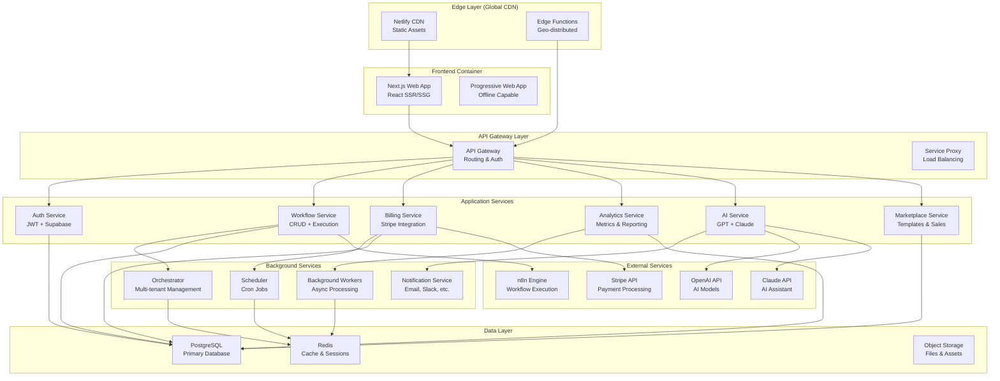

# 05. Container Architecture

## 🏗️ Container Overview

La arquitectura de contenedores de **Agente Virtual IA** está diseñada siguiendo principios de microservicios, con una separación clara de responsabilidades y comunicación bien definida entre servicios.



## 🌐 Frontend Container

### Next.js Web Application
```yaml
Container: "next-js-web-app"
Technology: "Next.js 15 + React 19"
Deployment: "Netlify Edge"
Responsibilities:
  - Server-side rendering (SSR)
  - Static site generation (SSG)
  - Client-side routing
  - State management
  - UI/UX rendering
```

**Container Configuration:**
```typescript
// Next.js configuration for container deployment
const nextConfig = {
  output: 'export', // Static export for CDN
  trailingSlash: true,
  images: {
    unoptimized: true // For static hosting
  },
  experimental: {
    runtime: 'edge' // Edge runtime compatibility
  }
}

export default nextConfig
```

**Service Interface:**
```typescript
// Frontend service interface
interface FrontendService {
  // Server-side rendering
  renderPage(route: string, context: RenderContext): Promise<string>
  
  // Static generation
  generateStaticProps(params: RouteParams): Promise<StaticProps>
  
  // Client hydration
  hydrateClient(initialData: InitialData): void
  
  // Route handling
  handleNavigation(route: string): Promise<void>
}
```

### Progressive Web App (PWA)
```yaml
Features:
  - Service worker for offline capability
  - App manifest for installation
  - Push notifications
  - Background sync
  - Cache-first strategy for static assets
```

```typescript
// Service Worker configuration
self.addEventListener('fetch', (event) => {
  if (event.request.destination === 'document') {
    // Network-first for HTML pages
    event.respondWith(
      fetch(event.request)
        .catch(() => caches.match('/offline.html'))
    )
  } else {
    // Cache-first for static assets
    event.respondWith(
      caches.match(event.request)
        .then(response => response || fetch(event.request))
    )
  }
})
```

## 🚪 API Gateway Layer

### Service Gateway
```yaml
Container: "api-gateway"
Technology: "Netlify Functions + Express"
Responsibilities:
  - Request routing
  - Authentication validation
  - Rate limiting
  - Request/response transformation
  - Service discovery
```

**Gateway Implementation:**
```typescript
// API Gateway router
export class APIGateway {
  private routes = new Map<string, ServiceHandler>()
  
  register(path: string, service: ServiceHandler) {
    this.routes.set(path, service)
  }
  
  async handle(request: Request): Promise<Response> {
    // 1. Authentication
    const auth = await this.validateAuth(request)
    
    // 2. Rate limiting
    await this.enforceRateLimit(auth.userId)
    
    // 3. Route resolution
    const handler = this.resolveRoute(request.url)
    
    // 4. Request forwarding
    return handler(request, { auth })
  }
}
```

### Service Proxy
```typescript
// Service proxy for load balancing
export class ServiceProxy {
  private services: ServiceInstance[] = []
  
  async route(serviceName: string, request: Request): Promise<Response> {
    const instance = this.selectHealthyInstance(serviceName)
    return this.forwardRequest(instance, request)
  }
  
  private selectHealthyInstance(serviceName: string): ServiceInstance {
    const healthy = this.services.filter(s => 
      s.name === serviceName && s.healthy
    )
    return this.roundRobin(healthy)
  }
}
```

## 🔧 Application Services

### Authentication Service
```yaml
Container: "auth-service"
Technology: "Node.js + Supabase Auth"
Responsibilities:
  - JWT token management
  - User authentication
  - Session management
  - Permission validation
  - Multi-factor authentication
```

```typescript
// Authentication service interface
export interface AuthService {
  // User authentication
  login(credentials: LoginCredentials): Promise<AuthResult>
  logout(token: string): Promise<void>
  refresh(refreshToken: string): Promise<AuthResult>
  
  // User management
  createUser(userData: CreateUserData): Promise<User>
  updateUser(id: string, updates: UserUpdates): Promise<User>
  deleteUser(id: string): Promise<void>
  
  // Permission management
  checkPermission(userId: string, resource: string, action: string): Promise<boolean>
  assignRole(userId: string, role: Role): Promise<void>
}
```

### Workflow Service
```yaml
Container: "workflow-service"
Technology: "Node.js + n8n API Client"
Responsibilities:
  - Workflow CRUD operations
  - Execution management
  - Status monitoring
  - Performance tracking
  - Error handling
```

```typescript
// Workflow service implementation
export class WorkflowService {
  async createWorkflow(spec: WorkflowSpec): Promise<Workflow> {
    // 1. Validate workflow specification
    const validation = await this.validateSpec(spec)
    if (!validation.valid) {
      throw new ValidationError(validation.errors)
    }
    
    // 2. Create in database
    const workflow = await this.db.workflows.create({
      name: spec.name,
      tenantId: spec.tenantId,
      nodes: spec.nodes,
      connections: spec.connections
    })
    
    // 3. Create in n8n
    const n8nWorkflow = await this.n8nClient.createWorkflow({
      name: workflow.name,
      nodes: workflow.nodes,
      connections: workflow.connections
    })
    
    // 4. Update with n8n ID
    return this.db.workflows.update(workflow.id, {
      n8nId: n8nWorkflow.id
    })
  }
  
  async executeWorkflow(id: string, data?: any): Promise<ExecutionResult> {
    const workflow = await this.getWorkflow(id)
    
    // Start execution in n8n
    const execution = await this.n8nClient.executeWorkflow(workflow.n8nId, data)
    
    // Track execution in database
    await this.db.executions.create({
      workflowId: id,
      n8nExecutionId: execution.id,
      status: 'running',
      startedAt: new Date()
    })
    
    return execution
  }
}
```

### Billing Service
```yaml
Container: "billing-service"
Technology: "Node.js + Stripe API"
Responsibilities:
  - Subscription management
  - Usage tracking
  - Invoice generation
  - Payment processing
  - Revenue reporting
```

```typescript
// Billing service with Stripe integration
export class BillingService {
  async createSubscription(customerId: string, plan: BillingPlan): Promise<Subscription> {
    const subscription = await stripe.subscriptions.create({
      customer: customerId,
      items: [{
        price: plan.stripePriceId,
        metadata: {
          tenantId: plan.tenantId,
          planType: plan.type
        }
      }],
      billing_cycle_anchor: this.getNextBillingCycle(),
      proration_behavior: 'create_prorations'
    })
    
    return this.db.subscriptions.create({
      stripeId: subscription.id,
      customerId,
      planId: plan.id,
      status: subscription.status
    })
  }
  
  async recordUsage(tenantId: string, usage: UsageData): Promise<void> {
    // Record in database for analytics
    await this.db.usage.create({
      tenantId,
      type: usage.type,
      quantity: usage.quantity,
      timestamp: usage.timestamp
    })
    
    // Report to Stripe for billing
    const subscription = await this.getActiveSubscription(tenantId)
    await stripe.subscriptionItems.createUsageRecord(
      subscription.stripeItemId,
      {
        quantity: usage.quantity,
        timestamp: Math.floor(usage.timestamp.getTime() / 1000)
      }
    )
  }
}
```

### AI Service
```yaml
Container: "ai-service"
Technology: "Node.js + OpenAI/Anthropic APIs"
Responsibilities:
  - Workflow generation
  - Error analysis
  - Performance optimization
  - Content generation
  - AI assistant functionality
```

```typescript
// AI service with multiple provider support
export class AIService {
  private providers: Map<string, AIProvider> = new Map()
  
  constructor() {
    this.providers.set('openai', new OpenAIProvider())
    this.providers.set('anthropic', new AnthropicProvider())
  }
  
  async generateWorkflow(prompt: string, options: GenerationOptions): Promise<WorkflowSpec> {
    const provider = this.selectBestProvider('workflow-generation', options)
    
    const response = await provider.complete({
      messages: [
        { role: 'system', content: WORKFLOW_GENERATION_PROMPT },
        { role: 'user', content: prompt }
      ],
      model: options.model || 'gpt-4',
      temperature: 0.3
    })
    
    return this.parseWorkflowSpec(response.content)
  }
  
  async explainError(error: WorkflowError): Promise<ErrorExplanation> {
    const provider = this.providers.get('anthropic') // Claude better for analysis
    
    const response = await provider.complete({
      messages: [{
        role: 'user',
        content: `Analyze this workflow error and provide a solution:
        
        Error: ${error.message}
        Stack: ${error.stack}
        Context: ${JSON.stringify(error.context)}`
      }],
      model: 'claude-3-sonnet-20240229'
    })
    
    return this.parseErrorExplanation(response.content)
  }
}
```

## 🔄 Background Services

### Orchestrator Service
```yaml
Container: "orchestrator-service"
Technology: "Node.js + Docker Management"
Responsibilities:
  - Multi-tenant resource management
  - Auto-scaling decisions
  - Health monitoring
  - Tenant promotion/demotion
  - Resource allocation
```

```typescript
// Orchestrator for multi-tenant management
export class OrchestratorService {
  async manageTenantResources(): Promise<void> {
    const tenants = await this.db.tenants.findActive()
    
    for (const tenant of tenants) {
      const metrics = await this.getMetrics(tenant.id)
      const decision = await this.makeScalingDecision(tenant, metrics)
      
      switch (decision.action) {
        case 'scale-up':
          await this.scaleUp(tenant, decision.target)
          break
        case 'scale-down':
          await this.scaleDown(tenant, decision.target)
          break
        case 'promote':
          await this.promoteTenant(tenant)
          break
        case 'demote':
          await this.demoteTenant(tenant)
          break
      }
    }
  }
  
  private async makeScalingDecision(
    tenant: Tenant, 
    metrics: TenantMetrics
  ): Promise<ScalingDecision> {
    const rules = await this.getScalingRules(tenant.planType)
    
    // CPU-based scaling
    if (metrics.avgCpuUsage > rules.scaleUpThreshold) {
      return { action: 'scale-up', target: metrics.currentInstances + 1 }
    }
    
    if (metrics.avgCpuUsage < rules.scaleDownThreshold) {
      return { action: 'scale-down', target: Math.max(1, metrics.currentInstances - 1) }
    }
    
    // Plan promotion based on consistent usage
    if (this.shouldPromote(tenant, metrics)) {
      return { action: 'promote', target: this.getNextPlan(tenant.planType) }
    }
    
    return { action: 'maintain', target: metrics.currentInstances }
  }
}
```

### Scheduler Service
```yaml
Container: "scheduler-service"
Technology: "Node.js + Cron"
Responsibilities:
  - Scheduled function execution
  - Recurring task management
  - Job queue management
  - Task monitoring
  - Failure recovery
```

```typescript
// Scheduler service with distributed job management
export class SchedulerService {
  private jobs: Map<string, CronJob> = new Map()
  
  async registerJob(jobSpec: JobSpecification): Promise<void> {
    const job = new CronJob({
      cronTime: jobSpec.schedule,
      onTick: () => this.executeJob(jobSpec),
      start: false,
      timeZone: jobSpec.timezone || 'UTC'
    })
    
    this.jobs.set(jobSpec.id, job)
    job.start()
    
    await this.db.jobs.create({
      id: jobSpec.id,
      name: jobSpec.name,
      schedule: jobSpec.schedule,
      handler: jobSpec.handler,
      active: true
    })
  }
  
  private async executeJob(spec: JobSpecification): Promise<void> {
    const execution = await this.db.jobExecutions.create({
      jobId: spec.id,
      startedAt: new Date(),
      status: 'running'
    })
    
    try {
      const handler = this.getHandler(spec.handler)
      const result = await handler.execute(spec.parameters)
      
      await this.db.jobExecutions.update(execution.id, {
        status: 'completed',
        completedAt: new Date(),
        result: result
      })
    } catch (error) {
      await this.db.jobExecutions.update(execution.id, {
        status: 'failed',
        completedAt: new Date(),
        error: error.message
      })
      
      // Retry logic if configured
      if (spec.retryPolicy) {
        await this.scheduleRetry(spec, execution.id)
      }
    }
  }
}
```

## 💾 Data Layer Containers

### PostgreSQL Database
```yaml
Container: "postgresql-primary"
Technology: "PostgreSQL 15 + Supabase"
Responsibilities:
  - Primary data storage
  - ACID transactions
  - Row-level security
  - Real-time subscriptions
  - Automated backups
```

**Database Schema Organization:**
```sql
-- Schema organization by domain
CREATE SCHEMA auth;        -- Authentication data
CREATE SCHEMA workflows;   -- Workflow definitions and executions
CREATE SCHEMA billing;     -- Subscription and usage data
CREATE SCHEMA analytics;   -- Metrics and reporting data
CREATE SCHEMA marketplace; -- Template catalog and sales

-- Example table with RLS
CREATE TABLE workflows.workflows (
  id UUID PRIMARY KEY DEFAULT gen_random_uuid(),
  tenant_id UUID NOT NULL,
  name VARCHAR(255) NOT NULL,
  definition JSONB NOT NULL,
  active BOOLEAN DEFAULT false,
  created_at TIMESTAMPTZ DEFAULT NOW(),
  updated_at TIMESTAMPTZ DEFAULT NOW()
);

-- Row Level Security
ALTER TABLE workflows.workflows ENABLE ROW LEVEL SECURITY;

CREATE POLICY workflows_tenant_isolation ON workflows.workflows
  FOR ALL USING (tenant_id = (auth.jwt() ->> 'tenant_id')::UUID);
```

### Redis Cache
```yaml
Container: "redis-cache"
Technology: "Redis 7.x"
Responsibilities:
  - Session storage
  - API response caching
  - Job queue management
  - Real-time data caching
  - Rate limiting counters
```

```typescript
// Redis service for caching and sessions
export class CacheService {
  async set(key: string, value: any, ttl?: number): Promise<void> {
    const serialized = JSON.stringify(value)
    if (ttl) {
      await this.redis.setex(key, ttl, serialized)
    } else {
      await this.redis.set(key, serialized)
    }
  }
  
  async get<T>(key: string): Promise<T | null> {
    const value = await this.redis.get(key)
    return value ? JSON.parse(value) : null
  }
  
  // Rate limiting
  async checkRateLimit(userId: string, action: string, limit: number, window: number): Promise<boolean> {
    const key = `rate_limit:${userId}:${action}`
    const current = await this.redis.incr(key)
    
    if (current === 1) {
      await this.redis.expire(key, window)
    }
    
    return current <= limit
  }
}
```

## 🔗 Service Communication

### Synchronous Communication
```typescript
// HTTP service-to-service communication
export class ServiceClient {
  async callService<T>(
    serviceName: string,
    endpoint: string,
    data?: any
  ): Promise<T> {
    const service = await this.serviceRegistry.discover(serviceName)
    
    const response = await fetch(`${service.baseUrl}${endpoint}`, {
      method: data ? 'POST' : 'GET',
      headers: {
        'Content-Type': 'application/json',
        'Authorization': `Bearer ${await this.getServiceToken()}`
      },
      body: data ? JSON.stringify(data) : undefined
    })
    
    if (!response.ok) {
      throw new ServiceError(`${serviceName} error: ${response.statusText}`)
    }
    
    return response.json()
  }
}
```

### Asynchronous Communication
```typescript
// Event-driven communication
export class EventBus {
  async publish(event: DomainEvent): Promise<void> {
    await Promise.all([
      this.redis.publish(event.type, JSON.stringify(event)),
      this.db.events.create({
        type: event.type,
        payload: event.payload,
        timestamp: event.timestamp
      })
    ])
  }
  
  subscribe(eventType: string, handler: EventHandler): void {
    this.redis.subscribe(eventType, (message) => {
      const event = JSON.parse(message)
      handler(event)
    })
  }
}
```

## 📊 Container Monitoring

### Health Checks
```typescript
// Health check implementation for each service
export class HealthChecker {
  async checkHealth(): Promise<HealthStatus> {
    const checks = await Promise.allSettled([
      this.checkDatabase(),
      this.checkCache(),
      this.checkExternalServices(),
      this.checkDiskSpace(),
      this.checkMemoryUsage()
    ])
    
    const failures = checks.filter(check => check.status === 'rejected')
    
    return {
      status: failures.length === 0 ? 'healthy' : 'unhealthy',
      timestamp: new Date(),
      checks: checks.map(this.formatCheck),
      uptime: process.uptime()
    }
  }
}
```

### Metrics Collection
```typescript
// Container metrics for monitoring
export class MetricsCollector {
  async collectMetrics(): Promise<ContainerMetrics> {
    return {
      cpu: await this.getCpuUsage(),
      memory: await this.getMemoryUsage(),
      disk: await this.getDiskUsage(),
      network: await this.getNetworkStats(),
      requests: await this.getRequestMetrics(),
      errors: await this.getErrorMetrics(),
      latency: await this.getLatencyMetrics()
    }
  }
}
```

---

**Próximo documento**: [06. Component Architecture](./06-component-architecture.md)