# 06. Component Architecture

## 🧩 Component Overview

La arquitectura de componentes de **Agente Virtual IA** está organizada en capas lógicas bien definidas, siguiendo principios de **Clean Architecture** y **Domain Driven Design**.

```mermaid
graph TB
    subgraph "Presentation Layer"
        PAGES[📄 Pages<br/>Next.js App Router]
        COMP[🧩 Components<br/>React UI Components]
        HOOKS[🎣 Hooks<br/>Custom React Hooks]
        PROVIDERS[🔄 Providers<br/>Context & State]
    end
    
    subgraph "Application Layer"
        API[🌐 API Routes<br/>Next.js API]
        MIDDLEWARE[⚙️ Middleware<br/>Auth, CORS, etc.]
        UTILS[🛠️ Utilities<br/>Helper Functions]
        VALIDATION[✅ Validation<br/>Zod Schemas]
    end
    
    subgraph "Domain Layer"
        ENTITIES[📦 Entities<br/>Business Objects]
        SERVICES[🔧 Services<br/>Business Logic]
        REPOS[💾 Repositories<br/>Data Access]
        EVENTS[📡 Events<br/>Domain Events]
    end
    
    subgraph "Infrastructure Layer"
        DB[🗄️ Database<br/>Supabase Client]
        EXTERNAL[🔌 External APIs<br/>n8n, Stripe, AI]
        STORAGE[💽 Storage<br/>File System]
        CACHE[⚡ Cache<br/>Redis Client]
    end
    
    PAGES --> COMP
    COMP --> HOOKS
    HOOKS --> PROVIDERS
    PAGES --> API
    API --> MIDDLEWARE
    API --> UTILS
    API --> VALIDATION
    API --> SERVICES
    SERVICES --> ENTITIES
    SERVICES --> REPOS
    SERVICES --> EVENTS
    REPOS --> DB
    SERVICES --> EXTERNAL
    UTILS --> STORAGE
    PROVIDERS --> CACHE
```



## 📄 Presentation Layer

### Pages (Next.js App Router)
```yaml
Location: "src/app/"
Pattern: "File-based routing with layouts"
Responsibilities:
  - Route definition
  - Page-level data fetching
  - SEO optimization
  - Layout composition
```

**Page Structure Example:**
```typescript
// src/app/[locale]/workflows/page.tsx
import { Suspense } from 'react'
import { WorkflowsList } from '@/components/workflows/WorkflowsList'
import { WorkflowsHeader } from '@/components/workflows/WorkflowsHeader'
import { WorkflowsSkeleton } from '@/components/workflows/WorkflowsSkeleton'

export default async function WorkflowsPage({
  params,
  searchParams
}: {
  params: { locale: string }
  searchParams: { search?: string; filter?: string }
}) {
  return (
    <div className="flex flex-col gap-6">
      <WorkflowsHeader />
      <Suspense fallback={<WorkflowsSkeleton />}>
        <WorkflowsList 
          search={searchParams.search}
          filter={searchParams.filter}
        />
      </Suspense>
    </div>
  )
}

// Metadata generation
export async function generateMetadata({
  params
}: {
  params: { locale: string }
}) {
  return {
    title: 'Workflows - Agente Virtual IA',
    description: 'Gestiona tus workflows de automatización inteligente'
  }
}
```

### UI Components
```yaml
Location: "src/components/"
Pattern: "Atomic Design + Composition"
Organization:
  - ui/: Base components (buttons, inputs, etc.)
  - feature/: Feature-specific components
  - layout/: Layout components
  - shared/: Shared components
```

**Component Structure:**
```typescript
// src/components/workflows/WorkflowCard.tsx
import { Badge } from '@/components/ui/badge'
import { Button } from '@/components/ui/button'
import { Card, CardContent, CardFooter, CardHeader } from '@/components/ui/card'
import { useWorkflowActions } from '@/hooks/useWorkflowActions'
import type { Workflow } from '@/lib/types/workflow'

interface WorkflowCardProps {
  workflow: Workflow
  onEdit?: (workflow: Workflow) => void
  onDelete?: (workflowId: string) => void
}

export function WorkflowCard({ workflow, onEdit, onDelete }: WorkflowCardProps) {
  const { toggleActive, isToggling } = useWorkflowActions()
  
  return (
    <Card className="hover:shadow-md transition-shadow">
      <CardHeader className="flex flex-row items-center justify-between">
        <div>
          <h3 className="font-semibold">{workflow.name}</h3>
          <p className="text-sm text-muted-foreground">
            {workflow.description}
          </p>
        </div>
        <Badge variant={workflow.active ? 'default' : 'secondary'}>
          {workflow.active ? 'Activo' : 'Inactivo'}
        </Badge>
      </CardHeader>
      
      <CardContent>
        <div className="flex items-center gap-4 text-sm text-muted-foreground">
          <span>Última ejecución: {workflow.lastExecution || 'Nunca'}</span>
          <span>Éxito: {workflow.successRate}%</span>
        </div>
      </CardContent>
      
      <CardFooter className="flex gap-2">
        <Button 
          variant="outline" 
          size="sm"
          onClick={() => toggleActive(workflow.id, !workflow.active)}
          disabled={isToggling}
        >
          {workflow.active ? 'Desactivar' : 'Activar'}
        </Button>
        
        <Button 
          variant="outline" 
          size="sm"
          onClick={() => onEdit?.(workflow)}
        >
          Editar
        </Button>
        
        <Button 
          variant="destructive" 
          size="sm"
          onClick={() => onDelete?.(workflow.id)}
        >
          Eliminar
        </Button>
      </CardFooter>
    </Card>
  )
}
```

### Custom Hooks
```yaml
Location: "src/hooks/"
Pattern: "Custom React Hooks"
Purpose:
  - State management
  - Side effects
  - Data fetching
  - Business logic abstraction
```

**Hook Example:**
```typescript
// src/hooks/useWorkflowActions.ts
import { useState } from 'react'
import { useMutation, useQueryClient } from '@tanstack/react-query'
import { workflowService } from '@/lib/services/workflow'
import { toast } from 'sonner'

export function useWorkflowActions() {
  const [isToggling, setIsToggling] = useState(false)
  const queryClient = useQueryClient()
  
  const toggleMutation = useMutation({
    mutationFn: async ({ id, active }: { id: string; active: boolean }) => {
      return active 
        ? workflowService.activate(id)
        : workflowService.deactivate(id)
    },
    onSuccess: () => {
      queryClient.invalidateQueries(['workflows'])
      toast.success('Workflow actualizado correctamente')
    },
    onError: (error) => {
      toast.error(`Error: ${error.message}`)
    }
  })
  
  const deleteMutation = useMutation({
    mutationFn: workflowService.delete,
    onSuccess: () => {
      queryClient.invalidateQueries(['workflows'])
      toast.success('Workflow eliminado correctamente')
    },
    onError: (error) => {
      toast.error(`Error al eliminar: ${error.message}`)
    }
  })
  
  const toggleActive = async (id: string, active: boolean) => {
    setIsToggling(true)
    try {
      await toggleMutation.mutateAsync({ id, active })
    } finally {
      setIsToggling(false)
    }
  }
  
  return {
    toggleActive,
    deleteWorkflow: deleteMutation.mutate,
    isToggling,
    isDeleting: deleteMutation.isLoading
  }
}
```

### Context Providers
```typescript
// src/providers/AuthProvider.tsx
'use client'

import { createContext, useContext, useEffect, useState } from 'react'
import { User } from '@/lib/types/auth'
import { authService } from '@/lib/services/auth'

interface AuthContextType {
  user: User | null
  loading: boolean
  login: (email: string, password: string) => Promise<void>
  logout: () => Promise<void>
  checkAuth: () => Promise<void>
}

const AuthContext = createContext<AuthContextType | undefined>(undefined)

export function AuthProvider({ children }: { children: React.ReactNode }) {
  const [user, setUser] = useState<User | null>(null)
  const [loading, setLoading] = useState(true)
  
  const checkAuth = async () => {
    try {
      const currentUser = await authService.getCurrentUser()
      setUser(currentUser)
    } catch {
      setUser(null)
    } finally {
      setLoading(false)
    }
  }
  
  const login = async (email: string, password: string) => {
    const { user } = await authService.login(email, password)
    setUser(user)
  }
  
  const logout = async () => {
    await authService.logout()
    setUser(null)
  }
  
  useEffect(() => {
    checkAuth()
  }, [])
  
  return (
    <AuthContext.Provider value={{ user, loading, login, logout, checkAuth }}>
      {children}
    </AuthContext.Provider>
  )
}

export function useAuth() {
  const context = useContext(AuthContext)
  if (!context) {
    throw new Error('useAuth must be used within AuthProvider')
  }
  return context
}
```

## 🌐 Application Layer

### API Routes
```yaml
Location: "src/app/api/"
Pattern: "RESTful API with Next.js Route Handlers"
Structure:
  - HTTP verb files (GET, POST, PUT, DELETE)
  - Nested route folders
  - Middleware integration
```

**API Route Example:**
```typescript
// src/app/api/workflows/route.ts
import { NextRequest, NextResponse } from 'next/server'
import { withAuth } from '@/lib/middleware/auth'
import { withTenant } from '@/lib/middleware/tenant'
import { workflowService } from '@/lib/services/workflow'
import { CreateWorkflowSchema } from '@/lib/validation/workflow'

// GET /api/workflows
export async function GET(request: NextRequest) {
  return withAuth(withTenant(async (req, { user, tenant }) => {
    const { searchParams } = new URL(req.url)
    const page = parseInt(searchParams.get('page') || '1')
    const limit = parseInt(searchParams.get('limit') || '10')
    const search = searchParams.get('search') || undefined
    
    const workflows = await workflowService.getWorkflows({
      tenantId: tenant.id,
      page,
      limit,
      search
    })
    
    return NextResponse.json(workflows)
  }))(request)
}

// POST /api/workflows
export async function POST(request: NextRequest) {
  return withAuth(withTenant(async (req, { user, tenant }) => {
    const body = await req.json()
    
    // Validate input
    const validation = CreateWorkflowSchema.safeParse(body)
    if (!validation.success) {
      return NextResponse.json(
        { error: 'Validation failed', details: validation.error.errors },
        { status: 400 }
      )
    }
    
    const workflow = await workflowService.createWorkflow({
      ...validation.data,
      tenantId: tenant.id,
      createdBy: user.id
    })
    
    return NextResponse.json(workflow, { status: 201 })
  }))(request)
}
```

### Middleware
```typescript
// src/lib/middleware/auth.ts
import { NextRequest, NextResponse } from 'next/server'
import { verifyJWT } from '@/lib/auth/jwt'

export type AuthenticatedHandler = (
  request: NextRequest,
  context: { user: JWTPayload }
) => Promise<NextResponse> | NextResponse

export function withAuth(handler: AuthenticatedHandler) {
  return async (request: NextRequest): Promise<NextResponse> => {
    const token = request.headers.get('authorization')?.replace('Bearer ', '')
    
    if (!token) {
      return NextResponse.json(
        { error: 'Authentication required' },
        { status: 401 }
      )
    }
    
    try {
      const user = await verifyJWT(token)
      return handler(request, { user })
    } catch (error) {
      return NextResponse.json(
        { error: 'Invalid token' },
        { status: 401 }
      )
    }
  }
}
```

### Validation Schemas
```typescript
// src/lib/validation/workflow.ts
import { z } from 'zod'

export const NodeSchema = z.object({
  id: z.string(),
  name: z.string(),
  type: z.string(),
  typeVersion: z.number(),
  position: z.tuple([z.number(), z.number()]),
  parameters: z.record(z.any()).optional()
})

export const ConnectionSchema = z.object({
  node: z.string(),
  type: z.string(),
  index: z.number()
})

export const WorkflowConnectionSchema = z.record(
  z.record(
    z.array(ConnectionSchema)
  )
)

export const CreateWorkflowSchema = z.object({
  name: z.string().min(1, 'Name is required').max(255),
  description: z.string().optional(),
  nodes: z.array(NodeSchema).min(1, 'At least one node is required'),
  connections: WorkflowConnectionSchema,
  tags: z.array(z.string()).optional(),
  settings: z.object({
    executionOrder: z.enum(['v0', 'v1']).default('v1'),
    saveDataErrorExecution: z.enum(['all', 'none']).default('all'),
    saveDataSuccessExecution: z.enum(['all', 'none']).default('all'),
    saveManualExecutions: z.boolean().default(true),
    timezone: z.string().default('UTC')
  }).optional()
})

export const UpdateWorkflowSchema = CreateWorkflowSchema.partial()

export type CreateWorkflowData = z.infer<typeof CreateWorkflowSchema>
export type UpdateWorkflowData = z.infer<typeof UpdateWorkflowSchema>
```

## 📦 Domain Layer

### Entities
```typescript
// src/lib/entities/Workflow.ts
export class Workflow {
  constructor(
    public readonly id: string,
    public readonly tenantId: string,
    public name: string,
    public description: string | null,
    public nodes: WorkflowNode[],
    public connections: WorkflowConnections,
    public active: boolean = false,
    public settings: WorkflowSettings = {},
    public readonly createdAt: Date = new Date(),
    public updatedAt: Date = new Date()
  ) {}
  
  // Business logic methods
  activate(): void {
    if (this.nodes.length === 0) {
      throw new Error('Cannot activate workflow without nodes')
    }
    this.active = true
    this.updatedAt = new Date()
  }
  
  deactivate(): void {
    this.active = false
    this.updatedAt = new Date()
  }
  
  addNode(node: WorkflowNode): void {
    if (this.hasNode(node.id)) {
      throw new Error(`Node with ID ${node.id} already exists`)
    }
    this.nodes.push(node)
    this.updatedAt = new Date()
  }
  
  removeNode(nodeId: string): void {
    const index = this.nodes.findIndex(n => n.id === nodeId)
    if (index === -1) {
      throw new Error(`Node with ID ${nodeId} not found`)
    }
    
    this.nodes.splice(index, 1)
    this.removeNodeConnections(nodeId)
    this.updatedAt = new Date()
  }
  
  private hasNode(nodeId: string): boolean {
    return this.nodes.some(n => n.id === nodeId)
  }
  
  private removeNodeConnections(nodeId: string): void {
    // Remove all connections to/from this node
    Object.keys(this.connections).forEach(fromNodeId => {
      if (fromNodeId === nodeId) {
        delete this.connections[fromNodeId]
      } else {
        Object.keys(this.connections[fromNodeId] || {}).forEach(outputType => {
          this.connections[fromNodeId][outputType] = 
            this.connections[fromNodeId][outputType].filter(
              conn => conn.node !== nodeId
            )
        })
      }
    })
  }
  
  validate(): ValidationResult {
    const errors: string[] = []
    
    // Check for orphaned nodes
    const connectedNodes = new Set<string>()
    Object.values(this.connections).forEach(outputs => {
      Object.values(outputs).forEach(connections => {
        connections.forEach(conn => connectedNodes.add(conn.node))
      })
    })
    
    const orphanedNodes = this.nodes.filter(node => 
      !connectedNodes.has(node.id) && node.type !== 'trigger'
    )
    
    if (orphanedNodes.length > 0) {
      errors.push(`Orphaned nodes: ${orphanedNodes.map(n => n.name).join(', ')}`)
    }
    
    // Check for trigger nodes
    const triggerNodes = this.nodes.filter(node => node.type === 'trigger')
    if (triggerNodes.length === 0) {
      errors.push('Workflow must have at least one trigger node')
    }
    
    return {
      valid: errors.length === 0,
      errors
    }
  }
}
```

### Services
```typescript
// src/lib/services/workflow.ts
import { Workflow } from '@/lib/entities/Workflow'
import { WorkflowRepository } from '@/lib/repositories/WorkflowRepository'
import { N8nService } from '@/lib/services/n8n'
import { EventBus } from '@/lib/events/EventBus'
import { 
  WorkflowCreatedEvent, 
  WorkflowActivatedEvent,
  WorkflowExecutedEvent 
} from '@/lib/events/workflow'

export class WorkflowService {
  constructor(
    private workflowRepo: WorkflowRepository,
    private n8nService: N8nService,
    private eventBus: EventBus
  ) {}
  
  async createWorkflow(data: CreateWorkflowData): Promise<Workflow> {
    // Create domain entity
    const workflow = new Workflow(
      generateId(),
      data.tenantId,
      data.name,
      data.description || null,
      data.nodes,
      data.connections
    )
    
    // Validate business rules
    const validation = workflow.validate()
    if (!validation.valid) {
      throw new ValidationError(validation.errors)
    }
    
    // Save to database
    const savedWorkflow = await this.workflowRepo.save(workflow)
    
    // Create in n8n
    try {
      const n8nWorkflow = await this.n8nService.createWorkflow({
        name: workflow.name,
        nodes: workflow.nodes,
        connections: workflow.connections
      })
      
      // Update with n8n ID
      await this.workflowRepo.updateN8nId(workflow.id, n8nWorkflow.id)
      
    } catch (error) {
      // Rollback database changes
      await this.workflowRepo.delete(workflow.id)
      throw new Error(`Failed to create workflow in n8n: ${error.message}`)
    }
    
    // Publish domain event
    await this.eventBus.publish(new WorkflowCreatedEvent({
      workflowId: workflow.id,
      tenantId: workflow.tenantId,
      createdBy: data.createdBy,
      timestamp: new Date()
    }))
    
    return savedWorkflow
  }
  
  async activateWorkflow(id: string): Promise<void> {
    const workflow = await this.workflowRepo.findById(id)
    if (!workflow) {
      throw new NotFoundError('Workflow not found')
    }
    
    // Business logic
    workflow.activate()
    
    // Update database
    await this.workflowRepo.save(workflow)
    
    // Activate in n8n
    if (workflow.n8nId) {
      await this.n8nService.activateWorkflow(workflow.n8nId)
    }
    
    // Publish event
    await this.eventBus.publish(new WorkflowActivatedEvent({
      workflowId: workflow.id,
      tenantId: workflow.tenantId,
      timestamp: new Date()
    }))
  }
  
  async executeWorkflow(id: string, data?: any): Promise<ExecutionResult> {
    const workflow = await this.workflowRepo.findById(id)
    if (!workflow) {
      throw new NotFoundError('Workflow not found')
    }
    
    if (!workflow.active) {
      throw new BusinessRuleError('Cannot execute inactive workflow')
    }
    
    // Execute in n8n
    const execution = await this.n8nService.executeWorkflow(
      workflow.n8nId!, 
      data
    )
    
    // Record execution
    await this.workflowRepo.recordExecution({
      workflowId: workflow.id,
      n8nExecutionId: execution.id,
      status: execution.status,
      startedAt: execution.startedAt,
      finishedAt: execution.finishedAt,
      executionTime: execution.executionTime
    })
    
    // Publish event
    await this.eventBus.publish(new WorkflowExecutedEvent({
      workflowId: workflow.id,
      tenantId: workflow.tenantId,
      executionId: execution.id,
      status: execution.status,
      timestamp: new Date()
    }))
    
    return execution
  }
}
```

### Repositories
```typescript
// src/lib/repositories/WorkflowRepository.ts
import { SupabaseClient } from '@supabase/supabase-js'
import { Workflow } from '@/lib/entities/Workflow'

export class WorkflowRepository {
  constructor(private supabase: SupabaseClient) {}
  
  async save(workflow: Workflow): Promise<Workflow> {
    const { data, error } = await this.supabase
      .from('workflows')
      .upsert({
        id: workflow.id,
        tenant_id: workflow.tenantId,
        name: workflow.name,
        description: workflow.description,
        nodes: workflow.nodes,
        connections: workflow.connections,
        active: workflow.active,
        settings: workflow.settings,
        updated_at: workflow.updatedAt.toISOString()
      })
      .select()
      .single()
    
    if (error) {
      throw new RepositoryError(`Failed to save workflow: ${error.message}`)
    }
    
    return this.mapToEntity(data)
  }
  
  async findById(id: string): Promise<Workflow | null> {
    const { data, error } = await this.supabase
      .from('workflows')
      .select('*')
      .eq('id', id)
      .single()
    
    if (error) {
      if (error.code === 'PGRST116') {
        return null // Not found
      }
      throw new RepositoryError(`Failed to find workflow: ${error.message}`)
    }
    
    return this.mapToEntity(data)
  }
  
  async findByTenant(
    tenantId: string, 
    options: PaginationOptions = {}
  ): Promise<PaginatedResult<Workflow>> {
    let query = this.supabase
      .from('workflows')
      .select('*, executions_count:executions(count)', { count: 'exact' })
      .eq('tenant_id', tenantId)
    
    if (options.search) {
      query = query.ilike('name', `%${options.search}%`)
    }
    
    if (options.orderBy) {
      query = query.order(options.orderBy, { 
        ascending: options.orderDirection === 'asc' 
      })
    }
    
    const from = ((options.page || 1) - 1) * (options.limit || 10)
    const to = from + (options.limit || 10) - 1
    
    const { data, error, count } = await query.range(from, to)
    
    if (error) {
      throw new RepositoryError(`Failed to find workflows: ${error.message}`)
    }
    
    return {
      data: data.map(item => this.mapToEntity(item)),
      pagination: {
        page: options.page || 1,
        limit: options.limit || 10,
        total: count || 0,
        totalPages: Math.ceil((count || 0) / (options.limit || 10))
      }
    }
  }
  
  private mapToEntity(data: any): Workflow {
    return new Workflow(
      data.id,
      data.tenant_id,
      data.name,
      data.description,
      data.nodes,
      data.connections,
      data.active,
      data.settings,
      new Date(data.created_at),
      new Date(data.updated_at)
    )
  }
}
```

## 🔌 Infrastructure Layer

### Database Client
```typescript
// src/lib/database/supabase.ts
import { createClient } from '@supabase/supabase-js'
import type { Database } from '@/lib/types/database'

const supabaseUrl = process.env.NEXT_PUBLIC_SUPABASE_URL!
const supabaseKey = process.env.NEXT_PUBLIC_SUPABASE_ANON_KEY!

export const supabase = createClient<Database>(supabaseUrl, supabaseKey, {
  auth: {
    autoRefreshToken: true,
    persistSession: true,
    detectSessionInUrl: true
  },
  db: {
    schema: 'public'
  },
  global: {
    headers: {
      'x-application-name': 'agente-virtual-ia'
    }
  }
})

// Server-side client with service role
export const supabaseAdmin = createClient<Database>(
  supabaseUrl,
  process.env.SUPABASE_SERVICE_ROLE_KEY!,
  {
    auth: {
      autoRefreshToken: false,
      persistSession: false
    }
  }
)
```

### External API Clients
```typescript
// src/lib/clients/n8n.ts
import axios, { AxiosInstance } from 'axios'

export class N8nClient {
  private client: AxiosInstance
  
  constructor(baseURL: string, apiKey: string) {
    this.client = axios.create({
      baseURL,
      headers: {
        'X-N8N-API-KEY': apiKey,
        'Content-Type': 'application/json'
      },
      timeout: 30000
    })
    
    this.setupInterceptors()
  }
  
  private setupInterceptors(): void {
    this.client.interceptors.request.use(
      config => {
        console.log(`N8N API Request: ${config.method?.toUpperCase()} ${config.url}`)
        return config
      },
      error => Promise.reject(error)
    )
    
    this.client.interceptors.response.use(
      response => response,
      error => {
        console.error('N8N API Error:', error.response?.data || error.message)
        return Promise.reject(new N8nApiError(error))
      }
    )
  }
  
  async createWorkflow(workflow: N8nWorkflowSpec): Promise<N8nWorkflow> {
    const response = await this.client.post('/workflows', workflow)
    return response.data
  }
  
  async getWorkflow(id: string): Promise<N8nWorkflow> {
    const response = await this.client.get(`/workflows/${id}`)
    return response.data
  }
  
  async updateWorkflow(id: string, updates: Partial<N8nWorkflowSpec>): Promise<N8nWorkflow> {
    const response = await this.client.patch(`/workflows/${id}`, updates)
    return response.data
  }
  
  async deleteWorkflow(id: string): Promise<void> {
    await this.client.delete(`/workflows/${id}`)
  }
  
  async activateWorkflow(id: string): Promise<void> {
    await this.client.patch(`/workflows/${id}/activate`)
  }
  
  async deactivateWorkflow(id: string): Promise<void> {
    await this.client.patch(`/workflows/${id}/deactivate`)
  }
  
  async executeWorkflow(id: string, data?: any): Promise<N8nExecution> {
    const response = await this.client.post(`/workflows/${id}/execute`, data)
    return response.data
  }
  
  async getExecutions(workflowId?: string): Promise<N8nExecution[]> {
    const params = workflowId ? { workflowId } : {}
    const response = await this.client.get('/executions', { params })
    return response.data
  }
}
```

## 🔗 Component Dependencies

### Dependency Injection
```typescript
// src/lib/container/ServiceContainer.ts
export class ServiceContainer {
  private static instance: ServiceContainer
  private services = new Map<string, any>()
  
  static getInstance(): ServiceContainer {
    if (!ServiceContainer.instance) {
      ServiceContainer.instance = new ServiceContainer()
    }
    return ServiceContainer.instance
  }
  
  register<T>(token: string, factory: () => T): void {
    this.services.set(token, factory)
  }
  
  resolve<T>(token: string): T {
    const factory = this.services.get(token)
    if (!factory) {
      throw new Error(`Service ${token} not registered`)
    }
    return factory()
  }
}

// Service registration
export function registerServices(container: ServiceContainer): void {
  // Database
  container.register('database', () => supabase)
  
  // External clients
  container.register('n8nClient', () => new N8nClient(
    process.env.N8N_BASE_URL!,
    process.env.N8N_API_KEY!
  ))
  
  container.register('stripeClient', () => new Stripe(
    process.env.STRIPE_SECRET_KEY!
  ))
  
  // Repositories
  container.register('workflowRepository', () => 
    new WorkflowRepository(container.resolve('database'))
  )
  
  // Services
  container.register('workflowService', () => 
    new WorkflowService(
      container.resolve('workflowRepository'),
      container.resolve('n8nClient'),
      container.resolve('eventBus')
    )
  )
}
```

### Error Boundaries
```typescript
// src/components/ErrorBoundary.tsx
'use client'

import { Component, ErrorInfo, ReactNode } from 'react'
import { Button } from '@/components/ui/button'
import { AlertCircle, RefreshCw } from 'lucide-react'

interface Props {
  children: ReactNode
  fallback?: ReactNode
}

interface State {
  hasError: boolean
  error?: Error
}

export class ErrorBoundary extends Component<Props, State> {
  constructor(props: Props) {
    super(props)
    this.state = { hasError: false }
  }
  
  static getDerivedStateFromError(error: Error): State {
    return { hasError: true, error }
  }
  
  componentDidCatch(error: Error, errorInfo: ErrorInfo) {
    console.error('Error boundary caught an error:', error, errorInfo)
    
    // Report error to monitoring service
    this.reportError(error, errorInfo)
  }
  
  private reportError(error: Error, errorInfo: ErrorInfo) {
    // Implementation for error reporting
    fetch('/api/errors', {
      method: 'POST',
      headers: { 'Content-Type': 'application/json' },
      body: JSON.stringify({
        error: error.message,
        stack: error.stack,
        componentStack: errorInfo.componentStack,
        timestamp: new Date().toISOString()
      })
    }).catch(console.error)
  }
  
  render() {
    if (this.state.hasError) {
      if (this.props.fallback) {
        return this.props.fallback
      }
      
      return (
        <div className="flex flex-col items-center justify-center min-h-[400px] gap-4">
          <AlertCircle className="w-12 h-12 text-destructive" />
          <div className="text-center">
            <h2 className="text-lg font-semibold">Algo salió mal</h2>
            <p className="text-muted-foreground">
              Ha ocurrido un error inesperado. Por favor, intenta recargar la página.
            </p>
          </div>
          <Button 
            onClick={() => window.location.reload()}
            className="gap-2"
          >
            <RefreshCw className="w-4 h-4" />
            Recargar página
          </Button>
        </div>
      )
    }
    
    return this.props.children
  }
}
```

---

**Próximo documento**: [07. Data Architecture](./07-data-architecture.md)