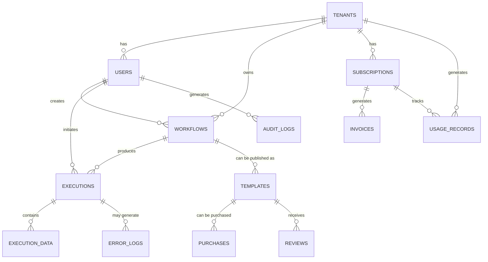

# 07. Data Architecture

## 🗄️ Data Architecture Overview

La arquitectura de datos de **Agente Virtual IA** está diseñada para soportar multi-tenancy, escalabilidad y consistencia de datos a través de múltiples dominios de negocio.



## 🏢 Multi-Tenant Data Model

### Tenant Isolation Strategy
```sql
-- Tenant schema with RLS
CREATE TABLE tenants (
  id UUID PRIMARY KEY DEFAULT gen_random_uuid(),
  name VARCHAR(255) NOT NULL,
  domain VARCHAR(100) UNIQUE,
  plan_type VARCHAR(50) NOT NULL DEFAULT 'starter',
  settings JSONB DEFAULT '{}',
  limits JSONB DEFAULT '{}',
  created_at TIMESTAMPTZ DEFAULT NOW(),
  updated_at TIMESTAMPTZ DEFAULT NOW()
);

-- RLS Policy for tenant isolation
CREATE POLICY tenant_isolation ON workflows
  FOR ALL USING (tenant_id = (auth.jwt() ->> 'tenant_id')::UUID);
```

### Core Entities

#### Users & Authentication
```sql
-- Users table (extends Supabase auth.users)
CREATE TABLE users (
  id UUID PRIMARY KEY REFERENCES auth.users(id),
  tenant_id UUID NOT NULL REFERENCES tenants(id),
  email VARCHAR(255) NOT NULL,
  full_name VARCHAR(255),
  role VARCHAR(50) DEFAULT 'user',
  preferences JSONB DEFAULT '{}',
  last_login_at TIMESTAMPTZ,
  created_at TIMESTAMPTZ DEFAULT NOW(),
  updated_at TIMESTAMPTZ DEFAULT NOW()
);

-- User roles and permissions
CREATE TABLE user_roles (
  id UUID PRIMARY KEY DEFAULT gen_random_uuid(),
  user_id UUID NOT NULL REFERENCES users(id),
  role VARCHAR(50) NOT NULL,
  permissions JSONB DEFAULT '[]',
  granted_by UUID REFERENCES users(id),
  granted_at TIMESTAMPTZ DEFAULT NOW()
);
```

#### Workflows & Executions
```sql
-- Workflows table
CREATE TABLE workflows (
  id UUID PRIMARY KEY DEFAULT gen_random_uuid(),
  tenant_id UUID NOT NULL REFERENCES tenants(id),
  created_by UUID NOT NULL REFERENCES users(id),
  name VARCHAR(255) NOT NULL,
  description TEXT,
  n8n_id VARCHAR(100), -- Reference to n8n workflow
  definition JSONB NOT NULL, -- Workflow nodes and connections
  settings JSONB DEFAULT '{}',
  active BOOLEAN DEFAULT false,
  tags TEXT[] DEFAULT '{}',
  version INTEGER DEFAULT 1,
  created_at TIMESTAMPTZ DEFAULT NOW(),
  updated_at TIMESTAMPTZ DEFAULT NOW()
);

-- Workflow executions
CREATE TABLE executions (
  id UUID PRIMARY KEY DEFAULT gen_random_uuid(),
  workflow_id UUID NOT NULL REFERENCES workflows(id),
  tenant_id UUID NOT NULL REFERENCES tenants(id),
  triggered_by UUID REFERENCES users(id),
  n8n_execution_id VARCHAR(100),
  status VARCHAR(50) NOT NULL DEFAULT 'running',
  input_data JSONB,
  output_data JSONB,
  error_data JSONB,
  execution_time INTEGER, -- milliseconds
  started_at TIMESTAMPTZ DEFAULT NOW(),
  finished_at TIMESTAMPTZ,
  created_at TIMESTAMPTZ DEFAULT NOW()
);

-- Execution performance index
CREATE INDEX idx_executions_performance 
ON executions (workflow_id, status, started_at);
```

## 💳 Billing & Usage Data

### Subscription Management
```sql
-- Subscriptions
CREATE TABLE subscriptions (
  id UUID PRIMARY KEY DEFAULT gen_random_uuid(),
  tenant_id UUID NOT NULL REFERENCES tenants(id),
  stripe_subscription_id VARCHAR(100) UNIQUE,
  stripe_customer_id VARCHAR(100) NOT NULL,
  plan_id VARCHAR(100) NOT NULL,
  status VARCHAR(50) NOT NULL,
  current_period_start TIMESTAMPTZ,
  current_period_end TIMESTAMPTZ,
  trial_end TIMESTAMPTZ,
  metadata JSONB DEFAULT '{}',
  created_at TIMESTAMPTZ DEFAULT NOW(),
  updated_at TIMESTAMPTZ DEFAULT NOW()
);

-- Usage tracking
CREATE TABLE usage_records (
  id UUID PRIMARY KEY DEFAULT gen_random_uuid(),
  tenant_id UUID NOT NULL REFERENCES tenants(id),
  subscription_id UUID REFERENCES subscriptions(id),
  usage_type VARCHAR(50) NOT NULL, -- 'executions', 'ai_calls', 'storage'
  quantity INTEGER NOT NULL,
  unit_price DECIMAL(10,4),
  metadata JSONB DEFAULT '{}',
  period_start TIMESTAMPTZ NOT NULL,
  period_end TIMESTAMPTZ NOT NULL,
  recorded_at TIMESTAMPTZ DEFAULT NOW()
);

-- Usage aggregation by day for analytics
CREATE MATERIALIZED VIEW daily_usage_summary AS
SELECT 
  tenant_id,
  usage_type,
  DATE(recorded_at) as usage_date,
  SUM(quantity) as total_quantity,
  COUNT(*) as record_count,
  MIN(recorded_at) as first_record,
  MAX(recorded_at) as last_record
FROM usage_records
GROUP BY tenant_id, usage_type, DATE(recorded_at);

-- Refresh daily at 2 AM UTC
CREATE FUNCTION refresh_daily_usage_summary()
RETURNS void AS $$
BEGIN
  REFRESH MATERIALIZED VIEW CONCURRENTLY daily_usage_summary;
END;
$$ LANGUAGE plpgsql;
```

## 🛒 Marketplace Data Model

### Templates & Collections
```sql
-- Templates (published workflows)
CREATE TABLE templates (
  id UUID PRIMARY KEY DEFAULT gen_random_uuid(),
  creator_id UUID NOT NULL REFERENCES users(id),
  workflow_id UUID REFERENCES workflows(id),
  name VARCHAR(255) NOT NULL,
  description TEXT NOT NULL,
  category VARCHAR(100) NOT NULL,
  tags TEXT[] DEFAULT '{}',
  price DECIMAL(10,2) DEFAULT 0,
  currency VARCHAR(3) DEFAULT 'USD',
  is_free BOOLEAN DEFAULT true,
  is_featured BOOLEAN DEFAULT false,
  download_count INTEGER DEFAULT 0,
  rating_avg DECIMAL(3,2) DEFAULT 0,
  rating_count INTEGER DEFAULT 0,
  status VARCHAR(50) DEFAULT 'draft', -- draft, published, archived
  published_at TIMESTAMPTZ,
  created_at TIMESTAMPTZ DEFAULT NOW(),
  updated_at TIMESTAMPTZ DEFAULT NOW()
);

-- Template purchases
CREATE TABLE template_purchases (
  id UUID PRIMARY KEY DEFAULT gen_random_uuid(),
  template_id UUID NOT NULL REFERENCES templates(id),
  buyer_id UUID NOT NULL REFERENCES users(id),
  tenant_id UUID NOT NULL REFERENCES tenants(id),
  price_paid DECIMAL(10,2) NOT NULL,
  currency VARCHAR(3) NOT NULL,
  stripe_payment_intent_id VARCHAR(100),
  status VARCHAR(50) DEFAULT 'pending',
  purchased_at TIMESTAMPTZ DEFAULT NOW()
);

-- Reviews and ratings
CREATE TABLE reviews (
  id UUID PRIMARY KEY DEFAULT gen_random_uuid(),
  template_id UUID NOT NULL REFERENCES templates(id),
  reviewer_id UUID NOT NULL REFERENCES users(id),
  rating INTEGER NOT NULL CHECK (rating >= 1 AND rating <= 5),
  title VARCHAR(255),
  content TEXT,
  helpful_count INTEGER DEFAULT 0,
  created_at TIMESTAMPTZ DEFAULT NOW(),
  updated_at TIMESTAMPTZ DEFAULT NOW(),
  
  UNIQUE(template_id, reviewer_id)
);
```

## 📊 Analytics & Reporting

### Event Sourcing for Analytics
```sql
-- Events table for analytics
CREATE TABLE events (
  id UUID PRIMARY KEY DEFAULT gen_random_uuid(),
  tenant_id UUID REFERENCES tenants(id),
  user_id UUID REFERENCES users(id),
  event_type VARCHAR(100) NOT NULL,
  event_data JSONB NOT NULL,
  session_id VARCHAR(100),
  ip_address INET,
  user_agent TEXT,
  occurred_at TIMESTAMPTZ DEFAULT NOW()
);

-- Partitioned by month for performance
CREATE TABLE events_y2025m01 PARTITION OF events
  FOR VALUES FROM ('2025-01-01') TO ('2025-02-01');

-- Analytics aggregations
CREATE MATERIALIZED VIEW tenant_analytics_daily AS
SELECT 
  tenant_id,
  DATE(occurred_at) as analytics_date,
  COUNT(*) FILTER (WHERE event_type = 'workflow_execution') as executions,
  COUNT(*) FILTER (WHERE event_type = 'user_login') as logins,
  COUNT(DISTINCT user_id) FILTER (WHERE event_type = 'user_login') as active_users,
  COUNT(*) FILTER (WHERE event_type = 'template_purchase') as purchases,
  SUM((event_data->>'amount')::DECIMAL) FILTER (WHERE event_type = 'template_purchase') as revenue
FROM events
GROUP BY tenant_id, DATE(occurred_at);
```

## 🔐 Security & Audit

### Audit Logging
```sql
-- Audit logs for compliance
CREATE TABLE audit_logs (
  id UUID PRIMARY KEY DEFAULT gen_random_uuid(),
  tenant_id UUID REFERENCES tenants(id),
  user_id UUID REFERENCES users(id),
  action VARCHAR(100) NOT NULL,
  resource_type VARCHAR(100) NOT NULL,
  resource_id UUID,
  old_values JSONB,
  new_values JSONB,
  ip_address INET,
  user_agent TEXT,
  created_at TIMESTAMPTZ DEFAULT NOW()
);

-- Automatic audit trigger
CREATE OR REPLACE FUNCTION audit_trigger()
RETURNS TRIGGER AS $$
BEGIN
  INSERT INTO audit_logs (
    tenant_id,
    user_id,
    action,
    resource_type,
    resource_id,
    old_values,
    new_values
  ) VALUES (
    COALESCE(NEW.tenant_id, OLD.tenant_id),
    (auth.jwt() ->> 'sub')::UUID,
    TG_OP,
    TG_TABLE_NAME,
    COALESCE(NEW.id, OLD.id),
    CASE WHEN TG_OP = 'DELETE' THEN to_jsonb(OLD) ELSE NULL END,
    CASE WHEN TG_OP = 'INSERT' OR TG_OP = 'UPDATE' THEN to_jsonb(NEW) ELSE NULL END
  );
  
  RETURN COALESCE(NEW, OLD);
END;
$$ LANGUAGE plpgsql;

-- Apply audit trigger to sensitive tables
CREATE TRIGGER workflows_audit_trigger
  AFTER INSERT OR UPDATE OR DELETE ON workflows
  FOR EACH ROW EXECUTE FUNCTION audit_trigger();
```

## 🌍 Internationalization Data

### Multi-language Support
```sql
-- Translations table
CREATE TABLE translations (
  id UUID PRIMARY KEY DEFAULT gen_random_uuid(),
  namespace VARCHAR(100) NOT NULL,
  key VARCHAR(255) NOT NULL,
  locale VARCHAR(10) NOT NULL,
  value TEXT NOT NULL,
  context JSONB DEFAULT '{}',
  created_at TIMESTAMPTZ DEFAULT NOW(),
  updated_at TIMESTAMPTZ DEFAULT NOW(),
  
  UNIQUE(namespace, key, locale)
);

-- Price book for multi-currency
CREATE TABLE price_book (
  id UUID PRIMARY KEY DEFAULT gen_random_uuid(),
  plan_id VARCHAR(100) NOT NULL,
  currency VARCHAR(3) NOT NULL,
  amount DECIMAL(10,2) NOT NULL,
  stripe_price_id VARCHAR(100) UNIQUE,
  active BOOLEAN DEFAULT true,
  created_at TIMESTAMPTZ DEFAULT NOW(),
  
  UNIQUE(plan_id, currency)
);
```

## 📈 Data Flow Patterns

### Real-time Data Pipeline
```typescript
// Real-time data synchronization
export class DataSyncService {
  async syncWorkflowExecution(execution: N8nExecution): Promise<void> {
    // 1. Update execution record
    await this.db.executions.update(execution.workflowId, {
      status: execution.status,
      finishedAt: execution.finishedAt,
      executionTime: execution.executionTime,
      outputData: execution.data
    })
    
    // 2. Record usage for billing
    await this.billingService.recordUsage({
      tenantId: execution.tenantId,
      type: 'execution',
      quantity: 1,
      timestamp: execution.finishedAt
    })
    
    // 3. Update analytics
    await this.analyticsService.recordEvent({
      type: 'workflow_execution',
      data: {
        workflowId: execution.workflowId,
        status: execution.status,
        executionTime: execution.executionTime
      }
    })
    
    // 4. Publish real-time update
    await this.realtimeService.publish(`workflow:${execution.workflowId}`, {
      type: 'execution_complete',
      execution
    })
  }
}
```

### Data Archival Strategy
```sql
-- Archive old execution data
CREATE TABLE executions_archive (
  LIKE executions INCLUDING ALL
);

-- Function to archive old executions
CREATE OR REPLACE FUNCTION archive_old_executions()
RETURNS INTEGER AS $$
DECLARE
  archived_count INTEGER;
BEGIN
  -- Move executions older than 90 days to archive
  WITH archived AS (
    DELETE FROM executions 
    WHERE finished_at < NOW() - INTERVAL '90 days'
    RETURNING *
  )
  INSERT INTO executions_archive 
  SELECT * FROM archived;
  
  GET DIAGNOSTICS archived_count = ROW_COUNT;
  RETURN archived_count;
END;
$$ LANGUAGE plpgsql;

-- Schedule archival job
SELECT cron.schedule(
  'archive-executions',
  '0 2 * * 0', -- Weekly on Sunday at 2 AM
  'SELECT archive_old_executions();'
);
```

---

**Próximo documento**: [08. Security Architecture](./08-security-architecture.md)