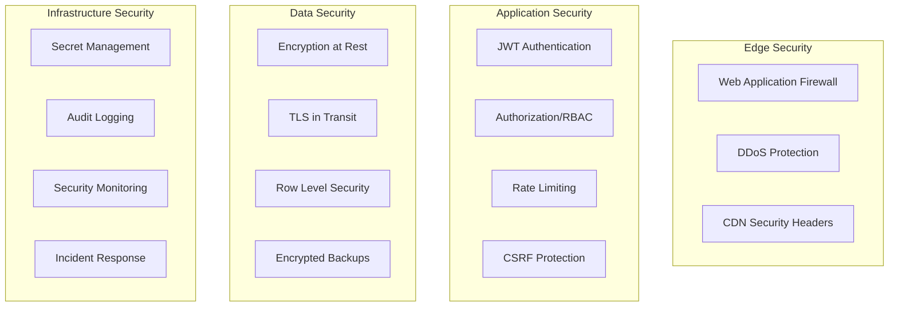

# 08. Security Architecture

## 🔐 Security Overview

**Agente Virtual IA** implementa múltiples capas de seguridad siguiendo principios de **zero-trust** y **defense-in-depth**.



## 🔑 Authentication & Authorization

### JWT-based Authentication
```typescript
// JWT implementation with Supabase
export class AuthService {
  async login(email: string, password: string): Promise<AuthResult> {
    const { data, error } = await supabase.auth.signInWithPassword({
      email,
      password
    })
    
    if (error) throw new AuthenticationError(error.message)
    
    // Generate custom JWT with tenant context
    const token = await this.generateJWT({
      sub: data.user.id,
      email: data.user.email,
      tenant_id: await this.getTenantId(data.user.id),
      roles: await this.getUserRoles(data.user.id)
    })
    
    return { user: data.user, token }
  }
  
  async verifyToken(token: string): Promise<JWTPayload> {
    try {
      return jwt.verify(token, process.env.JWT_SECRET!) as JWTPayload
    } catch (error) {
      throw new AuthenticationError('Invalid token')
    }
  }
}
```

### Role-Based Access Control (RBAC)
```typescript
// Permission system
interface Permission {
  resource: string  // 'workflows', 'templates', 'billing'
  action: string   // 'create', 'read', 'update', 'delete'
  scope?: string   // 'own', 'tenant', 'global'
}

const ROLE_PERMISSIONS: Record<string, Permission[]> = {
  'admin': [
    { resource: '*', action: '*', scope: 'tenant' }
  ],
  'developer': [
    { resource: 'workflows', action: '*', scope: 'own' },
    { resource: 'executions', action: 'read', scope: 'tenant' }
  ],
  'user': [
    { resource: 'workflows', action: 'read', scope: 'tenant' },
    { resource: 'workflows', action: 'execute', scope: 'tenant' }
  ]
}

export function checkPermission(
  userRoles: string[],
  resource: string,
  action: string
): boolean {
  return userRoles.some(role => {
    const permissions = ROLE_PERMISSIONS[role] || []
    return permissions.some(p => 
      (p.resource === '*' || p.resource === resource) &&
      (p.action === '*' || p.action === action)
    )
  })
}
```

## 🛡️ Application Security

### Request Validation & Sanitization
```typescript
// Input validation with Zod
import { z } from 'zod'

const WorkflowInputSchema = z.object({
  name: z.string().min(1).max(255).regex(/^[a-zA-Z0-9\s-_]+$/),
  description: z.string().max(1000).optional(),
  nodes: z.array(z.object({
    id: z.string().uuid(),
    type: z.string().regex(/^[a-zA-Z0-9-]+$/),
    parameters: z.record(z.any()).optional()
  }))
})

// Sanitization middleware
export function sanitizeInput(schema: z.ZodSchema) {
  return (req: Request, res: Response, next: NextFunction) => {
    try {
      const validated = schema.parse(req.body)
      req.body = validated
      next()
    } catch (error) {
      res.status(400).json({ error: 'Invalid input', details: error })
    }
  }
}
```

### Rate Limiting
```typescript
// Advanced rate limiting
export class RateLimiter {
  private redis: Redis
  
  async checkLimit(
    identifier: string,
    action: string,
    limits: RateLimit
  ): Promise<RateLimitResult> {
    const key = `rate_limit:${identifier}:${action}`
    const window = limits.window
    const limit = limits.requests
    
    const pipeline = this.redis.pipeline()
    pipeline.incr(key)
    pipeline.expire(key, window)
    
    const results = await pipeline.exec()
    const count = results[0][1] as number
    
    return {
      allowed: count <= limit,
      remaining: Math.max(0, limit - count),
      resetTime: Date.now() + (window * 1000)
    }
  }
}

// Usage in API routes
export async function withRateLimit(
  req: Request,
  limits: Record<string, RateLimit>
) {
  const rateLimiter = new RateLimiter()
  const user = req.user
  const action = `${req.method}:${req.route?.path}`
  
  const limit = limits[action] || limits.default
  const result = await rateLimiter.checkLimit(user.id, action, limit)
  
  if (!result.allowed) {
    throw new RateLimitError('Rate limit exceeded')
  }
}
```

## 🔒 Data Security

### Encryption Strategy
```typescript
// Field-level encryption for sensitive data
import crypto from 'crypto'

class FieldEncryption {
  private algorithm = 'aes-256-gcm'
  private key: Buffer
  
  constructor(secretKey: string) {
    this.key = crypto.scryptSync(secretKey, 'salt', 32)
  }
  
  encrypt(text: string): string {
    const iv = crypto.randomBytes(16)
    const cipher = crypto.createCipher(this.algorithm, this.key)
    cipher.setAAD(Buffer.from('agente-virtual-ia'))
    
    let encrypted = cipher.update(text, 'utf8', 'hex')
    encrypted += cipher.final('hex')
    
    const authTag = cipher.getAuthTag()
    
    return `${iv.toString('hex')}:${authTag.toString('hex')}:${encrypted}`
  }
  
  decrypt(encryptedData: string): string {
    const [ivHex, authTagHex, encrypted] = encryptedData.split(':')
    
    const iv = Buffer.from(ivHex, 'hex')
    const authTag = Buffer.from(authTagHex, 'hex')
    
    const decipher = crypto.createDecipher(this.algorithm, this.key)
    decipher.setAAD(Buffer.from('agente-virtual-ia'))
    decipher.setAuthTag(authTag)
    
    let decrypted = decipher.update(encrypted, 'hex', 'utf8')
    decrypted += decipher.final('utf8')
    
    return decrypted
  }
}

// Usage in sensitive data handling
class SecureUserData {
  private encryption = new FieldEncryption(process.env.ENCRYPTION_KEY!)
  
  async saveUser(userData: UserData) {
    return {
      ...userData,
      // Encrypt PII fields
      email: this.encryption.encrypt(userData.email),
      phone: userData.phone ? this.encryption.encrypt(userData.phone) : null,
      // Hash API keys
      apiKey: await this.hashApiKey(userData.apiKey)
    }
  }
}
```

### Database Security
```sql
-- Row Level Security policies
ALTER TABLE workflows ENABLE ROW LEVEL SECURITY;

-- Tenant isolation policy
CREATE POLICY workflows_tenant_isolation ON workflows
  FOR ALL USING (
    tenant_id = (auth.jwt() ->> 'tenant_id')::UUID
  );

-- Admin override policy
CREATE POLICY workflows_admin_access ON workflows
  FOR ALL USING (
    EXISTS (
      SELECT 1 FROM user_roles ur
      WHERE ur.user_id = (auth.jwt() ->> 'sub')::UUID
      AND ur.role = 'super_admin'
    )
  );

-- Encrypted columns
CREATE EXTENSION IF NOT EXISTS pgcrypto;

-- Function for sensitive data encryption
CREATE OR REPLACE FUNCTION encrypt_sensitive_data(data TEXT)
RETURNS TEXT AS $$
BEGIN
  RETURN encode(encrypt(data::bytea, current_setting('app.encryption_key'), 'aes'), 'base64');
END;
$$ LANGUAGE plpgsql SECURITY DEFINER;
```

## 🌐 Network Security

### Security Headers Implementation
```typescript
// Security headers middleware
export function securityHeaders() {
  return (req: Request, res: Response, next: NextFunction) => {
    // HSTS
    res.setHeader(
      'Strict-Transport-Security',
      'max-age=63072000; includeSubDomains; preload'
    )
    
    // CSP
    res.setHeader(
      'Content-Security-Policy',
      "default-src 'self'; " +
      "script-src 'self' 'unsafe-inline' 'unsafe-eval'; " +
      "style-src 'self' 'unsafe-inline'; " +
      "img-src 'self' data: https:; " +
      "connect-src 'self' https://*.supabase.co wss://*.supabase.co https://*.stripe.com; " +
      "frame-ancestors 'none';"
    )
    
    // Additional security headers
    res.setHeader('X-Content-Type-Options', 'nosniff')
    res.setHeader('X-Frame-Options', 'DENY')
    res.setHeader('X-XSS-Protection', '1; mode=block')
    res.setHeader('Referrer-Policy', 'strict-origin-when-cross-origin')
    
    next()
  }
}
```

## 📊 Security Monitoring

### Audit Logging
```typescript
// Comprehensive audit logging
export class AuditLogger {
  async log(event: AuditEvent): Promise<void> {
    const auditRecord = {
      id: generateId(),
      timestamp: new Date(),
      userId: event.userId,
      tenantId: event.tenantId,
      action: event.action,
      resource: event.resource,
      resourceId: event.resourceId,
      ipAddress: event.ipAddress,
      userAgent: event.userAgent,
      result: event.result, // success, failure, error
      details: event.details,
      riskScore: this.calculateRiskScore(event)
    }
    
    // Store in database
    await this.db.auditLogs.create(auditRecord)
    
    // Send to SIEM if high risk
    if (auditRecord.riskScore > 8) {
      await this.sendToSIEM(auditRecord)
    }
  }
  
  private calculateRiskScore(event: AuditEvent): number {
    let score = 0
    
    // Failed authentication attempts
    if (event.action === 'login' && event.result === 'failure') {
      score += 3
    }
    
    // Administrative actions
    if (event.action.includes('admin')) {
      score += 2
    }
    
    // Off-hours access
    const hour = new Date().getHours()
    if (hour < 6 || hour > 22) {
      score += 1
    }
    
    // Unusual IP patterns
    if (this.isUnusualIP(event.ipAddress, event.userId)) {
      score += 4
    }
    
    return Math.min(score, 10)
  }
}
```

### Threat Detection
```typescript
// Anomaly detection for security threats
export class ThreatDetector {
  async detectAnomalies(userId: string): Promise<ThreatAlert[]> {
    const alerts: ThreatAlert[] = []
    
    // Check for unusual login patterns
    const recentLogins = await this.getRecentLogins(userId, 24) // 24 hours
    if (recentLogins.length > 20) {
      alerts.push({
        type: 'excessive_login_attempts',
        severity: 'high',
        details: `${recentLogins.length} login attempts in 24 hours`
      })
    }
    
    // Check for privilege escalation
    const roleChanges = await this.getRecentRoleChanges(userId, 168) // 7 days
    if (roleChanges.some(change => change.newRole === 'admin')) {
      alerts.push({
        type: 'privilege_escalation',
        severity: 'critical',
        details: 'User elevated to admin role'
      })
    }
    
    // Check for unusual data access patterns
    const dataAccess = await this.getDataAccessPatterns(userId, 24)
    const avgAccess = await this.getAverageDataAccess(userId, 30)
    
    if (dataAccess > avgAccess * 3) {
      alerts.push({
        type: 'unusual_data_access',
        severity: 'medium',
        details: 'Data access 3x above normal'
      })
    }
    
    return alerts
  }
}
```

## 🚨 Incident Response

### Security Incident Workflow
```typescript
// Automated incident response
export class IncidentResponse {
  async handleSecurityIncident(incident: SecurityIncident): Promise<void> {
    // 1. Immediate containment
    await this.containThreat(incident)
    
    // 2. Notify security team
    await this.notifySecurityTeam(incident)
    
    // 3. Gather forensic data
    const forensics = await this.gatherForensicData(incident)
    
    // 4. Create incident ticket
    await this.createIncidentTicket(incident, forensics)
    
    // 5. Begin remediation
    await this.beginRemediation(incident)
  }
  
  private async containThreat(incident: SecurityIncident): Promise<void> {
    switch (incident.type) {
      case 'compromised_account':
        await this.suspendUser(incident.userId)
        await this.revokeAllSessions(incident.userId)
        break
        
      case 'malicious_api_usage':
        await this.blockIP(incident.sourceIP)
        await this.revokeApiKey(incident.apiKey)
        break
        
      case 'data_exfiltration':
        await this.enableEmergencyMode(incident.tenantId)
        await this.notifyDataProtectionOfficer(incident)
        break
    }
  }
}
```