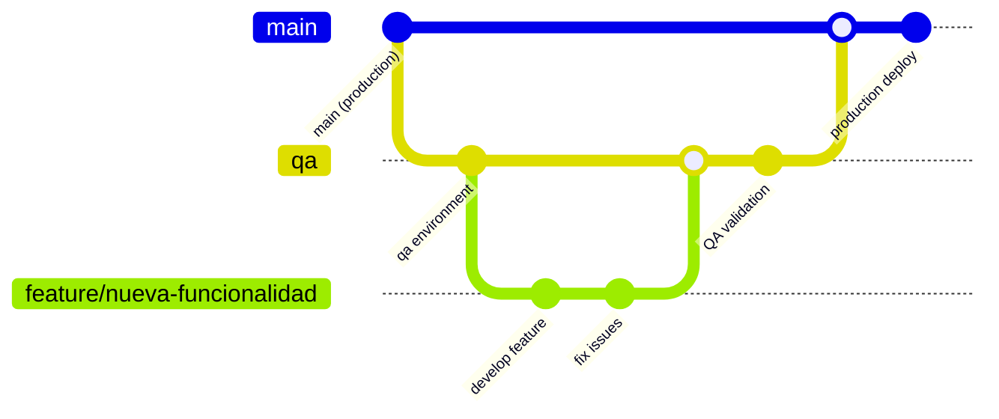

# 12. Development Workflow

## 🔄 QA-First Development Process

**Agente Virtual IA** implementa un workflow de desarrollo centrado en calidad con un ambiente QA dedicado para validación antes de producción.



## 🌳 Branching Strategy

### Branch Types

#### **Production Branch: `main`**
```yaml
Purpose: "Stable production code"
Protection_Rules:
  - Require PR approval
  - Require status checks
  - No direct pushes
  - Require up-to-date branches
Deploy_Target: "Production environment"
URL: "https://agentevirtualia.com"
```

#### **QA Branch: `qa`**
```yaml
Purpose: "Integration testing and validation"
Source: "Feature branches"
Protection_Rules:
  - Require PR approval for main merge
  - Allow direct pushes for hotfixes
Deploy_Target: "QA environment"  
URL: "https://qa-agentevirtualia.netlify.app"
Auto_Deploy: "true"
```

#### **Feature Branches: `feature/*`**
```yaml
Naming_Convention: "feature/description-kebab-case"
Examples:
  - "feature/ai-workflow-generator"
  - "feature/billing-improvements"
  - "feature/security-enhancements"
Source: "qa branch"
Merge_Target: "qa branch"
Lifecycle: "Delete after merge"
```

#### **Hotfix Branches: `hotfix/*`**
```yaml
Purpose: "Critical production fixes"
Naming_Convention: "hotfix/description-kebab-case"
Source: "main branch"
Merge_Targets: ["qa", "main"]
Priority: "High - fast-track through QA"
```

## 🔧 Development Process

### 1. Feature Development Cycle

```typescript
// Step 1: Create feature branch
git checkout qa
git pull origin qa
git checkout -b feature/ai-assistant-improvements

// Step 2: Development with iterative commits  
git add .
git commit -m "feat: add AI conversation history"
git push origin feature/ai-assistant-improvements

// Step 3: Create PR to QA
gh pr create --base qa --title "Add AI Assistant Improvements" --body "..."

// Step 4: After QA approval, auto-deploy to QA environment
// QA team validates functionality

// Step 5: Create PR from QA to main (after validation)
gh pr create --base main --head qa --title "Release: AI Assistant v2.1"
```

### 2. Quality Gates

#### **Pre-commit Checks**
```yaml
# .github/workflows/pre-commit.yml
name: Pre-commit Checks
on: [push, pull_request]

jobs:
  quality:
    runs-on: ubuntu-latest
    steps:
      - uses: actions/checkout@v4
      - uses: actions/setup-node@v4
        with:
          node-version: '20'
      
      # Install dependencies
      - run: npm install --legacy-peer-deps
      
      # Type checking
      - run: npm run typecheck
      
      # Linting
      - run: npm run lint:check
      
      # Testing
      - run: npm run test
      
      # Build verification
      - run: npm run build
```

#### **QA Environment Validation**
```typescript
// Automated QA checks after deployment
export const qaValidationSuite = [
  {
    name: 'Authentication Flow',
    test: async () => {
      const response = await fetch('/api/auth/me')
      return response.status === 401 // Should require auth
    }
  },
  {
    name: 'Workflow Creation',
    test: async () => {
      const workflow = await createTestWorkflow()
      return workflow.id && workflow.active === false
    }
  },
  {
    name: 'AI Service Integration',
    test: async () => {
      const response = await fetch('/api/ai/health')
      return response.status === 200
    }
  },
  {
    name: 'Database Connectivity',
    test: async () => {
      const result = await supabase.from('workflows').select('count')
      return result.error === null
    }
  }
]
```

### 3. Commit Message Standards

```yaml
# Conventional Commits specification
Format: "type(scope): description"

Types:
  - feat: New feature
  - fix: Bug fix  
  - docs: Documentation changes
  - style: Code style changes (formatting, etc.)
  - refactor: Code refactoring
  - test: Adding or updating tests
  - chore: Maintenance tasks

Examples:
  - "feat(auth): add 2FA support"
  - "fix(workflows): resolve execution timeout issue"
  - "docs(api): update authentication endpoints"
  - "refactor(billing): simplify usage calculation"
```

## 🚀 Deployment Pipeline

### Environment Configuration

#### **QA Environment**
```yaml
# netlify-qa.toml
[build]
  command = "npm run build"
  publish = ".next"

[build.environment]
  NODE_ENV = "staging"
  NEXT_PUBLIC_API_URL = "https://qa-api.agentevirtualia.com"
  NEXT_PUBLIC_SUPABASE_URL = "${QA_SUPABASE_URL}"
  NEXT_PUBLIC_SUPABASE_ANON_KEY = "${QA_SUPABASE_ANON_KEY}"

# Auto-deploy on qa branch updates  
[[branch-deploy]]
  branch = "qa"
  context = "qa"
```

#### **Production Environment**
```yaml
# netlify.toml
[build]
  command = "npm run build"
  publish = ".next"

[build.environment]  
  NODE_ENV = "production"
  NEXT_PUBLIC_API_URL = "https://api.agentevirtualia.com"

# Deploy only on main branch
[[branch-deploy]]
  branch = "main"
  context = "production"
```

### Deployment Automation

```typescript
// .github/workflows/deploy.yml
name: Deploy to Environments

on:
  push:
    branches: [qa, main]

jobs:
  deploy-qa:
    if: github.ref == 'refs/heads/qa'
    runs-on: ubuntu-latest
    environment: qa
    steps:
      - name: Deploy to QA
        run: |
          # Netlify auto-deploys on qa branch
          echo "QA deployment triggered"
          
      - name: Run QA Tests
        run: |
          npm run test:e2e:qa
          
      - name: Notify QA Team
        run: |
          curl -X POST ${{ secrets.SLACK_WEBHOOK }} \
            -d '{"text":"🚀 New QA deployment ready for testing"}'

  deploy-production:
    if: github.ref == 'refs/heads/main'
    runs-on: ubuntu-latest
    environment: production
    steps:
      - name: Pre-production Checks
        run: |
          npm run test
          npm run build
          npm run security-scan
          
      - name: Deploy to Production
        run: |
          # Netlify auto-deploys on main branch
          echo "Production deployment triggered"
          
      - name: Post-deployment Verification
        run: |
          npm run test:e2e:production
          
      - name: Update Changelog
        run: |
          npm run changelog
          git push origin main
```

## 🧪 Testing Strategy

### Test Types & Coverage

```typescript
// Testing pyramid implementation
export const testingStrategy = {
  // Unit Tests (70%)
  unit: {
    framework: 'Jest + React Testing Library',
    coverage: '80% minimum',
    files: ['**/*.test.ts', '**/*.test.tsx'],
    command: 'npm run test'
  },
  
  // Integration Tests (20%)
  integration: {
    framework: 'Jest + Supertest',
    coverage: 'Critical user flows',
    files: ['**/*.integration.test.ts'],
    command: 'npm run test:integration'
  },
  
  // E2E Tests (10%)
  e2e: {
    framework: 'Playwright',
    coverage: 'Happy path scenarios',
    files: ['tests/e2e/**/*.spec.ts'],
    command: 'npm run test:e2e'
  }
}

// Example E2E test for QA validation
test('Complete workflow creation and execution', async ({ page }) => {
  // Login to QA environment
  await page.goto('https://qa-agentevirtualia.netlify.app')
  await page.fill('[data-testid=email]', 'qa@agentevirtualia.com')
  await page.fill('[data-testid=password]', 'qa-password')
  await page.click('[data-testid=login-button]')
  
  // Navigate to workflows
  await page.click('[data-testid=workflows-nav]')
  
  // Create new workflow
  await page.click('[data-testid=create-workflow]')
  await page.fill('[data-testid=workflow-name]', 'QA Test Workflow')
  
  // Add nodes and connections
  await page.click('[data-testid=add-trigger-node]')
  await page.click('[data-testid=add-action-node]')
  
  // Save and activate
  await page.click('[data-testid=save-workflow]')
  await page.click('[data-testid=activate-workflow]')
  
  // Verify workflow is active
  await expect(page.locator('[data-testid=workflow-status]')).toHaveText('Active')
})
```

## 📊 Code Quality Standards

### Linting & Formatting

```typescript
// eslint.config.mjs
export default [
  {
    files: ['**/*.{ts,tsx}'],
    rules: {
      // TypeScript specific
      '@typescript-eslint/no-unused-vars': 'error',
      '@typescript-eslint/explicit-function-return-type': 'warn',
      '@typescript-eslint/no-explicit-any': 'warn',
      
      // React specific  
      'react/prop-types': 'off', // Using TypeScript
      'react-hooks/rules-of-hooks': 'error',
      'react-hooks/exhaustive-deps': 'warn',
      
      // Next.js specific
      '@next/next/no-img-element': 'error',
      '@next/next/no-html-link-for-pages': 'error',
      
      // General code quality
      'prefer-const': 'error',
      'no-console': 'warn',
      'no-debugger': 'error'
    }
  }
]

// TypeScript configuration for strict mode
{
  "compilerOptions": {
    "strict": true,
    "noUncheckedIndexedAccess": true,
    "exactOptionalPropertyTypes": true,
    "noImplicitReturns": true,
    "noFallthroughCasesInSwitch": true
  }
}
```

### Performance Monitoring

```typescript
// Performance budgets and monitoring
export const performanceBudgets = {
  // Bundle size limits
  javascript: '250kb', // Initial bundle
  css: '50kb',        // CSS bundle
  
  // Runtime performance
  FCP: '1.5s',        // First Contentful Paint
  LCP: '2.5s',        // Largest Contentful Paint  
  FID: '100ms',       // First Input Delay
  CLS: '0.1',         // Cumulative Layout Shift
  
  // API performance
  apiResponse: '500ms',  // 95th percentile
  databaseQuery: '100ms' // Average query time
}

// Automated performance testing
test('Performance budgets', async () => {
  const lighthouse = await runLighthouse('https://qa-agentevirtualia.netlify.app')
  
  expect(lighthouse.lcp).toBeLessThan(2500)
  expect(lighthouse.fcp).toBeLessThan(1500)
  expect(lighthouse.cls).toBeLessThan(0.1)
})
```

## 🚨 Emergency Procedures

### Hotfix Process

```bash
# Emergency hotfix workflow
# 1. Create hotfix branch from main
git checkout main
git pull origin main
git checkout -b hotfix/critical-security-fix

# 2. Implement fix with minimal changes
# Focus only on the critical issue

# 3. Test locally
npm run test
npm run build

# 4. Create PR to qa for rapid validation
gh pr create --base qa --title "[HOTFIX] Critical Security Fix" --body "..."

# 5. After QA approval (expedited), merge to main
gh pr create --base main --head qa --title "[HOTFIX] Production Deploy"

# 6. Monitor production deployment
npm run test:e2e:production
```

### Rollback Procedures

```typescript
// Automated rollback detection and execution
export class ProductionMonitor {
  async checkProductionHealth(): Promise<HealthStatus> {
    const checks = await Promise.all([
      this.checkApiHealth(),
      this.checkDatabaseConnectivity(), 
      this.checkExternalServices(),
      this.checkErrorRates()
    ])
    
    const failedChecks = checks.filter(check => !check.healthy)
    
    if (failedChecks.length > 0) {
      await this.triggerRollback()
      await this.notifyIncidentTeam(failedChecks)
    }
    
    return {
      healthy: failedChecks.length === 0,
      checks,
      timestamp: new Date()
    }
  }
  
  private async triggerRollback(): Promise<void> {
    // Automatic rollback to previous stable version
    await fetch('https://api.netlify.com/api/v1/sites/SITE_ID/deploys/PREVIOUS_DEPLOY_ID/restore', {
      method: 'POST',
      headers: { 'Authorization': `Bearer ${process.env.NETLIFY_TOKEN}` }
    })
  }
}
```

---

Este documento establece el workflow de desarrollo completo para **Agente Virtual IA**, asegurando calidad, estabilidad y capacidad de respuesta ante emergencias.