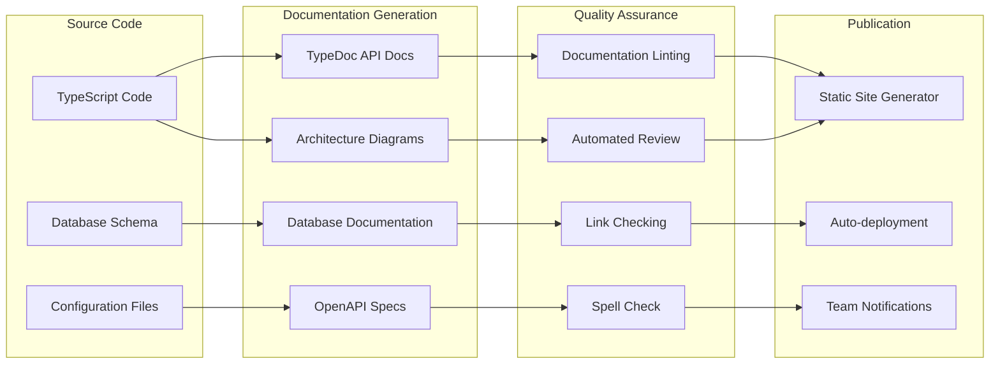

# 13. Documentation Automation & Maintenance

## 🤖 Automation Overview

La documentación de arquitectura de **Agente Virtual IA** utiliza herramientas automatizadas para mantener la consistencia, actualización y calidad de la documentación técnica.



## 📚 Automated Documentation Generation

### API Documentation with TypeDoc

```typescript
// typedoc.json - TypeDoc configuration
{
  "entryPoints": ["src/lib/**/*.ts", "src/app/api/**/*.ts"],
  "out": "docs/api",
  "theme": "default",
  "includeVersion": true,
  "excludePrivate": true,
  "excludeProtected": true,
  "excludeExternals": true,
  "readme": "docs/api/README.md",
  "name": "Agente Virtual IA - API Documentation",
  "tsconfig": "tsconfig.json",
  "plugin": ["typedoc-plugin-markdown"],
  "gitRevision": "main"
}

// Package.json script
{
  "scripts": {
    "docs:api": "typedoc",
    "docs:api:watch": "typedoc --watch"
  }
}
```

**Generated Documentation Structure:**
```
docs/api/
├── README.md
├── modules/
│   ├── auth.md
│   ├── workflows.md
│   ├── billing.md
│   └── analytics.md
├── interfaces/
│   ├── User.md
│   ├── Workflow.md
│   └── Execution.md
└── classes/
    ├── AuthService.md
    ├── WorkflowService.md
    └── BillingService.md
```

### Database Schema Documentation

```typescript
// scripts/generate-db-docs.ts
import { createClient } from '@supabase/supabase-js'
import { writeFileSync } from 'fs'

export async function generateDatabaseDocs(): Promise<void> {
  const supabase = createClient(
    process.env.SUPABASE_URL!,
    process.env.SUPABASE_SERVICE_ROLE_KEY!
  )
  
  // Get all tables
  const { data: tables } = await supabase
    .from('information_schema.tables')
    .select('table_name, table_comment')
    .eq('table_schema', 'public')
  
  // Get columns for each table
  const documentation = await Promise.all(
    tables?.map(async (table) => {
      const { data: columns } = await supabase
        .from('information_schema.columns')
        .select('column_name, data_type, is_nullable, column_default, column_comment')
        .eq('table_name', table.table_name)
        .order('ordinal_position')
      
      return {
        tableName: table.table_name,
        tableComment: table.table_comment,
        columns
      }
    }) || []
  )
  
  // Generate markdown documentation
  const markdown = generateSchemaMarkdown(documentation)
  writeFileSync('docs/database/schema.md', markdown)
  
  console.log('✅ Database documentation generated')
}

function generateSchemaMarkdown(tables: any[]): string {
  let markdown = '# Database Schema\n\n'
  
  tables.forEach(table => {
    markdown += `## ${table.tableName}\n\n`
    
    if (table.tableComment) {
      markdown += `${table.tableComment}\n\n`
    }
    
    markdown += '| Column | Type | Nullable | Default | Description |\n'
    markdown += '|--------|------|----------|---------|-------------|\n'
    
    table.columns.forEach((col: any) => {
      markdown += `| ${col.column_name} | ${col.data_type} | ${col.is_nullable} | ${col.column_default || ''} | ${col.column_comment || ''} |\n`
    })
    
    markdown += '\n'
  })
  
  return markdown
}
```

### OpenAPI Specification Generation

```typescript
// scripts/generate-openapi.ts
import { writeFileSync } from 'fs'
import { glob } from 'glob'
import { parse } from '@babel/parser'
import traverse from '@babel/traverse'

interface APIEndpoint {
  path: string
  method: string
  description: string
  parameters: any[]
  responses: any
}

export async function generateOpenAPISpec(): Promise<void> {
  const apiFiles = await glob('src/app/api/**/route.ts')
  const endpoints: APIEndpoint[] = []
  
  for (const file of apiFiles) {
    const fileContent = readFileSync(file, 'utf-8')
    const ast = parse(fileContent, {
      sourceType: 'module',
      plugins: ['typescript']
    })
    
    // Extract API route information
    traverse(ast, {
      ExportNamedDeclaration(path) {
        const declaration = path.node.declaration
        if (declaration?.type === 'FunctionDeclaration') {
          const endpoint = extractEndpointInfo(file, declaration)
          if (endpoint) {
            endpoints.push(endpoint)
          }
        }
      }
    })
  }
  
  const openApiSpec = {
    openapi: '3.0.0',
    info: {
      title: 'Agente Virtual IA API',
      version: process.env.npm_package_version || '1.0.0',
      description: 'API documentation for Agente Virtual IA platform'
    },
    servers: [
      {
        url: 'https://agentevirtualia.com/api',
        description: 'Production server'
      },
      {
        url: 'https://qa-agentevirtualia.netlify.app/api', 
        description: 'QA server'
      }
    ],
    paths: generatePaths(endpoints),
    components: {
      securitySchemes: {
        bearerAuth: {
          type: 'http',
          scheme: 'bearer',
          bearerFormat: 'JWT'
        }
      }
    }
  }
  
  writeFileSync('docs/api/openapi.json', JSON.stringify(openApiSpec, null, 2))
  console.log('✅ OpenAPI specification generated')
}
```

## 🎨 Diagram Automation

### Architecture Diagrams as Code

```typescript
// scripts/generate-diagrams.ts
import { exec } from 'child_process'
import { promisify } from 'util'
import { readFileSync, writeFileSync } from 'fs'

const execAsync = promisify(exec)

export async function generateArchitectureDiagrams(): Promise<void> {
  const diagramConfigs = [
    {
      name: 'system-context',
      type: 'mermaid',
      source: 'docs/diagrams/system-context.mmd',
      output: 'docs/architecture/diagrams/system-context.svg'
    },
    {
      name: 'container-architecture', 
      type: 'mermaid',
      source: 'docs/diagrams/container-architecture.mmd',
      output: 'docs/architecture/diagrams/container-architecture.svg'
    },
    {
      name: 'data-flow',
      type: 'plantuml',
      source: 'docs/diagrams/data-flow.puml',
      output: 'docs/architecture/diagrams/data-flow.svg'
    }
  ]
  
  for (const config of diagramConfigs) {
    if (config.type === 'mermaid') {
      await generateMermaidDiagram(config.source, config.output)
    } else if (config.type === 'plantuml') {
      await generatePlantUMLDiagram(config.source, config.output)
    }
  }
  
  console.log('✅ Architecture diagrams generated')
}

async function generateMermaidDiagram(source: string, output: string): Promise<void> {
  await execAsync(`mmdc -i ${source} -o ${output} -t dark -b transparent`)
}

async function generatePlantUMLDiagram(source: string, output: string): Promise<void> {
  await execAsync(`plantuml -tsvg -o ${output} ${source}`)
}
```

### Code-to-Diagram Generation

```typescript
// Extract component relationships from TypeScript code
export class ComponentDiagramGenerator {
  async generateComponentDiagram(): Promise<string> {
    const components = await this.analyzeComponents()
    return this.generateMermaidDiagram(components)
  }
  
  private async analyzeComponents(): Promise<Component[]> {
    const componentFiles = await glob('src/components/**/*.tsx')
    const components: Component[] = []
    
    for (const file of componentFiles) {
      const content = readFileSync(file, 'utf-8')
      const ast = parse(content, {
        sourceType: 'module',
        plugins: ['typescript', 'jsx']
      })
      
      const component = this.extractComponentInfo(ast, file)
      if (component) {
        components.push(component)
      }
    }
    
    return components
  }
  
  private generateMermaidDiagram(components: Component[]): string {
    let diagram = 'graph TD\n'
    
    components.forEach(component => {
      diagram += `  ${component.name}[${component.displayName}]\n`
      
      component.dependencies.forEach(dep => {
        diagram += `  ${component.name} --> ${dep}\n`
      })
    })
    
    return diagram
  }
}
```

## ✅ Documentation Quality Assurance

### Documentation Linting

```yaml
# .markdownlint.json
{
  "default": true,
  "MD013": {
    "line_length": 100,
    "tables": false
  },
  "MD033": {
    "allowed_elements": ["details", "summary", "br"]
  },
  "MD041": false
}
```

```typescript
// scripts/lint-docs.ts
import { glob } from 'glob'
import { readFileSync } from 'fs'
import markdownlint from 'markdownlint'

export async function lintDocumentation(): Promise<void> {
  const markdownFiles = await glob('docs/**/*.md')
  const options = {
    files: markdownFiles,
    config: JSON.parse(readFileSync('.markdownlint.json', 'utf-8'))
  }
  
  const result = markdownlint.sync(options)
  
  if (result.toString()) {
    console.error('❌ Documentation linting failed:')
    console.error(result.toString())
    process.exit(1)
  } else {
    console.log('✅ Documentation linting passed')
  }
}
```

### Link Validation

```typescript
// scripts/validate-links.ts
import { glob } from 'glob'
import { readFileSync } from 'fs'
import fetch from 'node-fetch'

interface LinkCheckResult {
  file: string
  link: string
  status: 'valid' | 'broken' | 'warning'
  statusCode?: number
  error?: string
}

export async function validateDocumentationLinks(): Promise<void> {
  const markdownFiles = await glob('docs/**/*.md')
  const results: LinkCheckResult[] = []
  
  for (const file of markdownFiles) {
    const content = readFileSync(file, 'utf-8')
    const links = extractLinks(content)
    
    for (const link of links) {
      const result = await checkLink(file, link)
      results.push(result)
    }
  }
  
  const brokenLinks = results.filter(r => r.status === 'broken')
  
  if (brokenLinks.length > 0) {
    console.error('❌ Broken links found:')
    brokenLinks.forEach(link => {
      console.error(`  ${link.file}: ${link.link} (${link.error})`)
    })
    process.exit(1)
  } else {
    console.log('✅ All links are valid')
  }
}

function extractLinks(content: string): string[] {
  const linkRegex = /\\[([^\\]]+)\\]\\(([^\\)]+)\\)/g
  const links: string[] = []
  let match
  
  while ((match = linkRegex.exec(content)) !== null) {
    links.push(match[2])
  }
  
  return links
}

async function checkLink(file: string, link: string): Promise<LinkCheckResult> {
  try {
    if (link.startsWith('http')) {
      const response = await fetch(link, { method: 'HEAD', timeout: 5000 })
      return {
        file,
        link,
        status: response.ok ? 'valid' : 'broken',
        statusCode: response.status
      }
    } else if (link.startsWith('./') || link.startsWith('../')) {
      // Check local file existence
      const exists = existsSync(resolve(dirname(file), link))
      return {
        file,
        link,
        status: exists ? 'valid' : 'broken',
        error: exists ? undefined : 'File not found'
      }
    } else {
      return { file, link, status: 'warning', error: 'Unhandled link type' }
    }
  } catch (error) {
    return {
      file,
      link,
      status: 'broken',
      error: error.message
    }
  }
}
```

## 🚀 Automated Publication

### Documentation Site Generation

```typescript
// docs/build-site.ts
import { readFileSync, writeFileSync, mkdirSync } from 'fs'
import { glob } from 'glob'
import { marked } from 'marked'
import { join, dirname, basename } from 'path'

export async function buildDocumentationSite(): Promise<void> {
  const template = readFileSync('docs/template.html', 'utf-8')
  const markdownFiles = await glob('docs/architecture/**/*.md')
  
  // Create output directory
  mkdirSync('docs/dist', { recursive: true })
  
  // Process each markdown file
  for (const file of markdownFiles) {
    const content = readFileSync(file, 'utf-8')
    const html = marked(content)
    
    const title = extractTitle(content)
    const outputPath = join('docs/dist', basename(file, '.md') + '.html')
    
    const finalHtml = template
      .replace('{{TITLE}}', title)
      .replace('{{CONTENT}}', html)
      .replace('{{NAVIGATION}}', generateNavigation(markdownFiles))
    
    writeFileSync(outputPath, finalHtml)
  }
  
  // Copy assets
  await copyAssets()
  
  console.log('✅ Documentation site built')
}

function generateNavigation(files: string[]): string {
  let nav = '<nav class=\"docs-nav\">\\n<ul>\\n'
  
  files.forEach(file => {
    const name = basename(file, '.md')
    const title = name.replace(/-/g, ' ').replace(/\\b\\w/g, l => l.toUpperCase())
    nav += `  <li><a href=\"${name}.html\">${title}</a></li>\\n`
  })
  
  nav += '</ul>\\n</nav>'
  return nav
}
```

### CI/CD Integration

```yaml
# .github/workflows/docs.yml
name: Documentation

on:
  push:
    branches: [main, qa]
    paths: ['docs/**', 'src/**/*.ts', 'src/**/*.tsx']
  pull_request:
    paths: ['docs/**']

jobs:
  generate-docs:
    runs-on: ubuntu-latest
    steps:
      - uses: actions/checkout@v4
      
      - name: Setup Node.js
        uses: actions/setup-node@v4
        with:
          node-version: '20'
          cache: 'npm'
      
      - name: Install dependencies
        run: npm install --legacy-peer-deps
      
      - name: Generate API Documentation
        run: npm run docs:api
      
      - name: Generate Database Documentation
        run: npm run docs:database
        env:
          SUPABASE_URL: ${{ secrets.SUPABASE_URL }}
          SUPABASE_SERVICE_ROLE_KEY: ${{ secrets.SUPABASE_SERVICE_ROLE_KEY }}
      
      - name: Generate OpenAPI Specification
        run: npm run docs:openapi
      
      - name: Generate Architecture Diagrams
        run: npm run docs:diagrams
      
      - name: Lint Documentation
        run: npm run docs:lint
      
      - name: Validate Links
        run: npm run docs:validate-links
      
      - name: Build Documentation Site
        run: npm run docs:build
      
      - name: Deploy Documentation
        if: github.ref == 'refs/heads/main'
        uses: peaceiris/actions-gh-pages@v3
        with:
          github_token: ${{ secrets.GITHUB_TOKEN }}
          publish_dir: ./docs/dist
          destination_dir: architecture
```

## 📋 Maintenance Procedures

### Scheduled Updates

```typescript
// Automated documentation updates
export class DocumentationMaintainer {
  async performScheduledMaintenance(): Promise<void> {
    console.log('🔄 Starting documentation maintenance...')
    
    // 1. Update API documentation
    await this.updateApiDocs()
    
    // 2. Refresh database schema docs
    await this.updateDatabaseDocs()
    
    // 3. Regenerate architecture diagrams
    await this.updateDiagrams()
    
    // 4. Check for outdated ADRs
    await this.reviewADRs()
    
    // 5. Validate all links
    await this.validateAllLinks()
    
    // 6. Generate maintenance report
    await this.generateMaintenanceReport()
    
    console.log('✅ Documentation maintenance completed')
  }
  
  private async reviewADRs(): Promise<void> {
    const adrFiles = await glob('docs/architecture/11-architecture-decisions/adr-*.md')
    const outdatedADRs: string[] = []
    
    for (const file of adrFiles) {
      const content = readFileSync(file, 'utf-8')
      const lastModified = statSync(file).mtime
      const daysSinceModified = (Date.now() - lastModified.getTime()) / (1000 * 60 * 60 * 24)
      
      // Flag ADRs older than 6 months for review
      if (daysSinceModified > 180) {
        outdatedADRs.push(file)
      }
    }
    
    if (outdatedADRs.length > 0) {
      await this.notifyArchitectureTeam(outdatedADRs)
    }
  }
}

// Schedule maintenance tasks
const schedule = require('node-cron')

// Daily link validation
schedule('0 2 * * *', async () => {
  await validateDocumentationLinks()
})

// Weekly full documentation regeneration  
schedule('0 3 * * 0', async () => {
  const maintainer = new DocumentationMaintainer()
  await maintainer.performScheduledMaintenance()
})
```

<function_calls>
<invoke name="TodoWrite">
<parameter name="todos">[{"id": "1", "content": "Analyze current system architecture and codebase structure", "status": "completed"}, {"id": "2", "content": "Document project overview and technology stack", "status": "completed"}, {"id": "3", "content": "Create system context and high-level architecture diagrams", "status": "completed"}, {"id": "4", "content": "Document component architecture and module relationships", "status": "completed"}, {"id": "5", "content": "Create data architecture and flow documentation", "status": "completed"}, {"id": "6", "content": "Document security architecture and authentication flows", "status": "completed"}, {"id": "7", "content": "Create deployment and infrastructure documentation", "status": "completed"}, {"id": "8", "content": "Set up Architecture Decision Records (ADRs) framework", "status": "completed"}, {"id": "9", "content": "Create development workflow and QA process documentation", "status": "completed"}, {"id": "10", "content": "Set up documentation automation and maintenance procedures", "status": "completed"}]