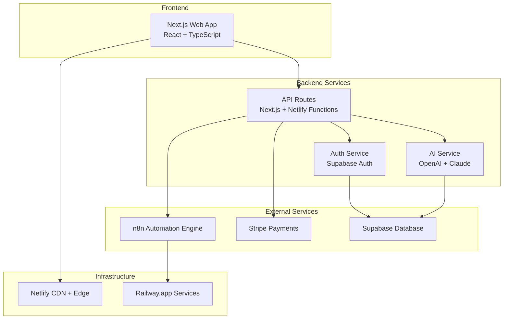

# 📖 01. Project Overview

## 🎯 ¿Qué es Agente Virtual IA?

**Agente Virtual IA** es una plataforma integral de automatización inteligente con IA diseñada para empresas modernas. Permitimos a las organizaciones crear, gestionar y ejecutar workflows automatizados usando tecnologías de inteligencia artificial de vanguardia.

### 🏢 Problema que Resolvemos

Las empresas enfrentan desafíos significativos con:
- **Procesos manuales repetitivos** que consumen tiempo valioso
- **Sistemas desconectados** sin integración efectiva
- **Dificultades para escalar** operaciones sin aumentar recursos humanos
- **Barreras técnicas** para implementar automatización avanzada

### ✨ Nuestra Solución

Ofrecemos una plataforma que combina:
- **Automatización Inteligente** con capacidades de IA integradas
- **Multi-tenancy** para múltiples organizaciones
- **Marketplace** de plantillas pre-construidas
- **Enterprise-Ready** con seguridad y compliance

## 🏗️ Arquitectura de Alto Nivel



## 💼 Modelo de Negocio

### 🎯 Usuarios Objetivo

1. **Empresas Medianas (50-500 empleados)**
   - Necesitan automatización pero no tienen recursos técnicos especializados
   - Buscan soluciones rápidas de implementar
   - Valoran el soporte y onboarding

2. **Empresas Grandes (500+ empleados)**
   - Requieren integraciones complejas
   - Necesitan compliance y seguridad enterprise
   - Valoran escalabilidad y performance

3. **Startups Tecnológicas**
   - Buscan ventaja competitiva a través de automatización
   - Necesitan soluciones cost-effective
   - Valoran innovación y features avanzadas

### 💰 Modelo de Revenue

```typescript
// Estructura de pricing por tiers
export const PRICING_TIERS = {
  starter: {
    monthlyPrice: 29,
    features: ['100 ejecuciones/mes', 'Soporte básico', 'Templates públicos'],
    target: 'Pequeñas empresas'
  },
  professional: {
    monthlyPrice: 99,
    features: ['1000 ejecuciones/mes', 'AI Assistant', 'Templates premium'],
    target: 'Empresas medianas'
  },
  enterprise: {
    monthlyPrice: 299,
    features: ['Ejecuciones ilimitadas', 'SSO', 'Soporte prioritario'],
    target: 'Grandes empresas'
  }
}
```

## 🎨 Stack Tecnológico Principal

### Frontend
- **Next.js 15** - Framework de React con SSR/SSG
- **React 19** - Biblioteca de UI con Server Components
- **TypeScript** - Type safety y mejor DX
- **Tailwind CSS** - Utility-first styling
- **Radix UI** - Componentes accesibles

### Backend
- **Next.js API Routes** - Serverless backend
- **Netlify Functions** - Edge computing
- **Supabase** - Database y autenticación
- **n8n** - Motor de automatización

### Servicios Externos
- **OpenAI/Claude** - Servicios de IA
- **Stripe** - Procesamiento de pagos
- **Netlify** - Hosting y CDN
- **Railway** - Hosting de servicios

## 🌍 Contexto de Mercado

### 📊 Mercado Total Direccionable (TAM)
- **Mercado de Automatización**: $20B+ globalmente
- **Crecimiento Anual**: 15-20% CAGR
- **Adopción IA**: 67% de empresas planean aumentar inversión

### 🏆 Competidores Principales

| Competidor | Fortalezas | Debilidades |
|------------|------------|-------------|
| **Zapier** | Simplicidad, ecosistema | Limitado para casos complejos |
| **Microsoft Power Automate** | Integración Office 365 | Dependencia del ecosistema MS |
| **UiPath** | Robustez enterprise | Complejidad, alto costo |

### 🎯 Nuestra Ventaja Competitiva

1. **IA Nativa**: Integración profunda de IA en toda la plataforma
2. **Developer Experience**: Herramientas modernas y workflow optimizado
3. **Marketplace**: Economía de creadores con templates monetizados
4. **Multi-región**: Soporte global desde el día uno

## 👥 Usuarios y Personas

### 🧑‍💼 Administrador de Empresa (Primary)
```yaml
Background: "C-level o VP de Operations"
Goals:
  - Reducir costos operacionales
  - Aumentar eficiencia del equipo
  - Implementar automatización sin fricción
Pain_Points:
  - Falta de tiempo para evaluar soluciones
  - Preocupación por seguridad y compliance
  - ROI unclear en automatización
Tools: "Salesforce, Slack, Office 365"
```

### 👨‍💻 Desarrollador/Automatizador (Primary)
```yaml
Background: "Developer, DevOps, o Business Analyst"
Goals:
  - Crear workflows eficientes
  - Integrar sistemas existentes
  - Mantener y escalar automatizaciones
Pain_Points:
  - Complejidad de integraciones
  - Debugging de workflows
  - Limitaciones de plataformas no-code
Tools: "VS Code, GitHub, Postman, n8n"
```

### 👩‍💼 Usuario de Negocio (Secondary)
```yaml
Background: "Manager o Specialist en operaciones"
Goals:
  - Ejecutar procesos automatizados
  - Obtener insights de datos
  - Reducir trabajo manual
Pain_Points:
  - Interfaces complejas
  - Falta de visibilidad en procesos
  - Dependencia de IT para cambios
Tools: "Excel, CRM, Email, Dashboards"
```

## 📈 Métricas Clave de Producto

### 🎯 Métricas de Producto (OKRs)

#### Objetivo: Aumentar Adopción de Usuarios
- **KR1**: 1,000+ Monthly Active Users (MAU) 
- **KR2**: 75% User Retention al mes 3
- **KR3**: Net Promoter Score (NPS) > 50

#### Objetivo: Optimizar Revenue
- **KR1**: $50K Monthly Recurring Revenue (MRR)
- **KR2**: Customer Acquisition Cost (CAC) < $150
- **KR3**: Customer Lifetime Value (LTV) > $1,200

#### Objetivo: Mejorar Product-Market Fit
- **KR1**: 40% de usuarios activos semanales
- **KR2**: 5+ workflows promedio por usuario activo
- **KR3**: 90% workflow success rate

### 📊 Analytics Tracking

```typescript
// Eventos principales que trackeamos
export const ANALYTICS_EVENTS = {
  // User Journey
  USER_SIGNUP: 'user_signup',
  USER_ACTIVATED: 'user_activated', // Primer workflow creado
  USER_RETAINED: 'user_retained',   // Uso en semana 2+
  
  // Product Usage
  WORKFLOW_CREATED: 'workflow_created',
  WORKFLOW_EXECUTED: 'workflow_executed', 
  TEMPLATE_PURCHASED: 'template_purchased',
  AI_FEATURE_USED: 'ai_feature_used',
  
  // Business Metrics
  SUBSCRIPTION_STARTED: 'subscription_started',
  SUBSCRIPTION_UPGRADED: 'subscription_upgraded',
  SUPPORT_TICKET_CREATED: 'support_ticket_created'
}
```

## 🗺️ Roadmap de Producto

### Q1 2025: Foundation
- ✅ **Core Platform**: Workflow CRUD, ejecución básica
- ✅ **Authentication**: JWT + Supabase Auth
- ✅ **Billing**: Stripe integration básica
- 🔄 **AI Features**: Generación de workflows básica

### Q2 2025: Growth
- 🔄 **Marketplace**: Templates monetizados
- 📋 **Analytics**: Dashboard avanzado
- 📋 **Integrations**: 20+ conectores populares
- 📋 **Mobile App**: React Native app

### Q3 2025: Scale
- 📋 **Enterprise Features**: SSO, RBAC avanzado
- 📋 **Multi-region**: Deployment global
- 📋 **Advanced AI**: Workflow optimization automática
- 📋 **Partner Program**: Channel partnerships

### Q4 2025: Innovation
- 📋 **AI Agents**: Autonomous workflow agents
- 📋 **Voice Interface**: Control por voz
- 📋 **Workflow Marketplace**: Ecosistema completo
- 📋 **Industry Solutions**: Verticales específicas

## 🎓 Conceptos Técnicos Clave

### 🔄 Workflows
Un **workflow** es una secuencia de tareas automatizadas que se ejecutan en respuesta a un trigger específico.

```typescript
interface Workflow {
  id: string
  name: string
  nodes: WorkflowNode[]     // Tareas individuales
  connections: Connection[] // Flujo entre tareas
  triggers: Trigger[]       // Eventos que inician el workflow
  active: boolean          // Estado de activación
}
```

### 🏢 Multi-tenancy
Cada **tenant** representa una organización con:
- Datos completamente aislados
- Configuración independiente
- Límites de recursos configurables
- Billing separado

### 🤖 AI Integration
Utilizamos IA para:
- **Generación de workflows** desde descripción natural
- **Optimización automática** de performance
- **Análisis de errores** y sugerencias de fix
- **Recomendaciones** de mejoras

## 📚 Recursos Adicionales

### 📖 Documentación Técnica
- [Architecture Documentation](../architecture/README.md)
- [API Reference](../api/README.md)
- [Database Schema](../database/schema.md)

### 🎥 Videos de Introducción
- [Product Demo](https://example.com/demo) (10 min)
- [Architecture Overview](https://example.com/arch) (15 min)
- [Developer Walkthrough](https://example.com/dev) (20 min)

### 🔗 Enlaces Útiles
- [Product Roadmap](https://example.com/roadmap)
- [User Research](https://example.com/research)
- [Competitive Analysis](https://example.com/competition)

---

**Próximo paso**: [⚙️ Development Environment Setup](./02-dev-environment-setup.md)