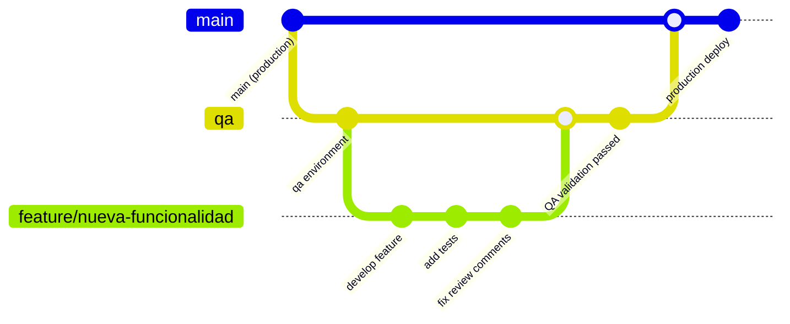

# 🔄 04. Development Workflow

Esta guía explica el proceso completo de desarrollo en **Agente Virtual IA**, desde la creación de features hasta el deployment en producción.

## 🌳 Git Workflow - QA First

Utilizamos un **workflow centrado en QA** que garantiza calidad antes de llegar a producción.



### 🎯 Branching Strategy

#### **Production Branch: `main`**
- ✅ Código estable en producción
- 🚫 **NO direct pushes**
- ✅ Solo merges desde `qa` después de validación
- 🌐 Auto-deploy a https://agentevirtualia.com

#### **QA Branch: `qa`**  
- 🧪 Ambiente de testing e integración
- ✅ Merges desde feature branches
- 🔄 Auto-deploy a https://qa-agentevirtualia.netlify.app
- ⚡ Testing de todas las features antes de producción

#### **Feature Branches: `feature/*`**
- 🛠️ Desarrollo de nuevas funcionalidades
- 📝 Naming: `feature/description-kebab-case`
- 🔀 Source: `qa` branch
- 🎯 Target: `qa` branch

#### **Hotfix Branches: `hotfix/*`**
- 🚨 Fixes críticos para producción
- ⚡ Fast-track a través de QA
- 🔀 Source: `main` branch
- 🎯 Targets: `qa` → `main`

## 📋 Step-by-Step Development Process

### 1. 🚀 Starting a New Feature

```bash
# 1. Asegurarse de estar en qa y actualizado
git checkout qa
git pull origin qa

# 2. Crear feature branch
git checkout -b feature/ai-workflow-generator

# 3. Verificar branch activo
git branch
# * feature/ai-workflow-generator
```

### 2. 💻 Development Cycle

```bash
# 1. Hacer cambios incrementales
# Edit files...

# 2. Staging changes
git add .

# 3. Commit with conventional format
git commit -m "feat(ai): add workflow generation from natural language"

# 4. Push regularmente para backup
git push origin feature/ai-workflow-generator
```

### 3. 🧪 Local Testing

Antes de crear PR, **siempre** ejecutar:

```bash
# 1. Type checking
npm run typecheck

# 2. Linting
npm run lint

# 3. Unit tests
npm run test

# 4. Build verification
npm run build

# 5. Local testing
npm run dev
# Verificar funcionalidad en http://localhost:3000
```

### 4. 📝 Creating Pull Request

```bash
# 1. Asegurar que qa está actualizado
git checkout qa
git pull origin qa

# 2. Rebase feature branch si es necesario
git checkout feature/ai-workflow-generator
git rebase qa

# 3. Crear PR usando GitHub CLI
gh pr create \
  --base qa \
  --title "feat: AI Workflow Generator" \
  --body "$(cat <<'EOF'
## Summary
Implementa generación automática de workflows usando IA.

## Changes
- ✅ Componente AIWorkflowGenerator
- ✅ Integración con OpenAI API
- ✅ Validación de workflows generados
- ✅ Tests unitarios y de integración

## Testing
- [ ] Generación básica de workflows funciona
- [ ] Validación de input/output
- [ ] Error handling para API failures
- [ ] UI/UX responsivo

## Screenshots
[Opcional: agregar screenshots]

## Checklist
- [x] Tests passing
- [x] Linting passing
- [x] TypeScript errors resolved
- [x] Documentation updated
- [x] Ready for QA review
EOF
)"
```

### 5. 👀 Code Review Process

#### **Review Checklist for Authors**
- [ ] ✅ **Tests**: Todos los tests pasan
- [ ] 📝 **Documentation**: README/docs actualizados si necesario
- [ ] 🎨 **UI/UX**: Screenshots incluidos para cambios visuales
- [ ] 🔒 **Security**: No hay secretos o información sensible
- [ ] ⚡ **Performance**: No hay regresiones de performance
- [ ] 🌍 **i18n**: Textos internacionalizados

#### **Review Checklist for Reviewers**
- [ ] 🎯 **Functionality**: Feature funciona como se especificó
- [ ] 🏗️ **Architecture**: Sigue patrones establecidos
- [ ] 📝 **Code Quality**: Código limpio y mantenible
- [ ] 🧪 **Tests**: Cobertura adecuada de tests
- [ ] 🔒 **Security**: No hay vulnerabilidades introducidas
- [ ] 📱 **Responsive**: UI funciona en diferentes dispositivos

#### **Review Comments Guidelines**

```typescript
// ✅ Good: Constructive with solution
// "Consider using useMemo here for performance optimization:
// const expensiveValue = useMemo(() => calculateValue(data), [data])"

// ❌ Bad: Only criticism without guidance
// "This is slow"

// ✅ Good: Specific and actionable
// "This function should be moved to a service layer for reusability.
// Suggest creating src/lib/services/ai.ts"

// ❌ Bad: Vague feedback
// "This needs refactoring"
```

### 6. 🚀 QA Deployment & Testing

Una vez aprobado el PR:

```bash
# 1. Merge to qa (triggers auto-deploy)
gh pr merge --squash

# 2. Verificar deployment
# QA environment: https://qa-agentevirtualia.netlify.app

# 3. Ejecutar QA validation checklist
```

#### **QA Testing Checklist**
- [ ] 🎯 **Functionality**: Feature funciona end-to-end
- [ ] 🔄 **Integration**: No rompe funcionalidad existente
- [ ] 📱 **Cross-browser**: Chrome, Safari, Firefox, Edge
- [ ] 📱 **Mobile**: iOS Safari, Android Chrome
- [ ] 🔒 **Security**: No hay vulnerabilidades introducidas
- [ ] ⚡ **Performance**: Tiempos de carga aceptables
- [ ] 🌍 **i18n**: Funciona en todos los idiomas soportados

### 7. 🌟 Production Deployment

Después de QA approval:

```bash
# 1. Crear PR de qa a main
gh pr create \
  --base main \
  --head qa \
  --title "Release: AI Workflow Generator v2.1" \
  --body "✅ QA validated changes ready for production"

# 2. Final approval y merge
gh pr merge --squash

# 3. Verificar production deployment
# Production: https://agentevirtualia.com
```

## 📊 Commit Message Standards

Utilizamos **Conventional Commits** para automatizar changelogs:

### 🎯 Commit Format

```
<type>(<scope>): <description>

[optional body]

[optional footer(s)]
```

### 📝 Types

```typescript
// Primary types
feat:     // Nueva funcionalidad
fix:      // Bug fix
docs:     // Documentación
style:    // Formatting, missing semi colons, etc
refactor: // Code change que no es feature ni fix
test:     // Adding tests
chore:    // Updating grunt tasks etc; no production code change

// Additional types
perf:     // Performance improvements
ci:       // CI/CD changes
build:    // Build system changes
revert:   // Reverting previous commits
```

### 🎯 Scopes

```typescript
// Feature scopes
(auth)      // Authentication
(workflows) // Workflow management
(billing)   // Billing system
(analytics) // Analytics
(ai)        // AI features
(ui)        // UI components
(api)       // API changes
(db)        // Database changes
(i18n)      // Internationalization
```

### ✅ Examples

```bash
# New feature
feat(ai): add workflow generation from natural language

# Bug fix
fix(workflows): resolve execution timeout on large datasets

# Documentation
docs(api): update authentication endpoints documentation

# Refactoring
refactor(billing): simplify subscription status calculation

# Performance improvement
perf(workflows): optimize workflow list rendering with virtualization

# Breaking change
feat(auth)!: replace JWT with session-based authentication

BREAKING CHANGE: Authentication system now uses sessions instead of JWT tokens.
Existing JWT tokens will need to be regenerated.
```

## 🔄 Continuous Integration

### 🤖 Automated Checks

Cada PR ejecuta automáticamente:

```yaml
# .github/workflows/ci.yml
name: CI Pipeline

on:
  pull_request:
    branches: [qa, main]

jobs:
  quality-checks:
    runs-on: ubuntu-latest
    steps:
      - name: Checkout
        uses: actions/checkout@v4
      
      - name: Setup Node.js
        uses: actions/setup-node@v4
        with:
          node-version: '20'
          cache: 'npm'
      
      - name: Install dependencies
        run: npm install --legacy-peer-deps
      
      - name: TypeScript check
        run: npm run typecheck
      
      - name: ESLint
        run: npm run lint
      
      - name: Unit tests
        run: npm run test
      
      - name: Build verification
        run: npm run build
      
      - name: E2E tests (QA only)
        if: github.base_ref == 'qa'
        run: npm run test:e2e
```

### 📊 Quality Gates

Para que un PR sea aprobado debe pasar:

- ✅ **TypeScript**: Sin errores de tipos
- ✅ **ESLint**: Sin errores de linting
- ✅ **Tests**: 100% de tests pasando
- ✅ **Build**: Compilación exitosa
- ✅ **Code Review**: Aprobación de al menos 1 reviewer
- ✅ **QA Testing**: Validación manual en QA environment

## 🚨 Hotfix Process

Para bugs críticos en producción:

### 1. 🔥 Create Hotfix

```bash
# 1. Branch from main
git checkout main
git pull origin main
git checkout -b hotfix/critical-auth-vulnerability

# 2. Fix the issue (minimal changes only)
# Edit files...

# 3. Test locally
npm run test
npm run build

# 4. Commit with hotfix type
git commit -m "hotfix(auth): patch critical security vulnerability"

# 5. Push hotfix
git push origin hotfix/critical-auth-vulnerability
```

### 2. ⚡ Fast-track Review

```bash
# 1. Create PR to qa with hotfix label
gh pr create \
  --base qa \
  --title "[HOTFIX] Critical Auth Vulnerability" \
  --label "hotfix" \
  --body "🚨 Critical security fix requiring immediate deployment"

# 2. Expedited review and QA testing
# 3. Fast-track to production
```

### 3. 🌟 Production Deploy

```bash
# 1. Merge qa to main immediately after QA validation
gh pr create --base main --head qa --title "[HOTFIX] Production Deploy"

# 2. Monitor production after deployment
npm run test:e2e:production
```

## 📈 Development Metrics

### 🎯 Team KPIs

```typescript
// Metrics que trackeamos
export const DEVELOPMENT_METRICS = {
  // Velocity
  CYCLE_TIME: 'Time from first commit to production',
  LEAD_TIME: 'Time from story creation to production',
  
  // Quality  
  BUG_RATE: 'Bugs found in production per sprint',
  HOTFIX_FREQUENCY: 'Number of hotfixes per month',
  
  // Process
  PR_SIZE: 'Average lines of code per PR',
  REVIEW_TIME: 'Time from PR creation to approval',
  
  // Performance
  BUILD_TIME: 'CI/CD pipeline execution time',
  DEPLOYMENT_SUCCESS_RATE: 'Percentage of successful deployments'
}
```

### 📊 Reporting

```bash
# Sprint metrics script
npm run metrics:sprint

# Git stats for team
git shortlog -sn --since="1 month ago"

# PR velocity
gh pr list --state merged --limit 50 --json mergedAt,createdAt
```

## 🛡️ Security in Development

### 🔒 Security Checklist

#### **Every PR Must Check:**
- [ ] 🚫 No hardcoded secrets or credentials
- [ ] 🔐 All user inputs are validated and sanitized
- [ ] 🛡️ Authentication/authorization implemented correctly
- [ ] 📝 Sensitive data is properly encrypted
- [ ] 🔍 Dependencies are up-to-date and secure
- [ ] 🚨 Error messages don't leak sensitive information

#### **Security Tools Integration:**

```bash
# Dependency vulnerability check
npm audit --audit-level=high

# Secret scanning (pre-commit)
git-secrets --scan

# SAST scanning
npm run security:scan
```

## 🎯 Best Practices

### ✅ Do's

1. **Small, Focused PRs**: Keep PRs under 400 lines of code
2. **Test-Driven Development**: Write tests before or with code
3. **Self-Review**: Review your own code before submitting PR
4. **Clear Descriptions**: Write detailed PR descriptions
5. **Regular Commits**: Commit frequently with clear messages
6. **Code Comments**: Comment complex business logic
7. **Performance**: Consider performance impact of changes

### ❌ Don'ts

1. **Large PRs**: Avoid PRs with 500+ lines of changes
2. **Direct to Main**: Never push directly to main branch
3. **Broken Tests**: Never merge with failing tests
4. **Missing Context**: Don't submit PRs without descriptions
5. **Force Push**: Avoid force pushing to shared branches
6. **Hardcoded Values**: Don't hardcode configuration values
7. **Skip QA**: Never bypass QA process for non-hotfixes

---

**Próximo paso**: [👥 Team Collaboration](./05-team-collaboration.md)