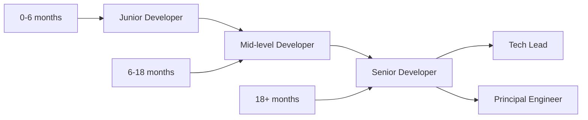

# 🎯 08. First Tasks & Milestones

Esta guía proporciona una progresión estructurada de tareas para nuevos desarrolladores, desde la orientación inicial hasta contribuciones significativas al proyecto.

## 📅 Cronograma de Onboarding

```mermaid
gantt
    title Developer Onboarding Milestones
    dateFormat  X
    axisFormat %d

    section Semana 1: Setup & Orientación
    Environment Setup      :done, env, 0, 2d
    Project Overview       :done, overview, 1d, 3d
    First Code Changes     :active, firstcode, 2d, 5d
    
    section Semana 2-3: Desarrollo
    Feature Development    :feature, 7d, 14d
    Code Review Process    :review, 10d, 17d
    
    section Semana 4: Integración
    Team Integration       :integration, 21d, 28d
    Full Productivity      :productivity, 25d, 30d
```

## 🎓 Niveles de Progresión

### 📚 Nivel 1: Orientación (Días 1-3)

**Objetivo**: Familiarizarse con el proyecto y configurar el entorno de desarrollo.

#### ✅ Task 1.1: Environment Setup & Verification
```bash
# Duration: 4-6 horas
# Difficulty: ⭐⭐☆☆☆

# 1. Completar setup del entorno
npm install --legacy-peer-deps
npm run dev

# 2. Verificar que todo funciona
npm run test
npm run build
npm run lint

# 3. Acceder a QA environment
# Visitar: https://qa-agentevirtualia.netlify.app

# 4. Crear cuenta de prueba y explorar UI
```

**Entregables:**
- [ ] Entorno local funcionando sin errores
- [ ] Todos los comandos npm ejecutándose correctamente
- [ ] Screenshot del proyecto corriendo localmente
- [ ] Cuenta de prueba creada en QA environment

#### ✅ Task 1.2: Code Exploration & Documentation Reading
```typescript
// Duration: 4-6 horas  
// Difficulty: ⭐⭐☆☆☆

// 1. Explorar estructura del proyecto
// Leer: docs/onboarding/03-codebase-structure.md
// Leer: docs/architecture/README.md

// 2. Familiarizarse con componentes principales
// src/components/workflows/WorkflowCard.tsx
// src/app/[locale]/workflows/page.tsx
// netlify/functions/workflows/

// 3. Entender flujo de datos
// src/lib/services/workflows.ts
// src/hooks/useWorkflows.ts
```

**Entregables:**
- [ ] Diagrama simple del flujo de datos principal
- [ ] Lista de 10 componentes principales identificados
- [ ] Preguntas documentadas para sesión 1:1

#### ✅ Task 1.3: First Code Change - Fix a Typo
```typescript
// Duration: 2-3 horas
// Difficulty: ⭐☆☆☆☆

// 1. Encontrar y corregir un typo en la UI
// Buscar en: src/i18n/messages/es.json

// 2. Crear tu primer PR
git checkout -b feature/fix-ui-typos
// Hacer cambios
git commit -m "fix(i18n): correct typos in Spanish translations"
git push origin feature/fix-ui-typos
gh pr create --base qa

// 3. Seguir proceso de code review
```

**Entregables:**
- [ ] PR creado y aprobado
- [ ] Cambios deployed en QA environment
- [ ] Comprensión del proceso de Git workflow

### 🔧 Nivel 2: Contribuciones Básicas (Días 4-10)

**Objetivo**: Realizar contribuciones pequeñas pero significativas al proyecto.

#### ✅ Task 2.1: Component Enhancement
```typescript
// Duration: 1-2 días
// Difficulty: ⭐⭐⭐☆☆

// Agregar funcionalidad a WorkflowCard component
// File: src/components/workflows/WorkflowCard.tsx

interface TaskRequirements {
  // 1. Agregar tooltip para workflow status
  // 2. Mostrar fecha de última ejecución
  // 3. Agregar animation en hover
  // 4. Escribir tests unitarios
}

// Ejemplo de improvement
export function WorkflowCard({ workflow }: WorkflowCardProps) {
  return (
    <Card className="hover:shadow-lg transition-all duration-200">
      <CardHeader className="flex flex-row items-center justify-between">
        <div>
          <h3 className="font-semibold">{workflow.name}</h3>
          <p className="text-sm text-muted-foreground">
            {workflow.description}
          </p>
          {/* NEW: Agregar última ejecución */}
          <p className="text-xs text-muted-foreground">
            Última ejecución: {formatRelativeTime(workflow.lastExecution)}
          </p>
        </div>
        {/* NEW: Tooltip para status */}
        <TooltipProvider>
          <Tooltip>
            <TooltipTrigger>
              <Badge variant={workflow.active ? 'default' : 'secondary'}>
                {workflow.active ? 'Activo' : 'Inactivo'}
              </Badge>
            </TooltipTrigger>
            <TooltipContent>
              <p>Estado del workflow: {getStatusDescription(workflow.status)}</p>
            </TooltipContent>
          </Tooltip>
        </TooltipProvider>
      </CardHeader>
      {/* Resto del componente... */}
    </Card>
  )
}
```

**Entregables:**
- [ ] Component mejorado con nuevas features
- [ ] Tests unitarios que cubran nuevas funcionalidades
- [ ] PR aprobado y merged
- [ ] Funcionalidad validada en QA

#### ✅ Task 2.2: API Integration
```typescript
// Duration: 2-3 días
// Difficulty: ⭐⭐⭐☆☆

// Crear nuevo endpoint para workflow statistics
// File: netlify/functions/workflows/stats.ts

import { Handler } from '@netlify/functions'
import { withAuth } from '../shared/middleware'

export const handler: Handler = withAuth(async (event, context) => {
  try {
    const { tenantId } = context.user
    
    // 1. Implementar lógica para obtener estadísticas
    const stats = await getWorkflowStats(tenantId)
    
    // 2. Retornar datos estructurados
    return {
      statusCode: 200,
      headers: { 'Content-Type': 'application/json' },
      body: JSON.stringify({
        totalWorkflows: stats.total,
        activeWorkflows: stats.active,
        totalExecutions: stats.executions,
        successRate: stats.successRate,
        avgExecutionTime: stats.avgExecutionTime
      })
    }
  } catch (error) {
    return {
      statusCode: 500,
      body: JSON.stringify({ error: 'Failed to fetch workflow stats' })
    }
  }
})

// 3. Crear hook para consumir API
// File: src/hooks/useWorkflowStats.ts
export function useWorkflowStats() {
  const { data, error, isLoading } = useSWR('/api/workflows/stats', fetcher)
  
  return {
    stats: data,
    loading: isLoading,
    error
  }
}

// 4. Integrar en dashboard
// File: src/components/dashboard/WorkflowStatsCard.tsx
export function WorkflowStatsCard() {
  const { stats, loading, error } = useWorkflowStats()
  
  if (loading) return <StatsCardSkeleton />
  if (error) return <StatsCardError error={error} />
  
  return (
    <Card>
      <CardHeader>
        <CardTitle>Estadísticas de Workflows</CardTitle>
      </CardHeader>
      <CardContent>
        <div className="grid grid-cols-2 gap-4">
          <div>
            <p className="text-2xl font-bold">{stats.totalWorkflows}</p>
            <p className="text-sm text-muted-foreground">Total Workflows</p>
          </div>
          <div>
            <p className="text-2xl font-bold">{stats.successRate}%</p>
            <p className="text-sm text-muted-foreground">Tasa de Éxito</p>
          </div>
        </div>
      </CardContent>
    </Card>
  )
}
```

**Entregables:**
- [ ] Nuevo endpoint API funcionando
- [ ] Hook personalizado para consumir datos
- [ ] Componente de dashboard con estadísticas
- [ ] Tests de integración API
- [ ] Documentación API actualizada

#### ✅ Task 2.3: Database Enhancement
```sql
-- Duration: 1-2 días
-- Difficulty: ⭐⭐⭐☆☆

-- 1. Crear nueva migración
-- File: supabase/migrations/XXX_workflow_analytics.sql

-- Agregar tabla para tracking de analytics
CREATE TABLE workflow_analytics (
  id UUID PRIMARY KEY DEFAULT gen_random_uuid(),
  workflow_id UUID NOT NULL REFERENCES workflows(id),
  event_type VARCHAR(50) NOT NULL, -- 'execution', 'error', 'success'
  event_data JSONB DEFAULT '{}',
  created_at TIMESTAMPTZ DEFAULT NOW()
);

-- Índices para performance
CREATE INDEX idx_workflow_analytics_workflow_id ON workflow_analytics(workflow_id);
CREATE INDEX idx_workflow_analytics_event_type ON workflow_analytics(event_type);
CREATE INDEX idx_workflow_analytics_created_at ON workflow_analytics(created_at);

-- Row Level Security
ALTER TABLE workflow_analytics ENABLE ROW LEVEL SECURITY;

CREATE POLICY workflow_analytics_tenant_isolation ON workflow_analytics
  FOR ALL USING (
    EXISTS (
      SELECT 1 FROM workflows w 
      WHERE w.id = workflow_analytics.workflow_id 
      AND w.tenant_id = (auth.jwt() ->> 'tenant_id')::UUID
    )
  );

-- 2. Crear función para insertar eventos
CREATE OR REPLACE FUNCTION track_workflow_event(
  p_workflow_id UUID,
  p_event_type VARCHAR(50),
  p_event_data JSONB DEFAULT '{}'
)
RETURNS UUID AS $$
DECLARE
  event_id UUID;
BEGIN
  INSERT INTO workflow_analytics (workflow_id, event_type, event_data)
  VALUES (p_workflow_id, p_event_type, p_event_data)
  RETURNING id INTO event_id;
  
  RETURN event_id;
END;
$$ LANGUAGE plpgsql SECURITY DEFINER;
```

**Entregables:**
- [ ] Migración aplicada exitosamente
- [ ] Función de tracking implementada
- [ ] RLS policies configuradas correctamente
- [ ] Tests de base de datos
- [ ] Documentación de schema actualizada

### 🚀 Nivel 3: Features Completas (Días 11-21)

**Objetivo**: Desarrollar features completas end-to-end con mínima supervisión.

#### ✅ Task 3.1: Workflow Templates Feature
```typescript
// Duration: 1 semana
// Difficulty: ⭐⭐⭐⭐☆

// 1. Database schema para templates
// supabase/migrations/XXX_workflow_templates.sql
CREATE TABLE workflow_templates (
  id UUID PRIMARY KEY DEFAULT gen_random_uuid(),
  name VARCHAR(255) NOT NULL,
  description TEXT,
  category VARCHAR(100) NOT NULL,
  template_data JSONB NOT NULL,
  created_by UUID NOT NULL REFERENCES users(id),
  is_public BOOLEAN DEFAULT false,
  download_count INTEGER DEFAULT 0,
  rating_avg DECIMAL(3,2) DEFAULT 0,
  created_at TIMESTAMPTZ DEFAULT NOW()
);

// 2. API endpoints
// netlify/functions/templates/list.ts
// netlify/functions/templates/create.ts  
// netlify/functions/templates/[id].ts

// 3. Frontend components
// src/components/templates/TemplateCard.tsx
// src/components/templates/TemplatesList.tsx
// src/components/templates/CreateTemplateModal.tsx

// 4. Pages
// src/app/[locale]/templates/page.tsx
// src/app/[locale]/templates/[id]/page.tsx

// 5. Custom hooks
// src/hooks/useTemplates.ts
// src/hooks/useTemplateActions.ts

interface TemplateFeatureRequirements {
  // Backend
  database: 'Templates table with RLS'
  api: 'CRUD operations for templates'
  validation: 'Input validation and sanitization'
  
  // Frontend  
  listing: 'Templates grid with filtering'
  creation: 'Modal for creating templates from workflows'
  preview: 'Template preview before installation'
  
  // Testing
  unit: 'Component and hook tests'
  integration: 'API integration tests'
  e2e: 'Full user flow tests'
}
```

**Entregables:**
- [ ] Database schema completo y migrado
- [ ] API endpoints completos con validación
- [ ] UI completa y responsiva
- [ ] Tests comprehensivos (>80% coverage)
- [ ] Documentación de feature
- [ ] Feature demo en QA environment

#### ✅ Task 3.2: Advanced Search & Filtering
```typescript
// Duration: 1 semana
// Difficulty: ⭐⭐⭐⭐☆

// Implementar búsqueda avanzada para workflows
interface SearchFeatureRequirements {
  // 1. Full-text search en nombres y descripciones
  backend: {
    postgresql: 'Full-text search con tsvector'
    api: 'Search endpoint con filtering avanzado'
    indexing: 'Índices optimizados para búsqueda'
  }
  
  // 2. Filtros múltiples
  filters: {
    status: 'active | inactive | all'
    category: 'automation | ai | integration | custom'
    dateRange: 'created_at, last_execution'
    tags: 'array de tags'
    creator: 'created_by user'
  }
  
  // 3. UI avanzada
  frontend: {
    searchBar: 'Búsqueda con autocomplete'
    filterPanel: 'Panel lateral con filtros'
    results: 'Grid de resultados con paginación'
    sorting: 'Sort por relevancia, fecha, nombre'
  }
}

// Ejemplo de implementación
// src/components/search/AdvancedSearchBar.tsx
export function AdvancedSearchBar() {
  const [query, setQuery] = useState('')
  const [filters, setFilters] = useState<SearchFilters>({})
  const { results, loading } = useAdvancedSearch(query, filters)
  
  return (
    <div className="search-container">
      <SearchInput 
        value={query}
        onChange={setQuery}
        placeholder="Buscar workflows..."
      />
      <FilterPanel 
        filters={filters}
        onChange={setFilters}
      />
      <SearchResults 
        results={results}
        loading={loading}
      />
    </div>
  )
}
```

**Entregables:**
- [ ] Search backend con PostgreSQL full-text search
- [ ] API endpoint optimizado con caching
- [ ] UI de búsqueda avanzada
- [ ] Filtros funcionales y performantes
- [ ] Analytics de búsqueda implementado
- [ ] Performance testing completado

### 🎖️ Nivel 4: Arquitectura & Leadership (Días 22+)

**Objetivo**: Liderar iniciativas técnicas y contribuir a decisiones arquitectónicas.

#### ✅ Task 4.1: Performance Optimization Initiative
```typescript
// Duration: 2-3 semanas
// Difficulty: ⭐⭐⭐⭐⭐

interface PerformanceProject {
  analysis: {
    // 1. Performance audit completo
    lighthouse: 'Core Web Vitals analysis'
    bundleAnalysis: 'Bundle size optimization'
    apiLatency: 'Backend response time analysis'
    dbQueries: 'Database query optimization'
  }
  
  optimization: {
    // 2. Implementar mejoras
    codesplitting: 'Dynamic imports para reducir bundle'
    lazyLoading: 'Lazy loading de componentes pesados'
    caching: 'Implementar caching strategies'
    dbOptimization: 'Query optimization y indexing'
  }
  
  monitoring: {
    // 3. Setup de monitoring
    metrics: 'Performance metrics dashboard'
    alerts: 'Performance regression alerts'
    reporting: 'Weekly performance reports'
  }
}

// Ejemplo de optimización
// src/components/workflows/WorkflowsList.tsx
import { memo, useMemo } from 'react'
import { FixedSizeList as List } from 'react-window'

export const WorkflowsList = memo(function WorkflowsList({
  workflows,
  filters
}: WorkflowsListProps) {
  // Virtualization para listas grandes
  const filteredWorkflows = useMemo(() => {
    return workflows.filter(workflow => 
      matchesFilters(workflow, filters)
    )
  }, [workflows, filters])
  
  const Row = useCallback(({ index, style }) => (
    <div style={style}>
      <WorkflowCard workflow={filteredWorkflows[index]} />
    </div>
  ), [filteredWorkflows])
  
  return (
    <List
      height={600}
      itemCount={filteredWorkflows.length}
      itemSize={120}
    >
      {Row}
    </List>
  )
})
```

**Entregables:**
- [ ] Performance audit report completo
- [ ] Implementación de optimizaciones
- [ ] Monitoring dashboard
- [ ] Performance regression tests
- [ ] Team training en performance best practices

#### ✅ Task 4.2: Mentoring & Knowledge Sharing
```typescript
// Duration: Ongoing
// Difficulty: ⭐⭐⭐⭐⭐

interface MentoringResponsibilities {
  // 1. Mentoring nuevos desarrolladores
  mentoring: {
    onboarding: 'Guiar proceso de onboarding'
    codeReview: 'Provide detailed code reviews'
    pairing: 'Pair programming sessions'
    questions: 'Answer technical questions'
  }
  
  // 2. Knowledge sharing
  documentation: {
    improve: 'Mejorar documentación existente'
    create: 'Crear nueva documentación técnica'
    examples: 'Agregar code examples y tutorials'
  }
  
  // 3. Technical leadership
  architecture: {
    adr: 'Contribuir a Architecture Decision Records'
    proposals: 'Technical proposals para mejoras'
    standards: 'Establecer coding standards'
    tooling: 'Evaluar y recomendar herramientas'
  }
}
```

**Entregables:**
- [ ] Mentoring de al menos 1 desarrollador nuevo
- [ ] 3+ ADRs contribuidos
- [ ] Technical talk o workshop para el equipo
- [ ] Contribución significativa a coding standards
- [ ] Tool evaluation y recomendaciones

## 🎯 Milestone Checkpoints

### 📊 Week 1 Checkpoint

**Skills Assessment:**
- [ ] ✅ **Environment**: Can setup and run project independently
- [ ] 🏗️ **Architecture**: Understands basic project structure  
- [ ] 🔄 **Git**: Can create branches, commits, and PRs
- [ ] 🧪 **Testing**: Can run tests and understand results
- [ ] 📖 **Documentation**: Has read core documentation

**Deliverables:**
- [ ] First PR merged successfully
- [ ] Environment setup documented/improved
- [ ] Questions list for 1:1 meeting

### 📊 Week 2-3 Checkpoint

**Skills Assessment:**
- [ ] ⚙️ **Components**: Can create and modify React components
- [ ] 🔌 **API**: Understands API integration patterns
- [ ] 🗄️ **Database**: Can work with database queries and migrations
- [ ] 🎨 **UI/UX**: Follows design patterns and accessibility
- [ ] 🧪 **Testing**: Writes meaningful unit tests

**Deliverables:**
- [ ] 2+ significant features contributed
- [ ] Code review participation
- [ ] Performance improvement identified/implemented

### 📊 Month 1 Checkpoint

**Skills Assessment:**
- [ ] 🏗️ **Architecture**: Can make architectural decisions
- [ ] 🚀 **Ownership**: Takes ownership of features end-to-end
- [ ] 👥 **Collaboration**: Contributes effectively to team
- [ ] 📈 **Growth**: Identifies learning opportunities
- [ ] 🎯 **Impact**: Makes measurable impact on product

**Deliverables:**
- [ ] Lead a feature development
- [ ] Contribute to technical decisions
- [ ] Help onboard another developer
- [ ] Present work to stakeholders

## 🏆 Recognition & Advancement

### 🎖️ Achievement Badges

```typescript
interface DeveloperBadges {
  // Technical Skills
  'first-pr': 'First Pull Request merged'
  'bug-hunter': 'Found and fixed 5+ bugs'
  'test-champion': 'Achieved >90% test coverage on feature'
  'performance-guru': 'Implemented significant performance improvement'
  
  // Collaboration
  'code-reviewer': 'Provided 20+ helpful code reviews'
  'mentor': 'Successfully mentored new team member'
  'knowledge-sharer': 'Created valuable documentation/tutorial'
  
  // Leadership
  'feature-owner': 'Led end-to-end feature development'
  'architecture-contributor': 'Contributed to architectural decisions'
  'innovation': 'Proposed and implemented innovative solution'
}
```

### 📈 Career Progression



**Progression Criteria:**

#### Junior → Mid-level (6+ months)
- [ ] Can work independently on medium complexity features
- [ ] Consistently produces quality code with minimal supervision
- [ ] Participates actively in code reviews
- [ ] Understands product architecture and business context

#### Mid-level → Senior (18+ months)
- [ ] Leads feature development from design to deployment
- [ ] Mentors junior developers effectively
- [ ] Makes significant contributions to technical decisions
- [ ] Drives process improvements and best practices

#### Senior → Tech Lead
- [ ] Leads technical vision and architectural decisions
- [ ] Manages technical roadmap and priorities
- [ ] Develops team technical capabilities
- [ ] Interfaces with product and business stakeholders

---

**Próximo paso**: [🛡️ Security & Compliance](./06-security-compliance.md)